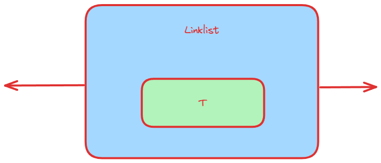
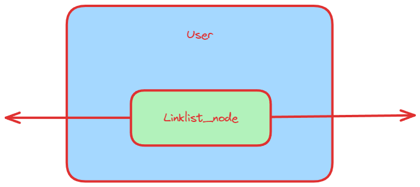

# 非侵入式链表

```cpp
template<typename T>
class Linklist_Node {
	T a;
	Linklist_Node* next;
}
```



# 侵入式链表

```cpp
Linklist_Node {
	Linklist_Node *next;
	Linklist_Node *prev;
}
template<typename T>
class User {
	T a;
	Linklist_Node now;
}
```



侵入式链表和非侵入式链表的区别在于非侵入式链表的区别主要在，非侵入式节点的是节点包含数据，而侵入式链表是对象包含节点信息。

非侵入式链表的对象只能是固定类型，而侵入式链表的对象可以是任意类型，只需要都包含 Linklist_node 就行

## 侵入式链表的好处

**这种数据结构既可以“寄宿”在具体的宿主数据结构内部，成为该数据结构的一个“连接件”**；也可以独立存在而成为一个队列的头。

同时，根据 `offsetof`、`container_of` 这两个神奇的宏了，使用这两个宏，在给定链表结构地址时，我们能够获取其宿主结构的地址。这样就能开心地操作宿主结构了。

```cpp
#define offsetof(TYPE, MEMBER) ((size_t) &((TYPE *)0)->MEMBER)

#define container_of(ptr, type, member) ({			\
	const typeof(((type *)0)->member) * __mptr = (ptr);	\
	(type *)((char *)__mptr - offsetof(type, member)); })
```

