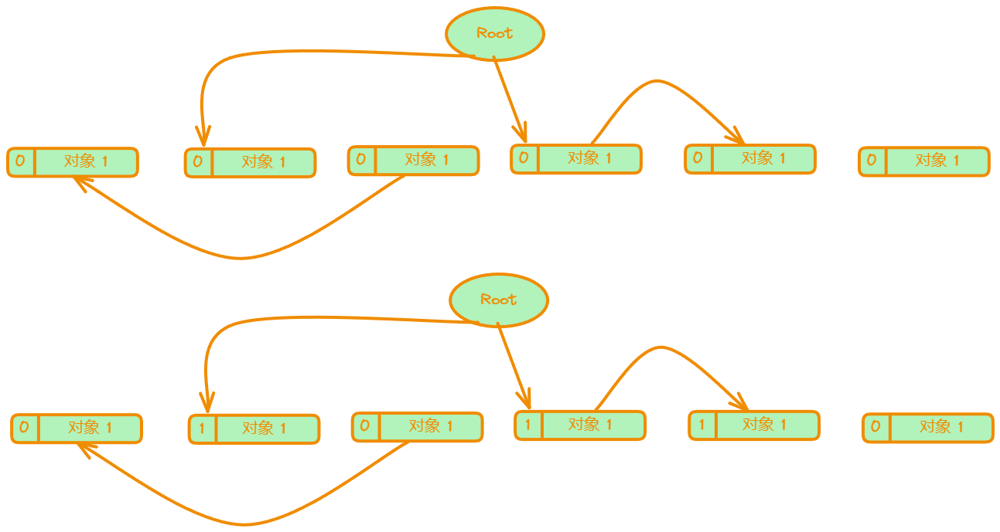
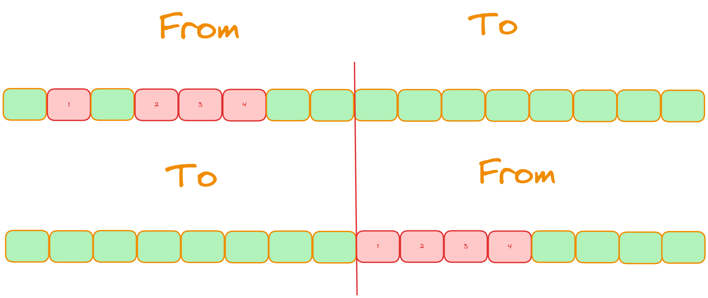
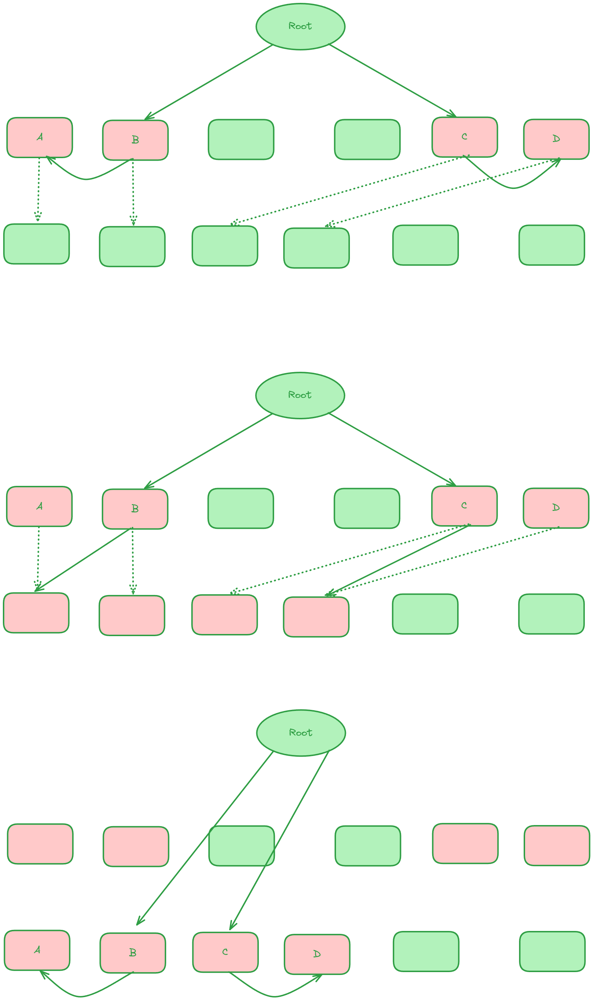

# GC

## 什么是 GC

GC 是 Garbage Collection 的简称，中文称为“垃圾回收”。GC ，是指程序把不用的内存空间视为垃圾并回收掉的整套动作。简单的概括就是：检查，回收

## 为什么会出现 GC

如果没有 GC，那么内存管理完全由程序员进行，那么当代码体量变大后，很难完美的处理每一块内存，就会造成：**内存泄露**，**悬垂指针**，**错误释放**引发 BUG。

* 内存泄漏：申请后未释放，很常见的就是 malloc 和 free 没有成对出现，导致内存一直得不到释放，最后内存占满。
* 悬垂指针：将指针指向对象释放后，没有修改指针指向，指针一直指向该已被释放的区域
* 错误释放：错误的释放了使用中的内存空间

基于以上的问题，我们开始思考，能不能将 GC 交给计算机去做，而不由程序员手动管理

## GC 的一些基本术语

* 对象：GC 的基本操作单元对象是内存空间的某些数据的集合。对象由头(header)和域(field)构成。

* 指针：指针是指向内存空间中某块区域的值，GC 是根据对象的指针指向去搜寻其他对象的。
* 活动对象，非活动对象：内存空间中被其他对象通过指针引用的对象成为活动对象，没有对象引用的对象是非活动对象
* 根：根是指向对象的指针的“起点” 部分。
* 堆：堆指的是用于动态（也就是执行程序时）存放对象的内存空间。当应用程序申请存放对象时， 所需的内存空间就会从这个堆中被分配给应用程序。

* 吞吐量：运行用户代码时间 / (运行用户代码时间 + 垃圾收集时间)。
* 最大暂停时间：因执行 GC 而暂停执行应用程序的最长时间
* 堆使用效率：程序在运行过程中，单位时间内能使用的堆内存空间的大小。
* 访问局部性：内存空间中相邻的数据很可能存在连续访问因而带来访问效率提升的情况，部分 GC 算法会利用这种局部性原理，把具有引用关系的对象安排在堆中较近的位置，就能提高在缓存 Cache 中读取到想要的数据的概率，令应用程序高速运行。

## GC 标记 清除法

从名字上可以看出，这个方法分为 **标记 清除** 两个阶段

### 标记

从根开始进行 DFS，找到所有正在被引用的对象，将其 MASK 标记

### 清除

然后遍历整个堆，将没有被 MASK 标记的对象进行垃圾回收

### 动态操作

在标记清除两个阶段，该机制还会有两个动态操作

#### 分配

将回收后的内存再分配给新的对象

#### 合并

将回收的内存和直接前后的空闲块进行合并（在物理地址上连续），形成一个大的空闲块

### 优缺点

#### 优点

简单容易实现

不会移动对象的位置，适合搭配保守式 GC 算法（指移动对象位置会使得指针悬垂或者指向错误的对象）

#### 缺点

碎片化：容易造成很多碎片内存，导致资源利用率下降

分配速度慢：分配内存需要遍历整个空闲链表

与 cow（copy on write） 不兼容：因为该算法在标记和清除阶段都会修改对象的头部信息（mark 标记）。所以这在这两个阶段就会频繁发生本应该发生的复制操作，进而增加内存空间的压力。

### 改进

#### 使用多个空闲链表：

将空闲块按大小分为不同的空间链表进行管理，需要时只需要从相应的空闲链表中寻找

#### BiBOP：

针对碎片空间的改进，将堆分为多个规格的空间，每个规格的空间只能分配同样大小的块

## 引用计数法

这个就非常类似于 c++ 中的 shared ptr，为每个对象分配一个计数器，称为引用计数器，当计数器为 0 时代表此对象可以被清除

### 优缺点

#### 优点

1. 可以立即回收垃圾：当被引用数的值为 0 时，对象马上就会把自己作为空闲空间被GC程序连接到空闲链表。也就是说，各个对象在变成垃圾的同时就会立刻被回收。
2. 最大暂停时常短：每次生成垃圾时这部分垃圾都会被回收，因而大幅度地削减了 GC 的最大暂停时间。
3. 不会跟着指针查找引用对象，可以减少指针寻找的次数

#### 缺点

1. 计数器的频繁修改：在引用计数法中，每当指针更新时，计数器的值都会随之更新，因此值的增减处理必然会变得繁重。
2. 计数器空间：计数器会占用额外的空间
3. 实现繁琐：由于涉及到了指针更新，还要频繁修改对象引用和计数器，这容易导致遗漏
4. 循环引用：没有办法解决对象循环引用导致的内存泄漏

### 改进

#### 延迟引用计数：

采用一个零数表 ZCT(Zero Count Table)来存储从根引用的各对象的被引用数，即使这个值变为0，程序也先不回收这个对象（延迟一词体现在这），而是等零数表 ZCT 爆满或者空闲链表为空时再扫描零数表 ZCT，删除确实没有被引用的对象。此方法减轻了因根引用频繁发生变化而导致的计数器增减所带来的额外负担。但是垃圾不能马上得到回收，这样一来垃圾就会压迫堆，程序也就失去了引用计数法的一大优点——可即刻回收垃圾。

#### 减少计数器位数：

将计数器的位数减小，如果计数器溢出：1）什么都不做，2）通过GC标记-清除法进行管理。

## GC 复制

将堆分为两块，一块是正在使用的内存几座 From，一块是没有使用的内存，记作 To，当 From 区满了的时候，遍历 From 区，将还被引用的内存复制到 To 中

### 执行过程

对根进行 DFS，然后将遍历到的对象依次复制到 To 中，然后切换 From 和 To

### 优缺点

#### 优点

吞吐量优秀：因为 GC 复制算法只搜索并复制活动对象，所以跟一般的 GC 标记-清除算法相比，它能在较短时间内完成 GC。也就是说，其吞吐量优秀。

内存分配高速：只需要直接在上一次分配基础上继续分配

不会产生碎片化：活动对象被集中安排在 From 空间的开头。

局部性原理：有引用关系的对象被放在堆里比较近的位置，访问效率高

#### 缺点

堆使用效率低下：每次只使用了一半的堆

不兼容保守式 GC：对象移动了

递归调用函数：采用递归的方法，对栈压力大，可能会造成栈溢出

### 改进

#### Cheney 的 GC 复制算法

将 DFS 改为 BFS，效率更高，但是局部性的优点没有了，访问上会变慢。可以采用近似 DFS

#### 多空间复制算法

将堆分成 N 分，对其中一部分块进行 GC 复制算法，其他部分进行 GC标记，清除算法

## GC 标记 压缩算法

### 过程

标记阶段。搜索根引用的对象及其子对象并打上标记，这里采用深度优先搜索。然后将打上标记的活动对象复制到堆的开头。压缩阶段并不会改变对象的排列顺序，只是缩小了它们之间的空隙， 把它们聚集到了堆的一端。

压缩过程会通过从头到尾按顺序扫描堆 3 次，第1次是对每个打上标记的对象找到它要移动的位置并记录在它们各自的成员变量 forwarding 里，第2次是重写所有活动对象的指针，将它们指向原位置的指针改为指向压缩后的对象地址，第3次是搜索整个堆，将活动对象移动到 forwarding 指针指向的位置完成对象的移动。

### 优缺点

#### 优点

有效利用堆：GC 标记-压缩算法和其他算法相比而言

没有碎片化问题

#### 缺点

1. 压缩花费计算成本。压缩有着巨大的好处，但也有相应的代价。必须对整个堆进行 3 次搜索。执行该算法所花费的时间是和堆大小成正比的。
2. GC 标记-压缩算法的吞吐量要劣于其他算法。

### 改进

#### 减少堆搜索次数的 Two-Finger 二指算法

将所有对象大小整理成大小一致的，然后利用双指针进行移动，类似的可以看 [消除有序数组中的重复元素](https://leetcode.cn/problems/remove-duplicates-from-sorted-array/description/?envType=study-plan-v2&envId=top-interview-150) 

优点：减少了遍历次数

缺点：压缩移动对象时没有考虑把有引用关系的对象放在一起，无法利用高速缓存基于局部性原理提升访存效率。该算法还有一个限制条件，那就是所有对象的大小必须一致，导致应用受限。

## 保守式 GC

保守式 GC(Conservative GC)指的是“不能识别指针和非指针的 GC”。

对于貌似指针的非指针，为了避免错误回收导致程序故障，采取“宁可放过，不可杀错”的宽容原则，把它们当做活动对象而保留下来，像这样，在运行 GC 时采取的是一种保守的态度，即“把可疑的东西看作指针，稳妥处理”保守式 GC 的特点是尽量不移动对象的位置，因为容易把非指针重写从而产生意想不到的 BUG。

### 优缺点

#### 优点

语言处理程序的实现者即使没有意识到 GC 的存在，程序也会自己回收垃圾。因此语言处理程序的实现要比准确式 GC 简单。

#### 缺点

1. 识别指针和非指针需要付出成本。

2. 错误识别指针会压迫堆。当存在貌似指针的非指针时，保守式 GC 会把被引用的对象错误识别为活动对象。
3. 能够使用的 GC 算法有限。

### 改进

#### 准确式 GC

准确式 GC(Exact GC)和保守式 GC 正好相反，它是能正确识别指针和非指针的 GC。

缺点：在创建语言处理程序时必须顾及 GC。增加了语言处理程序的实现复杂度。

优点：不会错误识别指针，不会将已经死了的对象识别为活动对象，因此GC回收垃圾会比较彻底。还可以使用GC复制算法等需要移动对象的算法，提高GC的吞吐量和效率。

#### 间接引用

类似虚拟内存一样的东西，修改的时候只需要修改中间引用层的内容，程序依旧可以通过访问中间引用层找到正确的对象地址

**优点：**因为在使用间接引用的情况下有可能实现 GC 复制算法，所以可以得到 GC 复制算法所带来的好处，例如消除碎片化等。

**缺点：**因为必须将所有对象都(经由句柄)间接引用，所以会降低访问对象内数据的速度，这会关系到整个语言处理程序的速度。

#### MostlyCopyingGC 大部分复制算法

MostlyCopyingGC 就是“把那些不明确的根指向的对象以外的对象都复制的 GC 算法”。Mostly 是“大部分”的意思。说白了，MostlyCopyingGC 就是抛开那些不能移动的对象，将其他“大部分”的对象都进行复制的 GC 算法。

## 分代垃圾回收

很多对象在生成之后马上就会编变成垃圾，所以我们可以将对象分为几代，针对不同的代使用不同的 GC 算法，我们把刚生成的对象称为新生代对象，到达一定年龄的对象则称为老年代对象。

由于新生代对象大部分会变成垃圾，如果应用程序只对这些新生代对象执行 GC，除了引用计数法以外的基本算法，都会进行只寻找活动对象的操作，如 GC 标记-清除算法的标记阶段和 GC 复制算法等。因此，如果很多对象都会死去，花费在 GC 上的时间应该就能减少。

我们将对新对象执行的 GC 称为新生代 GC(minor GC)。minor 在这里的意思是“小规模的”。新生代 GC 的前提是大部分新生代对象都没存活下来，GC 在短时间内就结束了。

另一方面，新生代 GC 将存活了一定次数的新生代对象当作老年代对象来处理。新生代对象上升为老年代对象的情况称为晋升(promotion)。

因为老年代对象很难成为垃圾，所以我们对老年代对象减少执行 GC 的频率。相对于新生代 GC，将面向老年代对象的 GC 称为老年代 GC(major GC)。

### 优缺点

#### 优点

新生代 GC 只将刚生成的对象当成对象，这样一来就能减少时间上的消耗。

分代垃圾回收可以改善 GC 所花费的时间(吞吐量)。

#### 缺点

新生代 GC 所花费的时间增多。

老年代 GC 频繁运行。

### 改进

#### 多代垃圾回收

分代垃圾回收将对象分为新生代和老年代，通过尽量减少从新生代晋升到老年代的对象， 来减少在老年代对象上消耗的垃圾回收的时间。多分几代

## 增量式垃圾回收

通过逐渐推进垃圾回收来控制应用程序最大暂停时间的方法。

又叫三色标记法

三色标记法是将对象根据搜索情况，分为三种颜色：

- 白色：还未搜索过的对象。
- 灰色：正在搜索的对象。
- 黑色：搜索完成的对象。

也就是在搜索过程中，全部点都是白色，将已经搜索过的点置为黑色，即将搜索的点置为灰色，GC 结束时，活动对象是黑色，垃圾对象是白色

三色标记法和 GC 标记-清除算法结合起来增量式执行，就是我们本节要说的增量式垃圾回收，或叫增量式标记-清除算法

### 增量式标记-清除算法过程

1. 将根直接的子对象置为灰色
2. 不断将灰色对象取出，置为黑色，将他们的子对象置为灰色放入队列中
3. 在清除阶段，将黑色对象视为活动对象并保留，将白色对象挂载到空闲链表以清除，便于后面新对象分配时使用。

注意：这里所有对象都是临界资源，是不可以并发执行的。

### 优缺点

#### 优点

增量式垃圾回收不是一口气运行 GC，而是和应用程序交替运行的，因此不会长时间妨碍到应用程序的运行。

增量式垃圾回收适合那些比起提高吞吐量，更重视缩短最大暂停时间的应用程序。

#### 缺点

用到了写入屏障，就会增加额外负担。既然有缩短最大暂停时间的优势，吞吐量也一般。

### 改进

#### Steele 的写入屏障

在标记过程中发出引用的对象是黑色对象，且新的引用的目标对象为灰色或白色，那么我们就把发出引用的对象涂成灰色。如下图所示，A 原本为黑色，引用白色的 C，这时，A 需要回退到灰色。Steele 的写入屏障相比上文的写入屏障来说，标记对象的条件要严格一些， 相应地写入屏障带来的额外负担会增大。但是可以减少被标记的对象，从而防止了因疏忽而造成垃圾残留的后果。

#### 删除屏障

被删除的对象，如果自身为灰色或者白色，那么被标记为灰色。如下图所示，C 被 B 删除时，C 本身为白色，所以需要被标记为灰色。这种方式实现相对简单，但是回收精度低，一个对象即使被删除了最后一个指向它的指针也依旧可以活过这一轮，在下一轮 GC 中才会被清理掉。