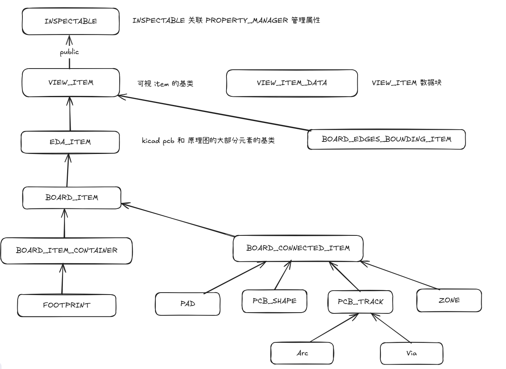
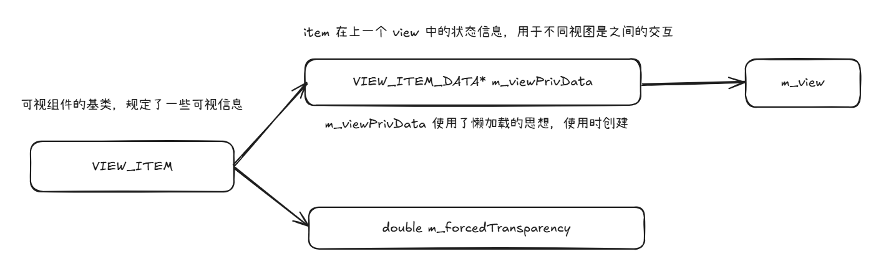
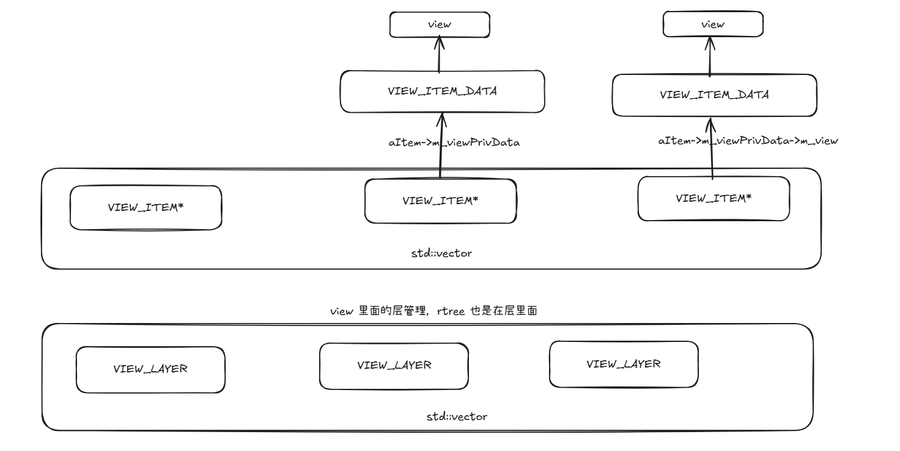
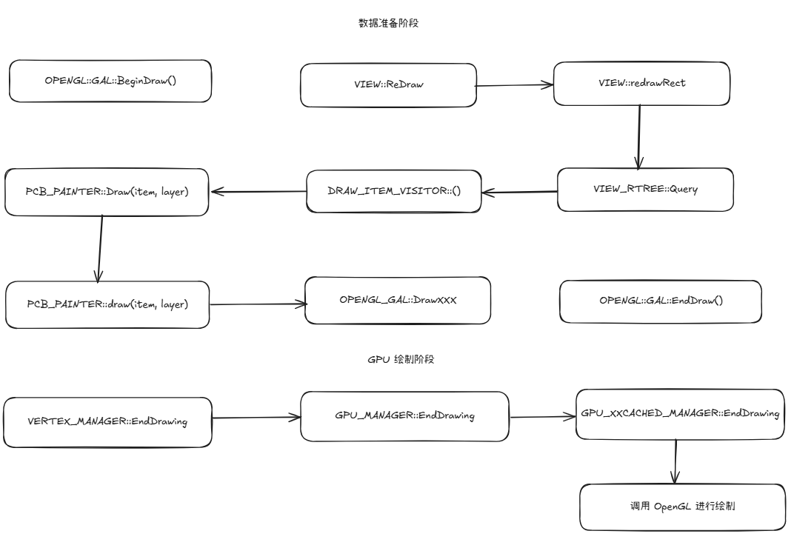
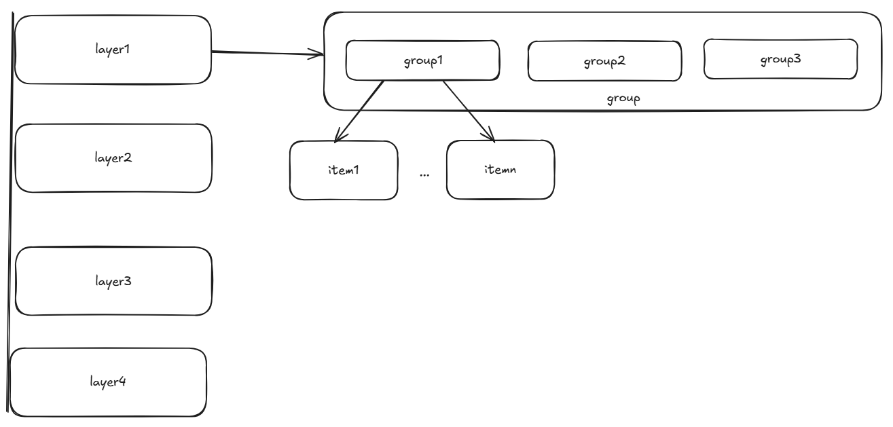
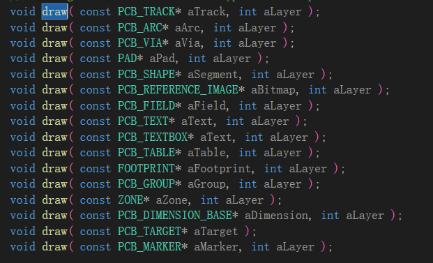
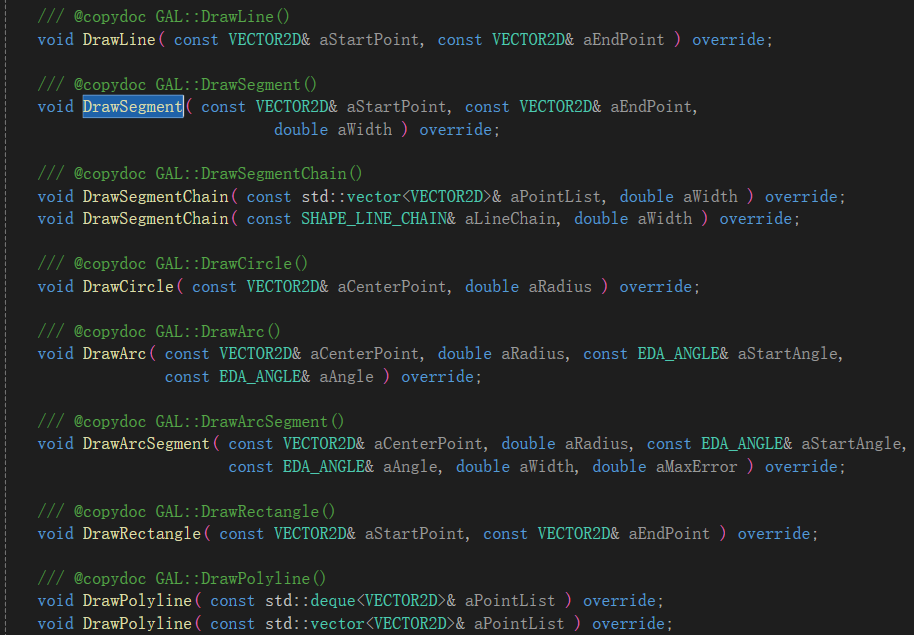

# `Kicad` 的绘制和 `PCB` 数据结构

## Kicad 中对于 rtree 的运用

在 `kicad` 中 `RTree` 主要用于绘图和规则，用于图形数据的筛选和碰撞检测

### VIEW_RTREE

`VIEW_RTREE` 是 `kicad` 绘制部分使用的 `Rtree`，主要作用是依赖传入的 box 来筛选元素，然后使用 visitor 来对筛选出的元素进行某种操作，类似下面：

```cpp
struct aaa {
	void operator()(int& x) {
		x += 100;
	}
};

template<typename T>
void xxx(T a) {
	int x = 100;
	a(x);
	std::cout << x;
}
int main(int argc, char* argv[])
{
	aaa a;
	xxx(a);
}
```

利用这种方式，让筛选出来的元素可以使用统一接口进行操作，同时也可以携带外部信息，类似下面：

```cpp
struct VIEW::UPDATE_COLOR_VISITOR
{
    UPDATE_COLOR_VISITOR( int aLayer, PAINTER* aPainter, GAL* aGal ) :
        layer( aLayer ),
        painter( aPainter ),
        gal( aGal )
    {}

    bool operator()( VIEW_ITEM* aItem )
    {
        // Obtain the color that should be used for coloring the item
        const COLOR4D color = painter->GetSettings()->GetColor( aItem, layer );
        int           group = aItem->viewPrivData()->getGroup( layer );

        if( group >= 0 )
            gal->ChangeGroupColor( group, color );

        return true;
    }

    int layer;
    PAINTER* painter;
    GAL* gal;
};
```

如上是 `VIEW` 里面针对颜色更新的 `VISITOR`，这个 `VISITOR` 携带了 `layer，painter，gal` 信息，并且提供了 `xxx(item)` 接口，调用为`UPDATE_COLOR_VISITOR visitor( aLayer, m_painter, m_gal );`

## Kicad 中的数据结构



### INSPECTABLE

INSPECTABLE 是 Kicad 中和属性管理器交互的类，Kicad 中的属性管理器是一个单例

INSPECTABLE 作用为设置属性

### VIEW_ITEM



`VIEW_ITEM : public INSPECTABLE`

VIEW_ITEM 是可以添加到 VIEW 中的所有对象的抽象基类

VIEW_ITEM 可以将几何形状，外观，可见性更新传递给其关联的 View

一个 VIEW_ITEM 不是一个 VIEW 的独有，VIEW_ITEM 是独立于 VIEW 的，一个 VIEW_ITEM 可以关联任意的 VIEW，但是 VIEW_ITEM 同一时间只能属于同一个 VIEW

同时，由于 VIEW_ITEM 在 VIEW 更新之前能够存储上一个 VIEW 的信息，所以 VIEW_ITEM 也可以用于两个 VIEW 之间一些信息的交互

VIEW_ITEM_DATA 和 VIEW_ITEM 的创建分开，时 VIEW_ITEM_DATA 的创建实现了类似懒加载的实现，一定程度上减少了内存压力

### EDA_ITEM

EDA_ITEM : public KIGFX::VIEW_ITEM

EDA_ITEM 是 kicad 中绝大多数 pcb 和 logic 的元素基类

提供了 m_flags 来表示 item 状态，m_structType 来表示 item 类型，m_forceVisible 强制绘制项目中用来忽略不可见标志

### BOARD_ITEM

BOARD_ITEM : public EDA_ITEM

所有可以加入到 Board 的类型的基类，主要使用在 pcbnew 和其他使用 Board 类的位置

在 EDA_ITEM 的基础上添加了 layer 信息，以及 group 信息

### BOARD_CONNECTED_ITEM

BOARD_CONNECTED_ITEM : public BOARD_ITEM

用于可连接且具有网络、网络名称、间隙的项目

#### PAD, PCB_SHAPE, PCB_TRACK, ZONE

PAD 类似于 ODBPad

PCB_SHAPE 类似于 ODBDraw 里面的 2D line，用于辅助作图，如丝印线，圆，多边形等等

PCB_TRACK 类似于 profile，用于上层铜皮和导线，表示电信号连接的线条

ZONE 覆铜

### BOARD_ITEM_CONTAINER

BOARD_ITEM 的抽象接口

### FOOTPRINT

类似于 ODBSymbol，包含了子对象容器，位置信息，边界缓存，电器连接等等

#### 子对象容器

| 变量                       | 作用                             |
| -------------------------- | -------------------------------- |
| PCB_FIELDS      m_fields   | 封装上的文本字段                 |
| DRAWINGS        m_drawings | 图形元素，丝印线，注释，标识框等 |
| PADS		  m_pads       | 焊盘列表                         |
| ZONES	       m_zones    | 在 footprint 中的覆铜区域        |
| GROUPS	    m_groups     | 某些绘图对象逻辑上为一组         |

#### 位置信息

| 变量         | 作用                 |
| ------------ | -------------------- |
| m_orient     | 相对于板子的旋转角度 |
| m_pos        | 所处位置             |
| m_fpid       | 在 lib 库中的编号    |
| m_attributes | 封装属性位           |
| m_fpStatus   | 自动布放的状态标志   |

#### 边界缓存

| 变量                     | 作用                               |
| ------------------------ | ---------------------------------- |
| m_cachedBoundingBox      | 封装整体边界框（含焊盘、文本）     |
| m_cachedVisibleBBox      | 可见元素边界框                     |
| m_cachedTextExcludedBBox | 不含文本的边界框（用于贴装分析等） |
| m_cachedHull             | 凸包形状（用于判定占位）           |

## Kicad 中的 VIEW



上面分别是 VIEW 中的 m_allItems 和 m_layers

其中 m_allItems 保存了 VIEW 中所有的可视 item

m_layers 中保存了每一层的可视 Item，同时 Rtree 也存在于 layer 中，VIEW 中定义的：

```cpp
struct CLEAR_LAYER_CACHE_VISITOR;
struct RECACHE_ITEM_VISITOR;
struct DRAW_ITEM_VISITOR;
struct UPDATE_COLOR_VISITOR;
struct UPDATE_DEPTH_VISITOR;
```

这几个类型就是筛选 viewport 的时候进行操作的 visitor

## Kicad 中的 Board

类似于 ObjectDatabase，Board 相当于 Kicad 中的数据库，保存了打开的 PCB 的信息

## Kicad 中的绘制流程



### 数据准备阶段

1. view 会根据 viewPort 和 layer 信息去对应的 rtree 中寻找相应的 item，然后将 item 交给 painter

    

2. 在 painter 中，item 被还原成他们对应的类型，调用对应类型的 draw



3. draw 会将信息交给对应的 GAL，这里交给的信息是图形信息



4. GAL 将图形信息转化为点集信息交给 VERTEX_MANAGER