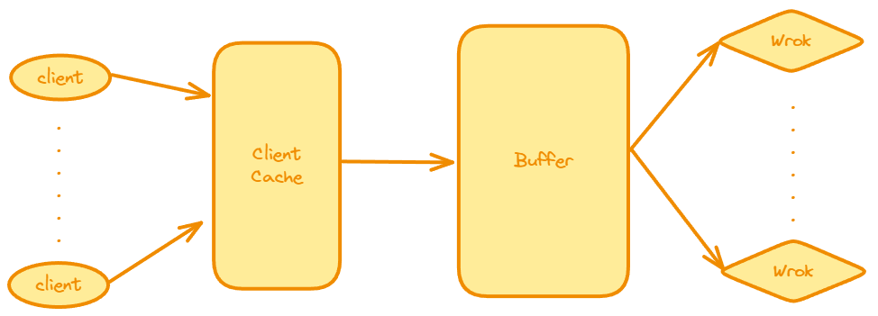

# ProxyLab



整个流程是，当浏览器请求到达主线程后，先访问 Cache 中是否由相同的请求，如果有就不用建立链接，如果没有就建立链接，然后添加到 Cache 中，然后主线程将链接任务分发到 Buffer 线程池中，委托 Work Thread 进行工作。

主要涉及：Cache，Cache 中的 LRU 替换策略，以及 client 对 Cache 访问的读写模型，Buffer 线程池分发任务的生产者消费者模型

## 读写模型

由于 Cache 中的 LRU 过于简单，所以略过

一组并发的线程要访问同一个共享对象时，将只读对象的线程叫做读者，只修改对象的进程叫做写者。写者必须拥有对对象的独占的访问，而读者可以与其它读者共享对象。该模型分为两类：

- 读优先：要求不让读者等待
- 写优先：要求在写者之后到达的读者必须等待

对于读者优先，只要有其它读者，则就应让读者先读，因此设置一个 read_cnt 记录读者数量，这个变量对于读者来说也是互斥的，所以设置一个 mutex 信号量来保护，读的过程中不允许写者写，写的过程不允许读者读，所以设置 w 来保护共享对象

```cpp
int read_cnt;
sem_t mutex, w;    //都初始化为1

void reader(void) 
{
    while(1){
        P(&mutex);
        readcnt++;
        if(readcnt==1)
            P(&w);
        V(&mutex);
        
        P(&mutex);
        readcnt--;
        if(readcnt==0)
            V(&w);
        V(&mutex);
    }
}

void writer(void)
{
	while(1){
        P(&w);
        
        ...
        
        V(&w)
    }
}
```

## 生产者消费者模型

生产者和消费者线程共享一个有 n 个槽的优先缓冲区，生产者反复地生成新的项目，并把它们插入到缓冲区中。消费者线程不断从缓冲区中取出，这些项目然后使用它们。因为插入和取出项目都涉及更新共享变量，所以我们必须保证对缓冲区地访问是互斥的，并调度对缓冲区地访问：

- 如果没有槽位：生产者必须等待
- 如果没有项目：消费者必须等待

在预线程化的服务器中，客户端就是生产者，不断产生连接；Proxy 就是消费者，不断选中客户端连接

- 其中有 3 个信号量
  - mutex 初始化为 1，保证对缓冲区的访问是互斥的
  - slots 初始化为 n，记录槽位
  - items 初始化为 0，记录项目数

插入函数：

- 首先有一个对 slots 的 P 操作，保证了如果槽位已满，则客户端被挂起，不会继续往缓冲区写入请求
- 然后是一个 mutex 的 P 操作，保证了对缓冲区互斥的访问
- 缓冲区插入完成后，释放所有的锁

取出函数：

- 首先有一个对 items 的 P 操作，保证了如果没有项目，则 Proxy 被挂起，不会继续往缓冲区读出客户端
- 然后是一个 mutex 的 P 操作，保证了对缓冲区互斥的访问
- 缓冲区读出完成后，释放所有的锁，返回其中一个客户端的描述符