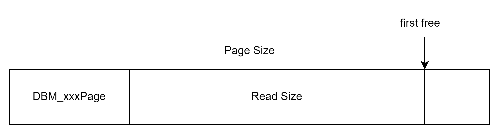
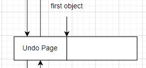
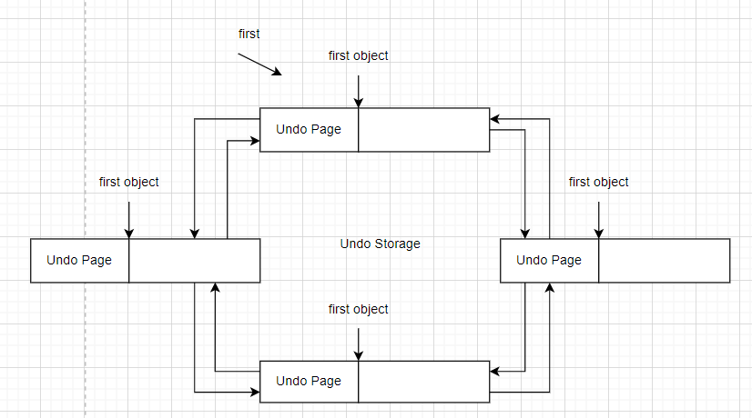

# SDB_Memory

## DBM_FixBase(绝对基类)（SDB_Memory_Inline）

所有固定大小的数据库对象的基类，在继承的时候需要放在所有类的前面，保证 dbm_flag 在内存槽最开始的地方。

定义 flags

## DBM_FlexBase（SDB_Memory_Inline）

定义：

1. 已分配的内存槽数
2. 已使用的内存槽数
3. large_used (?)

## DBM_FlexFreeSlot（SDB_Memory_Inline）

继承自 DBM_FlexBase

有三种解释：

1. 指向下一个空闲块
2. 用户数据
3. 临时的记录

## DBM_FlexTempRecord（SDB_Memory_Inline）

继承自 DBM_FlexBase

包含：

1. 数据的第一个 word
2. slot 已被使用的长度

## DBM_AddressTable（SDB_Memory.cpp）

用于二进制文件中，将二进制中的数据地址转化为内存地址

## DBM_Page（SDB_Memory_Inline）

DB 所有页的基类

链表管理页

页被相应特殊数据 controller 管理

DBM_Page 可以找到 controller

## DBM_ObjPage（SDB_Memory_Inline）

被 Object controller 使用，是链表的一个节点。

## DBM_LayerPage（SDB_Memory_Inline）

被 Layer controller 使用，是链表的一个节点。

## DBM_LayerDataPage（SDB_Memory_Inline）

被 layer data 使用，是链表的一个节点

## DBM_PageAllocator

分配内存

## DBM_PageList

相应 data page 的 list

## DBM_FreeList（SDB_Memory_Template）

空闲内存槽的 List

## DBM_FixFreeList（SDB_Memory_Template）

继承自 DBM_FreeList

固定大小的空闲内存槽的 List

## DBM_FlexFreeList（SDB_Memory_Template）

继承自 DBM_FreeList

灵活大小的空闲内存槽的 List

## DBM_FixHdrList（SDB_Memory_Template）

继承自 DBM_ObjPageList

有两个链表，一个是空闲链表，一个是已使用的链表

其他的是对 node 的一些统计

## DBM_FlexHdrList

继承自 DBM_LayerPageList

只有一个空闲链表

## DBM_FixDataList（SDB_Memory_Template）

继承自 DBM_ObjPageList

只有一个空闲链表

## DBM_FlexDataList

继承自 DBM_LayerDataPageList

有一个 DBM_FlexFreeList 作为 free list

有一个 DBM_FlexFreeList 数组作为 free table

用一个 lcc vector 用于垃圾回收

一个 DBM_LayerDataPage

## DBM_SlotInfo

m_s_ptr

m_e_ptr

## DBM_Slot（SDB_Memory.cpp）

两种解释

1. 指向下一个空闲块
2. 被引用的次数

## DBM_SlotPage（SDB_Memory.cpp）

是一个 DBR_Node 

里面是固定大小的 slot

## DBM_SlotList（SDB_Memory_Template）

也是管理固定大小的 slot

包含 used_list 和 free_list

## DBM_InterfacePtr（SDB_Memory.cpp）

interface pointer

## DBM_UndoRefCnt

对撤销记录的引用计数，只有引用到 0 时才可以删除数据库数据

data pointer

## DBM_UndoPage

undo controller 使用的 page

包括，这一页的第一个 undo object，和这一页的最后一个 undo object

## DBM_UndoStorage

管理 undo page

包括，当前是哪一页，第一个 undo object，当前的 undo object，最后一个 undo object

undo list 的最大 size

## DBM_UndoBranch

owning checkpoint

用于撤销分支

## DBM_UndoPageList

用于 undo controller

# SDB_Memory_Inline

实现了 

DBM_FixBase，DBM_FlexBase，DBM_FlexFreeSlot，DBMFlexTempRecord，

DBM_Page： 确定 controller

DBM_ObjPage，DBM_LayerPage，DBM_LayerDataPage：type，size，inpage

## SDB_Memory.cpp

实现

### DBM_AddressTable

InitAddressTable 分配 table 内存

SetAddressInTable 将旧地址作为 array index，新地址作为值

ClearAddressInTable 清除 array index 指向的值

SetAddressToSkip 将 address 设置进 address to skip

IsAddressToSkip 返回 address 对应的值

### DBM_ObjPage，DBM_LayerPage

### DBM_Slot

set free slot

### DBM_SlotPage

set and get size

### DBM_InterfacePtr

### DBM_UndoPage

### DBM_UndoStorage

### SDB_UndoBranch

### SDB_UndoPageList

# sdb_memory_dbm_pageallocator

VirtualAlloc

VirtualFree

# sdb_memory_dbm_flexdatalist

# sdb_memory_dbm_flexhdrlist

# sdb_memory_dbm_pagelist

垃圾回收

# SDB_Memory_Template

