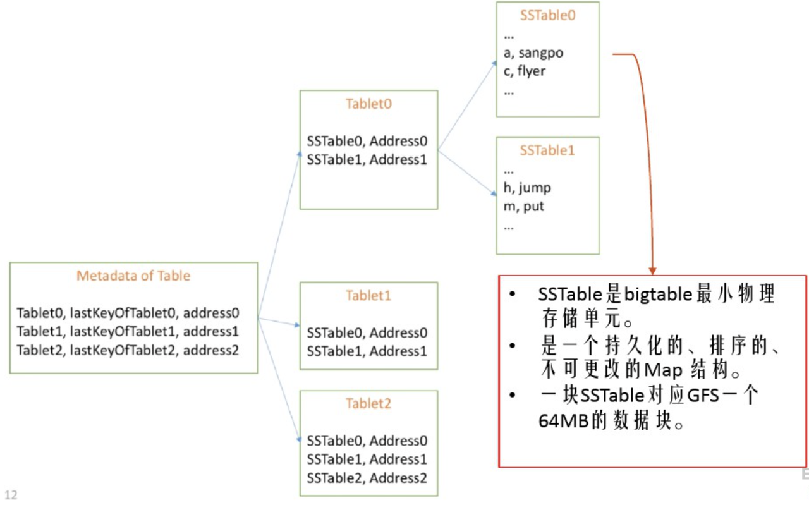

# BigTable

`BigTable` 是一个分布式存储系统，`BigTable` 不能支持完整的关系型数据模型，相反，它为客户提供了一个简单数据模型，该数据模型可以支持针对数据部署和格式的动态控制，并且可以允许用户去推理底层存储所展现的数据的位置属性(比如具有相同前缀 `key` 的数据位置很接近，读取时候可进行一定的预取来进行优化)。`BigTable` 使用行和列名称对数据进行索引，这些名称可以是任意字符串。`BigTable` 把数据视为未经解释的字符串，客户可能经常把不同格式的结构化数据和非结构化数据都序列化成字符串。最后，`BigTable` 模式参数允许用户动态地控制，是从磁盘获得数据还是从内存获得数据。

## 数据模型

BigTable是一个稀疏的、分布式的、持久化存储的多维排序Map。Map的索引是行关键字、列关键字以及时间戳；Map中的每个value都是一个未经解析的byte数组。

```go
(row:string,column:string,time:int64)->string
```

#### 行

关键字为任意长度的字符串（max 64KB）

对同一个行关键字的读写是原子的

行关键字通过字典序排列，表中的每个行都可以动态分区，每个分区叫做一个 “Tablet”，Tablet是数据分布和负载均衡调整的最小单位。这样做的结果是，当操作只读取行中很少几列的数据时效率很高，通常只需要很少几次机器间的通信即可完成。

用户可以通过选择合适的行关键字，在数据访问时有效利用数据的位置相关性，从而更好的利用这个特性。

#### 列

列关键字组成的集合叫列族

列族是访问控制的基本单位。存放在同一列族下的所有数据通常都属于同一个类型（我们可以把同一个列族下的数据压缩在一起）。列族在使用之前必须先创建，然后才能在列族中任何的列关键字下存放数据；列族创建后，其中的任何一个列关键字下都可以存放数据。根据我们的设计意图，一张表中的列族不能太多（最多几百个），并且列族在运行期间很少改变。与之相对应的，一张表可以有无限多个列。

列关键字的命名语法如下：列族：限定词。列族的名字必须是可打印的字符串，而限定词的名字可以是任意的字符串。

访问控制、磁盘和内存的使用统计都是在列族层面进行的

#### 时间戳

`BigTable` 中，表的每一个数据都可以有自己同一份数据的不同版本，不同版本按照时间戳来索引。数据项中，不同版本的数据按照时间戳倒序排序，即最新的数据排在最前面。

为了减轻多个版本数据的管理负担，`BigTable` 对每一个列族配有两个设置参数，`BigTable` 通过这两个参数可以对废弃版本的数据自动进行垃圾收集。用户可以指定只保存最后n个版本的数据，或者只保存“足够新”的版本的数据

​	

## 接口

#### 修改和删除

```cpp
// Open the table 
Table *T = OpenOrDie("/bigtable/web/webtable");
 // Write a new anchor and delete an old anchor 
RowMutation r1(T, "com.cnn.www");
r1.Set("anchor:www.c-span.org", "CNN");
r1.Delete("anchor:www.abc.com");
Operation op; 
Apply(&op, &r1);
```

#### 写入

```cpp
Scanner scanner(T);
 ScanStream *stream;
 stream = scanner.FetchColumnFamily("anchor");
 stream->SetReturnAllVersions();
 scanner.Lookup("com.cnn.www");
 for (; !stream->Done(); stream->Next()) {
     printf("%s %s %lld %s\n",
         scanner.RowName(),
         stream->ColumnName(),
         stream->MicroTimestamp(),
         stream->Value());
 }
```

## 实现


##### 第一层 Chubby File

Chubby 文件存储了 root tablet 的位置信息，如果 Chubby 服务不可用，整个服务就不可用了

##### 第二层 Root Tablet

元数据表 `METADATA Tablets` 的第一个 `Tablet`，其余 `METADATA Tablets` 每一项都是 `UserTable` 的位置信息



`METADATA Table` 存储 `Tablet` 位置信息时，`Row Key` 是通过对 `Tablet Table Identifier` 和该 `Tablet` 的 `End Row` 生成的。

每个 **`METADATA Table`** 的 **`Row Key`** 大约占用1KB的内存，一般情况下，配置 **`METADATA Table`** 的大小限制为 128MB，也就是说，三层的定位模式大约可以寻址 $2^{34}$ 个 `Tablets`。

##### 第三层

其他元数据表的 `Tablet`，这些 `Tablet` 与 `root tablet` 共同构成整个元数据表。

客户程序使用的库会缓存 `Tablet` 的位置信息。如果客户程序没有缓存某个 `Tablet` 的地址信息，或者发现它缓存的地址信息不正确，客户程序就在树状的存储结构中递归的查询 `Tablet` 位置信息；如果客户端缓存是空的，那么寻址算法需要通过三次网络来回通信寻址，这其中包括了一次Chubby 读操 作；如果客户端缓存的地址信息过期了，那么寻址算法可能需要最多６次网络来回通信才能更新数据，因为只有在缓存中没有查到数据的时候才能发现数据过期（其中的三次通信发现缓存过期，另外三次更新缓存数据）(假设 `METADATA` 的 `Tablet` 没有被频繁的移动）。尽管 `Tablet` 的地址信息是存放在内存里的，对它的操作不必访问 `GFS` 文件系统，但是，通常我们 会通过预取 `Tablet` 地址来进一步的减少访问的开销：每次需要从`METADATA` 表中读取一个 `Tablet` 的元数据的时候，它都会多读取几个 `Tablet` 的元数据。

#### 分配

在任何一个时刻，一个Tablet只能分配给一个 Tablet 服务器。

Master 服务器记录了当前有哪些活跃的 Tablet 服务器、哪些 Tablet 分配给了哪些Tablet服务器、哪些 Tablet 还没有被分配。当一个 Tablet 还没有被分配、并且刚好有一个 Tablet 服务器有足够的空闲空间装载该 Tablet 时，Master 服务器会给这个 Tablet 服务器发送一个装载请求，把 Tablet 分配给这个服务器。

##### 当一个 Tablet 服务器启动流程：

在 Chubby 的一个指定目录下建立一个唯一的文件，并且获取该文件的独占锁。

##### Master 如何管理 Tablet 服务器

Master 服务器实时监控着这个目录（服务器目录），因此 Master 服务器能够知道有新的 Tablet 服务器加入了。当 Tablet 服务器终止时（比如，集群的管理系统将该 Tablet 服务器的主机从集群中移除），它会尝试释放它持有的文件锁，这样一来，Master 服务器就能尽快把 Tablet 分配到其它的Tablet 服务器。

##### Tablet 服务器如何工作？

如果 Tablet 服务器丢失了 Chubby 上的独占锁——比如，由于网络断开导致 Tablet 服务器和 Chubby 的会话丢失——它就停止对 Tablet 提供服务。（Chubby 提供了一种高效的机制，利用这种机制，Tablet 服务器能够在不增加网络负担的情况下知道它是否还持有锁）。

只要文件还存在，Tablet 服务器就会试图重新获得对该文件的独占锁；如果文件不存在了，那么 Tablet 服务器就不能再提供服务了，它会自行退出。此时 Master 服务器将会把 Tablet 迁移。

##### Master 如何管理 Tablet 服务器

Master 服务器负责检查一个 Tablet 服务器是否已经不再为它的 Tablet 提供服务了，并且要尽快重新分配它加载的 Tablet(给其它 Tablet 服务器)。

Master 服务器通过轮询 Tablet 服务器文件锁的状态来检测何时 Tablet 服务器不再为 Tablet 提供服务。如果一个 Tablet 服务器报告它丢失了文件锁，或者 Master 服务器最近几次尝试和它通信都没有得到响应，Master 服务器就会尝试获取该 Tablet 服务器文件的独占锁；如果 Master 服务器成功获取了独占锁，那么就说明 Chubby 是正常运行的，而 Tablet 服务器要么是宕机了、要么是不能和 Chubby 通信了，因此，Master 服务器就删除该Tablet 服务器在 Chubby 上的服务器文件以确保它不再给 Tablet 提供服务。

一旦 Tablet 服务器在 Chubby 上的服务器文件被删除了，Master 服务器就把之前分配给它的所有的 Tablet 放入未分配的 Tablet 集合中。为了确保BigTable 集群在 Master 服务器和 Chubby 之间网络出现故障的时候仍然可以使用，Master 服务器在它的 Chubby 会话过期后主动退出。但是不管怎样，如同我们前面所描述的，Master 服务器的故障不会改变现有 Tablet 在 Tablet 服务器上的分配状态。

##### Master 服务器启动过程

当集群管理系统启动了一个 Master 服务器之后，Master 服务器首先要了解当前Tablet的分配状态，之后才能够修改分配状态。Master服务器在启动的时候执行以下步骤：

（1）Master服务器从Chubby获取一个唯一的Master锁，用来阻止创建其它的Master服务器实例；（2）Master服务器扫描Chubby的服务器文件锁存储目录，获取当前正在运行的服务器列表；

（3）Master服务器和所有的正在运行的Tablet服务器通信，获取每个Tablet服务器上Tablet的分配信息；

（4）Master服务器扫描METADATA表获取所有的Tablet的集合。在扫描的过程中，当Master服务器发现了一个还没有分配的Tablet，Master服务器就将这个Tablet加入未分配的Tablet集合并等待合适的时机分配。

可能会遇到一种复杂的情况：在METADATA表的Tablet还没有被分配之前是不能够扫描它的。因此，在开始扫描之前（步骤4），如果在第三步的扫描过程中发现Root Tablet还没有分配，Master服务器就把Root Tablet加入到未分配的Tablet集合。这个附加操作确保了Root Tablet会被分配。由于Root Tablet包括了所有METADATA的Tablet的名字，因此Master服务器扫描完Root Tablet以后，就得到了所有的METADATA表的Tablet的名字了。

保存现有Tablet的集合只有在以下事件发生时才会改变：建立了一个新表或者删除了一个旧表、两个Tablet被合并了、或者一个Tablet被分割成两个小的Tablet。Master服务器可以跟踪记录所有这些事件，因为除了最后一个事件外的两个事件都是由它启动的。

Tablet 分割事件需要特殊处理，因为它是由 Tablet 服务器启动。在分割操作完成之后，Tablet 服务器通过在 METADATA 表中记录新的 Tablet 的信息来提交这个操作；当分割操作提交之后，Tablet 服务器会通知 Master 服务器。如果分割操作已提交的信息没有通知到 Master 服务器（可能两个服务器中有一个宕机了），Master 服务器在要求 Tablet 服务器装载已经被分割的子表的时候会发现一个新的 Tablet。通过对比 METADATA 表中 Tablet 的信息，Tablet 服务器会发现 Master 服务器要求其装载的 Tablet 并不完整，因此，Tablet 服务器会重新向 Master 服务器发送通知信息。

#### 服务

一个tablet的持久化状态是存储在GFS中的，如图5所示。更新被提交到一个提交日志，日志中记录了redo记录。在这些更新当中，最近提交的更新被存放到内存当中的一个被称为 memtable 的排序缓冲区，比较老的更新被存储在一系列 SSTable 中。为了恢复一个 tablet，tablet 服务器从METADATA 表当中读取这个 tablet 的元数据。这个元数据包含了 SSTable 列表，其中每个 SSTable 都包括一个 tablet 和一个重做点（redo point）的集合，这些 redo point 是一些指针，它们指向那些可能包含tablet所需数据的重做日志。服务器把SSTable索引读入内存，执行重做点以后的所有已经提交的更新来重新构建memtable。

当一个写操作到达tablet服务器时，服务器首先检查它定义是否良好，并且发送者是否被授权执行该变更。执行授权检查时，会从一个Chubby文件中读取具有访问权限的写入者的列表，这个Chubby文件通常总能够在Chubby客户端缓存中找到。一个有效的变更会被写入提交日志中。分组提交是为了优化许多小变更[13,16]操作的吞吐量。在写操作已经被提交以后，它的内容就会被插入到memtable。

当一个读操作到达Tablet服务器，与写操作类似，服务器也会首先检查它是否是良好定义和得到授权的。一个有效地读操作是在一系列SSTable和memtable的合并的视图上执行的。由于SSTable和memtable是字典排序的数据结构，视图合并的执行效率很高。

当tablet发生合并或分割操作时，正在到达的读写操作仍然可以继续进行。

#### 压缩

随着写操作的执行，memtable的大小逐渐增加。当memtable的大小到达一个阈值的时候，memtable就会被冻结然后创建一个新的memtable，被冻结的memtable就转化成一个SSTable并被写入到GFS。这个*小压缩（minor compaction）*过程有两个目标：它缩小了tablet服务器的内存使用率；当发生服务器宕机需要恢复时可以减少了需要从重做日志中读取的数据量。当压缩过程正在进行时，正在到达的读写操作仍然可以继续进行。

每一次小压缩都会创建一个新的SSTable，如果这种行为没有约束地持续进行，读操作可能需要从任意数量的SSTable中合并更新。相反，我们会对这种文件的数量进行限制，我们在后台周期性地运行一个合并压缩程序。一个合并压缩程序从一些SSTable和memtable中读取内容，并且写出一个新的SSTable。一旦压缩过程完成，这个输入的SSTable和memtable就可以被删除。

一个合并压缩程序，把所有的SSTable的数据重写到一个SSTable，这个合并压缩被称为“主压缩”（major compaction）。非主压缩所产生的SSTable可以包含特殊的删除入口（entry），它把被删除的数据压缩在仍然存活的比较老的SSTable当中。另一方面，一个主压缩过程，产生一个不包含删除信息或被删除的数据的SSTable。BigTable定期检查它的所有tablet，并执行主压缩操作。这些主压缩过程可以允许BigTable收回被删除数据占用的资源，并且保证被删除数据在一定时间内就可以及时的从系统中消失，这对于一些存储敏感数据的服务来说是非常重要的。

## 优化

#### 局域性群组

客户端可以把多个列族一起分组到一个 locality group 中。我们会为每个 tablet 中的每个 locality group 都生成一个单独的 SSTable。把那些通常不会被一起访问的列族分割在不同的 locality group，可以实现更高效的读。

另外，可以针对每个locality group来指定一些有用的参数。这个特性对于那些被频繁访问的小量数据来说是非常有用的：我们在内部使用其获取METADATA表的列族位置。

#### 压缩

客户端可以控制是否对相应于某个locality group的SSTable进行压缩，如果压缩，应该采用什么格式。

#### 读缓存

为了读操作的性能，tablet服务器使用双层缓存。扫描缓存是高层缓存，它缓存了tablet服务器代码使用SSTable接口获取的key-value对；块缓存是底层缓存，它缓存了从GFS上读取的SSTables块。

扫描缓存主要用于倾向重复访问相同数据的应用。块缓存主要用于倾向读取近期数据附近数据的应用

#### Bloom Filter

利用 Bloom Filter 降低访问次数
