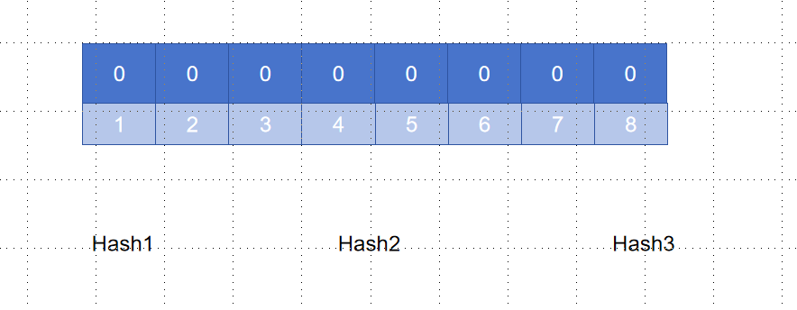
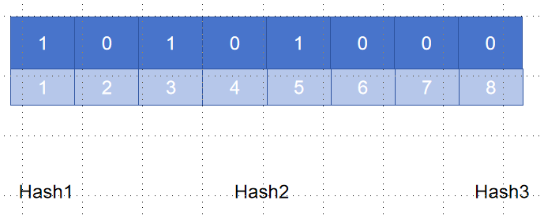
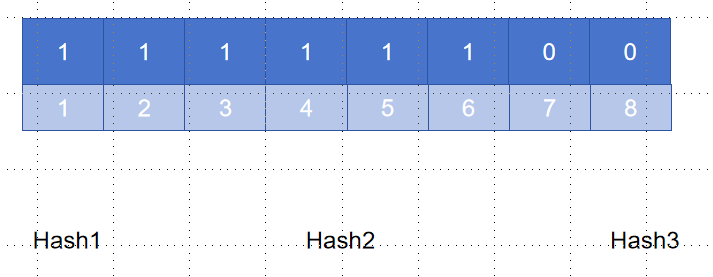
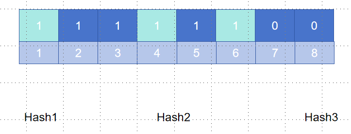

# Bloom Filter

LSM-tree 的一种优化方案，本质上布隆过滤器是一种数据结构，比较巧妙的概率型数据结构（probabilistic data structure），特点是高效地插入和查询，可以用来告诉你 **某样东西一定不存在或者可能存在**。

## 实现原理

Bloom Filter 本质上是一个 bit 数组，这里我们假设的是八位的 bit 数组，然后是三个 hash 函数

将一个值映射到 bit 数组时，我们需要使用这三个不同的 hash 产生不同的 hash 值，假如我们现在插入一个数据 128，它通过三个 hash 函数得到的三个值分别是 1 3 5，那么我们将 1 3 5 置 1，得到的 bit 数组如下图所示

然后我们再插入一个值 256，它通过三个 hash 函数得到的三个值分别是 2 4 6，我们将 2 4 6 置 1，得到的 bit 数组如下图所示

这个时候，如果我们再插入一个数 255， 它通过三个 hash 函数得到的值是 1 4 6，得到的 bit 数组如下图所示

我们可以发现，255 的位置上，本来的位已经被置为 1 了，如果像普通的 hash 函数一样，就会判定这个值已经存在，但是这不是我们希望的结果，所以 Bloom Filter 只能判断这个数可能存在或者不存在，不能判断这个数一定存在，就像我们刚刚的例子一样，如果我们直接查询 255，那么我们希望得到的结果是它可能存在，因为它本身不在我们的数据中，但是如果一个数它的 hash 值中有第 7 位或者第 8 位这样还是 0 的，我们就可以判断它一定不在我们的数据中。

## 如何选择 hash 函数的个数和 Bloom Filter 的长度

我们假设 `k` 为哈希函数个数，`m` 为布隆过滤器长度，`n` 为插入的元素个数，`p` 为误报率

对于一个 hash 函数，某一位被置为 1 的可能为 $\frac{1}{m}$，没有被置为 1 的可能为 $1-\frac{1}{m}$那么 k 个 hash 函数都没被置为 1 的可能为 $(1-\frac{1}{m})^k$，插入 n 个数后仍然没有被置为 1 的概率为 $(1-\frac{1}{m})^{nk}$，如果一个数据没有在我们的数据库中但是被一个 hash 函数判定为 1 的可能性为 $1-(1-\frac{1}{m})^{nk}$，那么 k 个 hash 函数同时误判的可能性为 $(1-(1-\frac{1}{m})^{nk})^k$。
$$
(1-(1-\frac{1}{m})^{nk})^k \approx (1-e^{-kn/m})k
$$

## Counting Bloom Filter

支持删除操作的特殊的 Bloom Filter

修改 bit array 为一个计数器，然后插入的时候将计数器加一，删除的时候减一，但是要注意计数器 `max number` 的选择，过小会有可能导致误判，过多可能导致资源浪费 