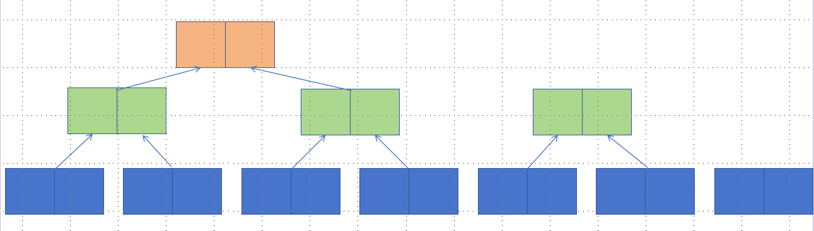

# LSM

#### 就地更新和非就地更新

就地更新指的是在原有数据的基础上进行修改，而不需要额外的空间来存储结果。在就地更新中，修改操作直接作用于原始数据，原始数据被更新为新的值。这种更新方式通常具有较低的空间复杂度，因为不需要额外的存储空间。然而，就地更新可能会改变原始数据，因此需要谨慎处理，确保不会对其他依赖该数据的部分产生意外的影响。

非就地更新指的是在进行修改操作时，创建一个新的数据副本，将修改后的结果存储在副本中，而原始数据保持不变。这种更新方式通常需要额外的空间来存储结果，因此会有较高的空间复杂度。非就地更新的优点是原始数据不会被修改，可以保留数据的完整性，适用于对原始数据的保护或需要同时保留多个版本的情况。

#### 顺序 I/O 和随机 I/O

随机IO就是读写的内容分散在磁盘的不同位置,需要来回查找所以效率低;

顺序IO就是读写的内容集中存储在磁盘的一块，从前到后依次读取，免去了查找的过程，所以效率高。

## LSM 组成

#### `memtable`

`MemTable` 是在**内存**中的数据结构，用于保存最近更新的数据，会按照 `Key` 有序地组织这些数据，`LSM` 树对于具体如何组织有序地组织数据并没有明确的数据结构定义。

因为数据暂时保存在内存中，内存并不是可靠存储，如果断电会丢失数据，因此通常会通过 `WAL` (Write-ahead logging，预写式日志)的方式来保证数据的可靠性。

#### `immutable memtable`

当 `MemTable` 达到一定大小后，会转化成 `Immutable MemTable`。`Immutable MemTable` 是将转 `MemTable` 变为 `SSTable` 的一种中间状态。写操作由新的 `MemTable` 处理，在转存过程中不阻塞数据更新操作。

#### `SStable`

**有序键值对**集合，是LSM树组在**磁盘**中的数据结构。为了加快 `SSTable` 的读取，可以通过建立 `key` 的索引以及布隆过滤器来加快 `key` 的查找。

#### 特点

`SSTable` 将所有的数据插入，修改，删除等操作记录保存到内存中，当记录达到设定的值的时候，再批量的顺序写入到磁盘中，这样的设计是为了顺序写，并且不用修改之前的 `SSTable` 的 `key`，保证了顺序写

但同时也有一些问题：

1. 不断的修改使我们只需要最新修改的那条信息，那么之前的信息就冗余了，但是它仍然占用了存储空间，所以我们需要对它进行 `Compact` 操作消除冗余
2. 读取时需要从最新的开始顺序查询，直到找到记录，最坏的情况我们需要遍历所有的 `SSTable` 才能找到某条信息

## Compact

`Compact` 将多个 `SSTable` 合并成一共，然后将无用的数据清除掉，合并的新文件也根据 `key` 排序的

### Size-Tiered Compaction Strategy(STCS)

当 `immutable memtable` 逐步写入到 `SSTable` 中的时候，如果 `small SSTable` 达到一定的阈值，就合并成一共 `middle SSTable`，如果 `middle SSTable` 到达一定的阈值时，合并成一个 `big SSTable`，以此类推

总的来说，STCS 就是将 `SSTable` 按大小分类，相似大小的 `Table` 分在同一类，然后将多个同类的 `SSTable` 合并到下一个类别。

STCS 能有效的减少 `SSTable` 的数量，同一份数据在 `Compact` 期间拷贝的次数比较小（写入放大较小），但是它有很大的缺陷，空间放大，还有很大的读放大

##### 空间放大

空间放大指在 `Compact` 的过程中，数据膨胀，需要大量的额外空间

我们假设所有的操作都是插入一个新数，我们假设，`SSTable` 每 2 个会触发一次 `Compact`，`Memtable` 的大小也是 2，假如我们插入 8 个数

最后得到的 `SSTable`， 几次 `Compact` 中我们需要一共 24 个块来保存数，最多同时存在 16 个数据块，大大超过了原有数据所占空间，导致了空间放大

实际情况中，还有许多原因导致数据膨胀，比如某个 `SSTable` 中的某个数据是读操作，这个文件还被引用，也不能立即删除，所以在 `Compact` 过程中，新老文件共存，产生临时空间放大，这就使得系统不得不使用比实际数据更大的磁盘空间来保证 `Compact` 顺利执行，产生昂贵的代价。

同时，如果我们每次 `memtable` 的数据都是一样的

此时，我们对于同样的数据，有三个不同的副本，并且不能进行 `Compact`，这就导致了大量的空间被浪费，所以对于覆盖写较少的场景，STCS 的空间放大尚可接受；但是对于覆盖写频繁的场景，STCS 便不再是一个很好的选择。

### Leveled Compaction Strategy(LCS)

##### 特点：

`SSTable` 的大小可控，所有的 `SSTable` 的大小都是一样的

LCS 在合并的时候，保证除了 Level 0 (L0) 之外的其他 Level 有序且无覆盖

LCS除了 L0 之外，每层文件的总大小成指数增长，L1 是 10 个，L2 是 100 个， L3 是 1000 个

LCS 的工作原理如下图所示：

内存中 `memtable` 转到 L0 中，然后 L0 达到一定阈值之后，将 L0 的所有文件和与 L1 有覆盖的文件进行合并，然后生成新文件（如果文件大小超过阈值，会切成多个）到 L1，L1 中的文件时全局有序的，不会出现重叠的情况；

当 L1 的文件数量达到阈值时，会选取 L1 中的一个 `SSTable` 与 L2 中的多个文件做合并，假设 L1 有 10 个文件，那么一个文件便占 L1 数据量的 1/10，假设每层包含的 key 范围相同，那么 L1 中的一个文件理论上会覆盖 L2 层的 10 个文件，因此会选取 L1 中的一个文件与 L2 中的 10 个文件一起 Compact，将生成的新文件放到 L2；

当 L2 文件数量达到阈值时，处理方式同上，如此往复。

##### 如何解决空间放大问题：

1. LCS 不会像 STCS 一样，有明显的临时磁盘占用问题，由于 LCS 中的 `SSTable` 的大小是固定的，不会产生超大文件，并且层与层之间只会调用 11 个 `SSTable`，临时空间很小
2. LCS 不会被重复数据困扰，每一个 `SSTable` 都是有序的，所以每一层 `SSTable` 不会有重复数据出现。

##### 读放大

读放大指的是，读取一次数据，会产生多次 `io`，`io` 次数即为读放大（注：这里是以 `io` 次数来做的定义，有些文章是以数据量放大倍数来定义，笔者觉得应该将两者结合起来定义更准确）。对于 STCS 来说，由于每层内的 `SSTable` 数据可以相互重叠，因此最坏情况下，需要遍历层内所有 `SSTable` 才能获取。而对于 LCS 来说，如果数据确定在某层（除 L0）的话，只需要定位到数据所在的 `SSTable`，只访问一个 `SSTable` 即可，所以理论上来讲，LCS 的读放大要比 STCS 好得多。

##### 写入放大

写入放大指的是实际写入的物理数据量是写入数据量的多倍。

LCS 虽然解决了空间放大，但是也引入了另一个问题 -- **写入放大**

如果一个数据要被写入到 L4 的话，就会被写入 6 次，分别是 L0，L1，L2，L3，L4，WAL

#### 并发控制和恢复
### Hybrid

Tiered 和 Leveled 混合的方式。很多系统使用两者混合的方式以取得读写放大、空间放大之间进一步的权衡

#### Time Series

- 索引 key 和写入时间相关
- 数据按照时间顺序写入，只有少量数据不遵守这个顺序
- 数据只能通过 TTL(Time to Live 是指存储在数据库中的数据记录或文档的生存时间。TTL是一种在数据库中设置的过期时间，用于控制数据在数据库中的有效期限) 或者删除整个 partition(分区是一种将大型数据库表或索引分割成更小、更可管理的部分的技术。通过将数据分布在多个分区中，可以提高查询性能、简化数据维护和管理，并支持更高的可伸缩性) 来删除
- 数据写入的速度几乎是恒定的
- 数据查询通常是在一个特定的 partition 中的，例如 "values from the last hour/day/week"

#### Rocksdb

Rocksdb 的 Leveled Compaction实现实际上是结合了 Tiered，level0 是 Tiered 的实现方式，除 Level0 层外其它都是 leveled。level0 的每个 run 由一次 flush memtables 得来，多个run 之间范围有交叠，其它 Levels 由多个 Sstables 组成一个有序的 run。这种结合方式的好处一是减小了写入放大，二是可以在写入负载较高时快速释放 memtable 以缓解内存的压力。Leveled 是 Rocksdb 默认的 Compaction 方式。

##### Tiered(Universal)

tiered在最大层维护全量的N份副本会带来N倍的空间放大，rocksdb增加了参数来限制最差的空间放大，最多只允许最大层有K个runs，K的范围是2～N。

tiered在rocksdb中是依赖Universal Compaction来实现的，用户使用leveled无法应对高写入的速率时可以尝试使用Universal Style。

##### Leveled-n

Leveled-n 是 Leveled 优化了写放大的实现方式，允许每层有多个有序的 runs，Compaction 时 merge L-1 层的所有 runs 和 Ln的一个sort run，Dostoevsky中提出的 lazying compaction 也是类似的思想，本质上是通过调整最大层 run 的数量和相邻 Level 的 size 比 T 来平衡读写放大和空间放大。

## 挑战

compaction 过程中对 io/cpu 资源的消耗

compaction 完成时造成批量的 Cache 失效。

另外一个在 LSM-Tree这种结构下存在的比较棘手的问题是需要 delete 的记录不能立刻被消除，要消除的记录可能会存在每一层，需要通过全量的 Compaction 才能消除，这对资源是非常大的消耗。

### 资源消耗

任务运行时的压缩/解压缩、拷贝、Compare 消耗 cpu 资源，读写数据消耗i/o资源。

### Cache 失效

Compaction 完成生效时旧数据文件失效，Cache 中的数据同样也会失效，Compaction 任务越大数据越热，Cache 失效越严重。Cache miss率升高引起大量的读 i/o，读 i/o 请求与Compaction 任务执行时读文件请求之间进一步争抢资源，加剧读性能的降低。

### delete entries

- 在 LSM-Tree中，delete/update 都是写一条新的记录，delete 记录一般使用一位 flag 来区分，delete 记录堆积会带来更多的空间放大和写放大，更为严重的是在 range delete 场景下，读性能会受到很大影响。而目前系统消除 delete 的方式需要触发全量的 Compaction，带来过多的资源消耗，这是一种非常贵的解决方式。Rocksdb 实现了根据 delete 记录的分布来挑选文件来合并的优化方式，以达到消除 delete 和相关记录的目的，这样可以避免一些多余的数据合并，是一种优化手段，但是对于 delete 广泛分布在各个文件中的情况依然无法避免全量的 Compaction。
- 对统计信息的影响，如果是用在关系型数据库中，例如 myrocks，会导致统计信息不准影响 sql 优化器的决策。
- Lethe 论文中还提到带来侵犯隐私的风险，用户要求删除的数据没有在一定时间内物理删除，甚至在用户注销后数据还存在，会引起法律风险。

## 优化

#### 写入放大

##### WriteBuffer(WB)-tree

通过 Hash 分片来限制每个 SSTable 文件拥有大小相同的数据，以此来均衡用户 workload

将每一层的 SSTable 文件组（Tiering 会将每一层 key 范围相近的 SSTable 作为一个文件组，用作下次的合并） 组织成一个 B±tree 的形态，并且能够根据 B±tree 的数据量（节点个数）来动态调整 level 的层数。

- 其中每一个 SSTable 文件组 都会被当作一个 B±tree 中的结点，当非叶子结点的文件组满了之后会触发合并，并将生成的 SSTable 文件组作为当前结点的子节点。
- 当叶子结点的文件组满了之后进行合并，会生成一个 key 的范围包含多个 SSTable 文件，将这一些文件按照范围拆分为两个 SSTable 文件组，从而形成两个叶子结点。

##### Light-weight compaction(LWC)-tree

SSTable 的大小不固定，根据下一个 level 的重叠度决定

如果数据太多，那么合并的 SSTable 的 key 范围减少，相邻的 SSTable 的 key 的范围会增大

#### 合并跳过

Skip-tree 提到，如果现在的数据在第 k 层，而 k + 1 到 k + N - 1 都没有相同的 key，直到 k + N 层才有，此时我们可以直接将 k 层的数据和 k + N 层合并，可以通过 Bloom Filter 来检查中间级别。

#### 数据偏斜场景

TRIAD 减少了一些不均匀数据分布中需要频繁更新热键的写入放大

## 分布式 KV Store 的 Compaction 管理

### Smart Cache

按照key range增量地填充并淘汰对应key range的旧数据，这样不会造成大批量的原本在caceh中的数据被淘汰。对于请求的数据，要么落在旧的cache中，要么落在新填充的cache中，很小的概率是属于刚被淘汰而还未被填充的数据范围。因此这种方式效果测试很好，几乎没有cache miss。

分布式场景下可以从外部方式来解决compaction带来的问题，这是单机系统做不到的，像smart cache这种解决方式，在单机中无法同时在内存中保存新旧两份数据，避免不了性能的抖动，而在分布式场景下，利用远程的内存保存新的数据并一点点地替换掉本地的cache，而compaction前后的数据对于读请求返回的是一致的结果，因此这种方式可以保证正确性，也达到了很好的效果。

