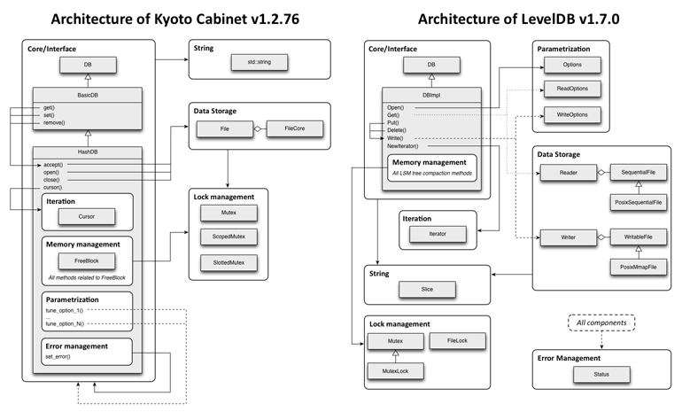

# LevelDB



## 基本组件

#### 字节序

- 将低序字节存储在起始地址，称为小端；
- 将高序字节存储在起始地址，称为大端；

LevelDB 采用小端

#### Slice

查询一个区间的数据

主要操作为拷贝构造函数

```cpp
class LEVELDB_EXPORT Slice {
 public:
  Slice() : data_(""), size_(0) {}
  Slice(const char* d, size_t n) : data_(d), size_(n) {}
  Slice(const std::string& s) : data_(s.data()), size_(s.size()) {}
  Slice(const char* s) : data_(s), size_(strlen(s)) {}
  Slice(const Slice&) = default;
  Slice& operator=(const Slice&) = default;
  const char* data() const { return data_; }
  size_t size() const { return size_; }
  bool empty() const { return size_ == 0; }

  // Return the ith byte in the referenced data.
  // REQUIRES: n < size()
  char operator[](size_t n) const;

  // Drop the first "n" bytes from this slice.
  void remove_prefix(size_t n);

  int compare(const Slice& b) const;

  // Return true iff "x" is a prefix of "*this"
  bool starts_with(const Slice& x) const {
    return ((size_ >= x.size_) && (memcmp(data_, x.data_, x.size_) == 0));
  }

 private:
  const char* data_;
  size_t size_;
};
```

成员变量：`data_`（数据地址），`size_`（数据长度）

成员函数：`remove_prefix`，`start_with`，`compare`

`remove_prefix`，将前 `n bytes` 的数据从 `slice` 中移除

`start_with`，判断 `x` 是否是 `slice` 的前缀

`compare`，判断两个 `slice` 是否相同以及或者谁是谁的前缀

#### Status

用于记录 LevelDB 中状态信息，保存错误码和对应的字符串错误信息(不过不支持自定义)。


##### code

```cpp
enum Code {
    kOk = 0,
    kNotFound = 1,
    kCorruption = 2,
    kNotSupported = 3,
    kInvalidArgument = 4,
    kIOError = 5
};
```

#### 编码

LevelDB 中分为定长和变长编码，其中变长编码目的是为了减少空间占用。其基本思想是：每一个 Byte 最高位 bit 用 0/1 表示该整数是否结束，用剩余 7bit 表示实际的数值，在 protobuf 中被广泛使用。


#### Option

```cpp
struct LEVELDB_EXPORT Options {
  Options();
  const Comparator* comparator;
  bool create_if_missing = false;
  bool error_if_exists = false;
  bool paranoid_checks = false;
  Env* env;
  Logger* info_log = nullptr;
  size_t write_buffer_size = 4 * 1024 * 1024;
  int max_open_files = 1000;
  Cache* block_cache = nullptr;
  size_t block_size = 4 * 1024;
  int block_restart_interval = 16;
  size_t max_file_size = 2 * 1024 * 1024;
  CompressionType compression = kSnappyCompression;
  int zstd_compression_level = 1;
  bool reuse_logs = false;
  const FilterPolicy* filter_policy = nullptr;
};

struct LEVELDB_EXPORT ReadOptions {
  bool verify_checksums = false;
  bool fill_cache = true;
  const Snapshot* snapshot = nullptr;
};

struct LEVELDB_EXPORT WriteOptions {
  WriteOptions() = default;
  bool sync = false;
};

}  // namespace leveldb
```

##### Option 通用

1. `Comparator`：被用来表中key比较，默认是字典序

2. `create_if_missing`：打开数据库，如果数据库不存在，是否创建新的

3. `error_if_exists`：打开数据库，如果数据库存在，是否抛出错误

4. `paranoid_checks`：如果为 true，则实现将对其正在处理的数据进行积极检查，如果检测到任何错误，则会提前停止。 这可能会产生不可预见的后果：例如，一个数据库条目的损坏可能导致大量条目变得不可读或整个数据库变得无法打开。

5. `env`：封装了平台相关接口

6. `info_log`：db 日志句柄

7. `write_buffer_size`：memtable 的大小(默认 4mb)

   - 值大有利于性能提升

   - 但是内存可能会存在两份，太大需要注意oom

   - 过大刷盘之后，不利于数据恢复

8. `max_open_files`：允许打开的最大文件数

9. `block_cache`：block 的缓存

10. `block_size`：每个 block 的数据包大小(未压缩)，默认是 4k

11. `block_restart_interval`：block 中记录完整 key 的间隔

12. `max_file_size`：生成新文件的阈值(对于性能较好的文件系统可以调大该阈值，但会增加数据恢复的时间)，默认 2k

13. `compression`：数据压缩类型，默认是 kSnappyCompression，压缩速度快

14. `reuse_logs`：是否复用之前的 MANIFES 和 log files

15. `filter_policy`：block 块中的过滤策略，支持布隆过滤器

##### Read Option

1. `verify_checknums`：是否对从磁盘读取的数据进行校验
2. `fill_cache`：读取到block数据，是否加入到cache中
3. `snapshot`：记录的是当前的快照

##### Write Option

`sync`：是否同步刷盘，也就是调用完 write 之后是否需要显式 fsync

##### Configs

1. `kNumLevels`：磁盘上最大的 level 个数，默认为 7
2. `kL0_CompactionTrigger`：第 0 层 SSTable 个数到达这个阈值时触发压缩，默认值为 4
3. `kL0_SlowdownWritesTrigger`：第 0 层 SSTable 到达这个阈值时，延迟写入 1ms，将 CPU 尽可能的移交给压缩线程，默认值为 8
4. `kL0_StopWritesTrigger`：第 0 层 SSTable 到达这个阈值时将会停止写，等到压缩结束，默认值为 12
5. `kMaxMemCompactLevel`：新压缩产生的 SSTable 允许最多推送至几层(目标层不允许重叠)，默认为 2
6. `kReadBytesPeriod`：在数据迭代的过程中，也会检查是否满足压缩条件，该参数控制读取的最大字节数
7. `MaxBytesForLevel` 函数：每一层容量大小为上一层的 10 倍
8. `MaxGrandParentOverlapBytes`：$level - n$ 和 $leveldb-n+2$ 之间重叠的字节数，默认大小为 $10*max_file_size$

#### SkipList

LevelDB 的线段跳表

```cpp
template <typename Key, class Comparator>
class SkipList {
 private:
  struct Node;
 public:
  
   private:
    const SkipList* list_;
    Node* node_;
    // Intentionally copyable
  };

 private:
  enum { kMaxHeight = 12 };

  inline int GetMaxHeight() const {
    return max_height_.load(std::memory_order_relaxed);
  }

  Node* NewNode(const Key& key, int height);
  int RandomHeight();
  bool Equal(const Key& a, const Key& b) const { return (compare_(a, b) == 0); }

  // Return true if key is greater than the data stored in "n"
  bool KeyIsAfterNode(const Key& key, Node* n) const;

  // Return the earliest node that comes at or after key.
  // Return nullptr if there is no such node.
  //
  // If prev is non-null, fills prev[level] with pointer to previous
  // node at "level" for every level in [0..max_height_-1].
  Node* FindGreaterOrEqual(const Key& key, Node** prev) const;

  // Return the latest node with a key < key.
  // Return head_ if there is no such node.
  Node* FindLessThan(const Key& key) const;

  // Return the last node in the list.
  // Return head_ if list is empty.
  Node* FindLast() const;

  // Immutable after construction
  Comparator const compare_;
  Arena* const arena_;  // Arena used for allocations of nodes

  Node* const head_;

  // Modified only by Insert().  Read racily by readers, but stale
  // values are ok.
  std::atomic<int> max_height_;  // Height of the entire list

  // Read/written only by Insert().
  Random rnd_;
};


// Implementation details follow
template <typename Key, class Comparator>
struct SkipList<Key, Comparator>::Node {
  explicit Node(const Key& k) : key(k) {}

  Key const key;

  // Accessors/mutators for links.  Wrapped in methods so we can
  // add the appropriate barriers as necessary.
  Node* Next(int n) {
    assert(n >= 0);
    // Use an 'acquire load' so that we observe a fully initialized
    // version of the returned Node.
    return next_[n].load(std::memory_order_acquire);
  }
  void SetNext(int n, Node* x) {
    assert(n >= 0);
    // Use a 'release store' so that anybody who reads through this
    // pointer observes a fully initialized version of the inserted node.
    next_[n].store(x, std::memory_order_release);
  }

  // No-barrier variants that can be safely used in a few locations.
  Node* NoBarrier_Next(int n) {
    assert(n >= 0);
    return next_[n].load(std::memory_order_relaxed);
  }
  void NoBarrier_SetNext(int n, Node* x) {
    assert(n >= 0);
    next_[n].store(x, std::memory_order_relaxed);
  }

 private:
  // Array of length equal to the node height.  next_[0] is lowest level link.
  //1.这里提前使用声明分配1个对象的内存，是因为，第0层数据肯定是都有的，而且，是全部数据
  //2.使用数组方式，那么后续分配的内存就是连续的，cache-friend
  std::atomic<Node*> next_[1]; //atomic保证原子性
};


template <typename Key, class Comparator>
typename SkipList<Key, Comparator>::Node* SkipList<Key, Comparator>::NewNode(
    const Key& key, int height) {
  //仔细想想，这个为啥是level-1？？？
  //答案：前面已经给你分配了一层了
  char* const node_memory = arena_->AllocateAligned(
      sizeof(Node) + sizeof(std::atomic<Node*>) * (height - 1));
  //这个是定位new写法
  return new (node_memory) Node(key);
}
```

