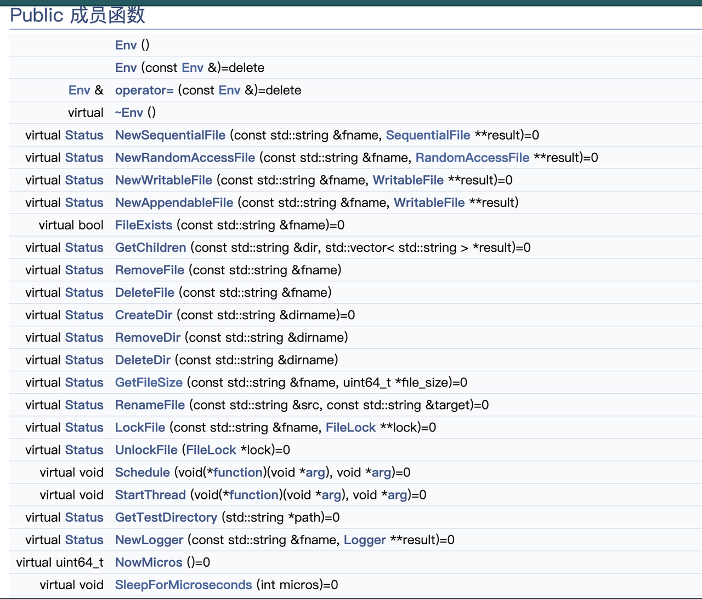
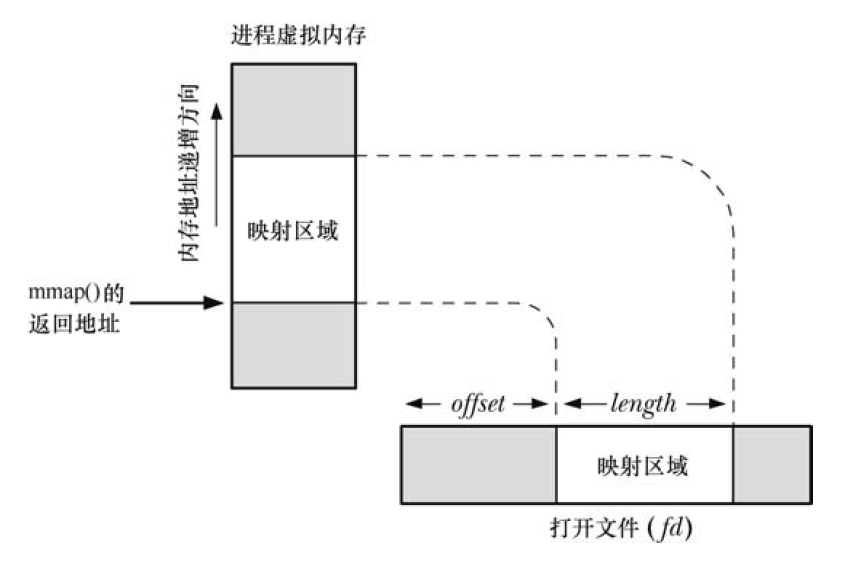
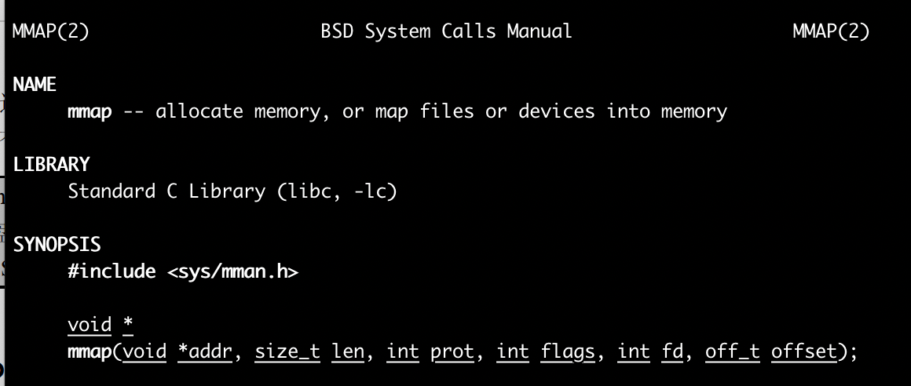
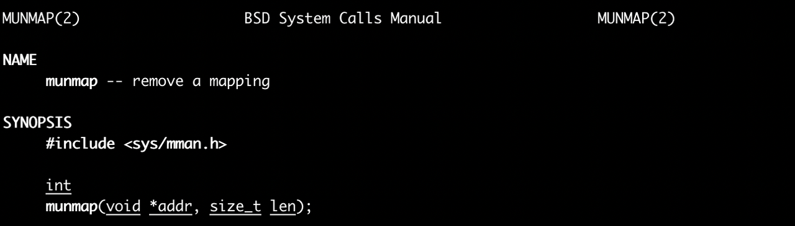
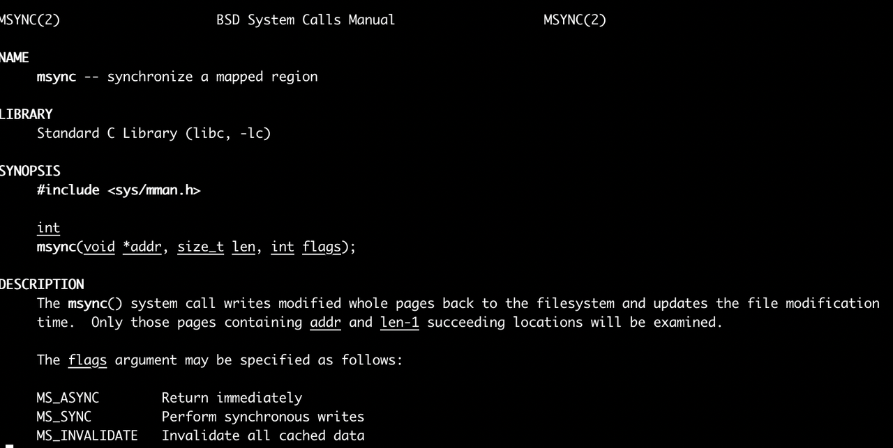
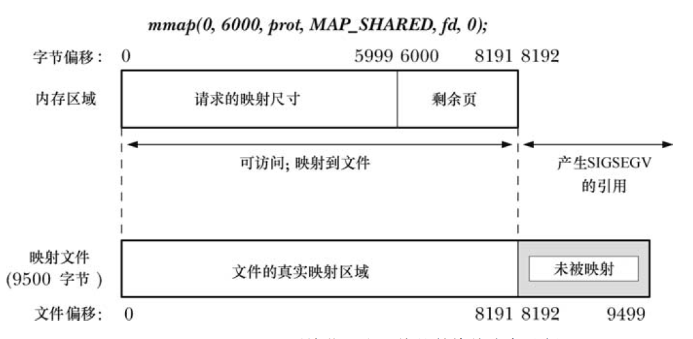
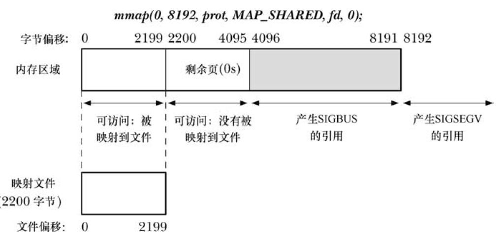
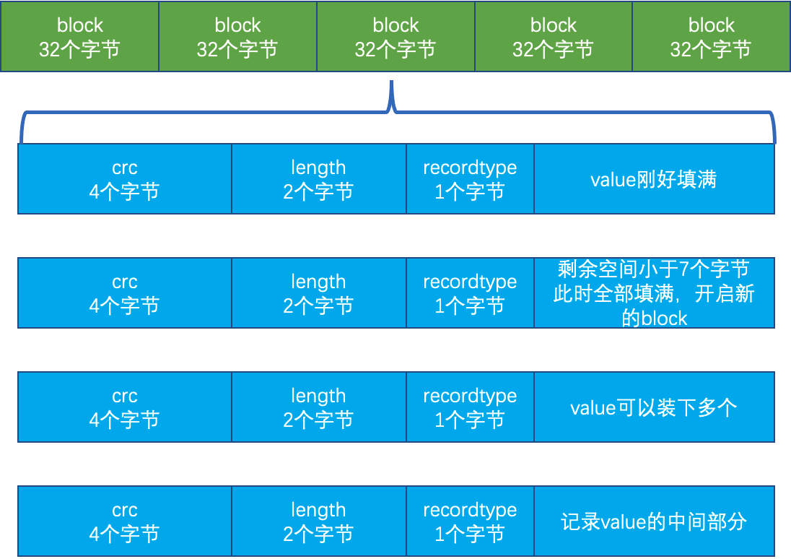
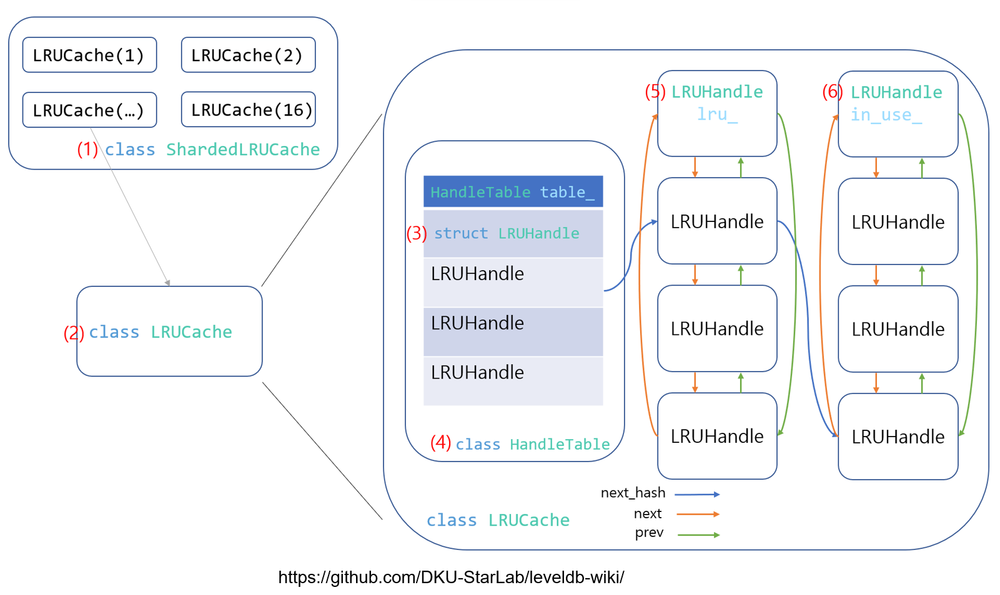

# LevelDB基本组件


## 字节序

- 将低序字节存储在起始地址，称为小端；
- 将高序字节存储在起始地址，称为大端；

LevelDB 采用小端

## Slice

查询一个区间的数据

主要操作为拷贝构造函数

```cpp
class LEVELDB_EXPORT Slice {
 public:
  Slice() : data_(""), size_(0) {}
  Slice(const char* d, size_t n) : data_(d), size_(n) {}
  Slice(const std::string& s) : data_(s.data()), size_(s.size()) {}
  Slice(const char* s) : data_(s), size_(strlen(s)) {}
  Slice(const Slice&) = default;
  Slice& operator=(const Slice&) = default;
  const char* data() const { return data_; }
  size_t size() const { return size_; }
  bool empty() const { return size_ == 0; }

  // Return the ith byte in the referenced data.
  // REQUIRES: n < size()
  char operator[](size_t n) const;

  // Drop the first "n" bytes from this slice.
  void remove_prefix(size_t n);

  int compare(const Slice& b) const;

  // Return true iff "x" is a prefix of "*this"
  bool starts_with(const Slice& x) const {
    return ((size_ >= x.size_) && (memcmp(data_, x.data_, x.size_) == 0));
  }

 private:
  const char* data_;
  size_t size_;
};
```

成员变量：`data_`（数据地址），`size_`（数据长度）

成员函数：`remove_prefix`，`start_with`，`compare`

`remove_prefix`，将前 `n bytes` 的数据从 `slice` 中移除

`start_with`，判断 `x` 是否是 `slice` 的前缀

`compare`，判断两个 `slice` 是否相同以及或者谁是谁的前缀

## Status

用于记录 LevelDB 中状态信息，保存错误码和对应的字符串错误信息(不过不支持自定义)。


##### code

```cpp
enum Code {
    kOk = 0,
    kNotFound = 1,
    kCorruption = 2,
    kNotSupported = 3,
    kInvalidArgument = 4,
    kIOError = 5
};
```

## 编码

LevelDB 中分为定长和变长编码，其中变长编码目的是为了减少空间占用。其基本思想是：每一个 Byte 最高位 bit 用 0/1 表示该整数是否结束，用剩余 7bit 表示实际的数值，在 protobuf 中被广泛使用。


## Option

```cpp
struct LEVELDB_EXPORT Options {
  Options();
  const Comparator* comparator;
  bool create_if_missing = false;
  bool error_if_exists = false;
  bool paranoid_checks = false;
  Env* env;
  Logger* info_log = nullptr;
  size_t write_buffer_size = 4 * 1024 * 1024;
  int max_open_files = 1000;
  Cache* block_cache = nullptr;
  size_t block_size = 4 * 1024;
  int block_restart_interval = 16;
  size_t max_file_size = 2 * 1024 * 1024;
  CompressionType compression = kSnappyCompression;
  int zstd_compression_level = 1;
  bool reuse_logs = false;
  const FilterPolicy* filter_policy = nullptr;
};

struct LEVELDB_EXPORT ReadOptions {
  bool verify_checksums = false;
  bool fill_cache = true;
  const Snapshot* snapshot = nullptr;
};

struct LEVELDB_EXPORT WriteOptions {
  WriteOptions() = default;
  bool sync = false;
};

}  // namespace leveldb
```

#### Option 通用

1. `Comparator`：被用来表中key比较，默认是字典序

2. `create_if_missing`：打开数据库，如果数据库不存在，是否创建新的

3. `error_if_exists`：打开数据库，如果数据库存在，是否抛出错误

4. `paranoid_checks`：如果为 true，则实现将对其正在处理的数据进行积极检查，如果检测到任何错误，则会提前停止。 这可能会产生不可预见的后果：例如，一个数据库条目的损坏可能导致大量条目变得不可读或整个数据库变得无法打开。

5. `env`：封装了平台相关接口

6. `info_log`：db 日志句柄

7. `write_buffer_size`：memtable 的大小(默认 4mb)
   - 值大有利于性能提升
   
   - 但是内存可能会存在两份，太大需要注意oom
   
   - 过大刷盘之后，不利于数据恢复
   
8. `max_open_files`：允许打开的最大文件数

9. `block_cache`：block 的缓存

10. `block_size`：每个 block 的数据包大小(未压缩)，默认是 4k

11. `block_restart_interval`：block 中记录完整 key 的间隔

12. `max_file_size`：生成新文件的阈值(对于性能较好的文件系统可以调大该阈值，但会增加数据恢复的时间)，默认 2k

13. `compression`：数据压缩类型，默认是 kSnappyCompression，压缩速度快

14. `reuse_logs`：是否复用之前的 MANIFES 和 log files

15. `filter_policy`：block 块中的过滤策略，支持布隆过滤器

#### Read Option

1. `verify_checknums`：是否对从磁盘读取的数据进行校验
2. `fill_cache`：读取到block数据，是否加入到cache中
3. `snapshot`：记录的是当前的快照

#### Write Option

`sync`：是否同步刷盘，也就是调用完 write 之后是否需要显式 fsync

#### Configs

1. `kNumLevels`：磁盘上最大的 level 个数，默认为 7
2. `kL0_CompactionTrigger`：第 0 层 SSTable 个数到达这个阈值时触发压缩，默认值为 4
3. `kL0_SlowdownWritesTrigger`：第 0 层 SSTable 到达这个阈值时，延迟写入 1ms，将 CPU 尽可能的移交给压缩线程，默认值为 8
4. `kL0_StopWritesTrigger`：第 0 层 SSTable 到达这个阈值时将会停止写，等到压缩结束，默认值为 12
5. `kMaxMemCompactLevel`：新压缩产生的 SSTable 允许最多推送至几层(目标层不允许重叠)，默认为 2
6. `kReadBytesPeriod`：在数据迭代的过程中，也会检查是否满足压缩条件，该参数控制读取的最大字节数
7. `MaxBytesForLevel` 函数：每一层容量大小为上一层的 10 倍
8. `MaxGrandParentOverlapBytes`：$level - n$ 和 $leveldb-n+2$ 之间重叠的字节数，默认大小为 $10*max\_file\_size$

## SkipList

LevelDB 的线段跳表

#### Node

```cpp
template <typename Key, class Comparator>
struct SkipList<Key, Comparator>::Node {
  explicit Node(const Key& k) : key(k) {}
  Key const key;
  Node* Next(int n);
  void SetNext(int n, Node* x);

  Node* NoBarrier_Next(int n);
  void NoBarrier_SetNext(int n, Node* x);
 private:
  std::atomic<Node*> next_[1];
};
```

在 `Skiplist` 中，`Node` 代表的是跳表中的节点

结构体包含两个变量，当前节点的 Key 值和指向下一个节点的 `next_[1]`

结构体包含了四个方法 `Next、SetNext、NoBarrier_Next、NoBarrier_SetNext`。前两个方法对应加载与读取（内存使用 `barrier` 按需进行），后两个方案对应非屏障方案（可以乱序执行）加载与读取。这四种方案均对 `next_[1]` 进行操作。

#### Iterator

`Skiplist` 中的工具类

```cpp
class Iterator {
   public:
    explicit Iterator(const SkipList* list);
    bool Valid() const;
    const Key& key() const;
    void Next();
    void Prev();
    void Seek(const Key& target);
    void SeekToFirst();
    void SeekToLast();
   private:
    const SkipList* list_;
    Node* node_;
  };
```

有两个成员变量，SkipList 和当前 Node

#### Skiplist

抛开 Iterator 后，和普通的 Skiplist 一样，从 level 高的地方开始找，没找到就跳下一个，下一个如果大于要找的值或者没有下一个，`level` 就下一层，重复上面的步骤直到找到或者 `level == 0` 停止

插入的时候会随机一个 `height` 值，这个值代表 `node` 的高度，和查询相似，但是每次在 `level` 要减一的时候，我们会将当前 `node` 保存起来，在找到最后一个的时候，再从下往上一层一层的添加到 `node` 的后面。

删除类似插入，找到所有下一层是我们删除的 `node` 的节点 `pre`，然后将 `pre.next = node.next`，然后直到 `level == 0`，将 `node[n]` 回收

## 内存管理

#### 成员变量

- `alloc_ptr_`：当前已使用内存的指针

- `blocks_`：实际分配的内存池

- `alloc_bytes_remaining_`：剩余内存字节数

- `memory_usage_`：记录内存的使用情况

- `kBlockSize`：一个块大小(4k)

#### 成员函数

需要注意的是 `AllocateFallback` 函数

```cpp
char* Arena::AllocateFallback(size_t bytes) {
  if (bytes > kBlockSize / 4) {
    char* result = AllocateNewBlock(bytes);
    return result;
  }

  alloc_ptr_ = AllocateNewBlock(kBlockSize);
  alloc_bytes_remaining_ = kBlockSize;

  char* result = alloc_ptr_;
  alloc_ptr_ += bytes;
  alloc_bytes_remaining_ -= bytes;
  return result;
}
```

当 `bytes` 大于 `kBlockSize/4` 时，是大内存，如果我们直接分配一个 `Block` 的话，那么剩下剩下的空位比较小，那么此 `Block` 复用次数比较少，并且此时可能有 `1/4` 的左侧资源被浪费，所以选择按需分配

当 `bytes` 小于 `kBlockSize/4` 时，此时新开一个 `Block`，既可以大量复用，又可以减少左侧资源的浪费

左侧资源指当前 `Block` 的 `alloc_bytes_remaining_`

## 引用计数

引用计数是一种内存管理方式。在 LevelDB 中，`memtable/version` 等组件，可能被多个线程共享，因此不能直接删除，需要等到没有线程占用时，才能删除。

## 各种 key 和 compare

#### 各种 key

- `user_key`：用户输入的数据 `key`(`slice` 格式)

- `ParsedInternalKey`：

  - 是对`InternalKey`的解析，因为`InternalKey`是一个字符串

  - `Slice user_key`;

  - `SequenceNumber sequence`

  -   `ValueType type`

- InternalKey：

  - 内部 `key`，常用来比如 `key` 比较等场景

  - `std::string rep_`

- `memtable key`：
  - 故名思义：存储在 `memtable` 中的 `key`，这个 `key` 比较特殊他是包含 `value` 的

- `lookup key`：

  - 用于 `DBImpl::Get` 中

  - 成员变量

    - `char space_[200]`，`lookup` 中有一个细小的内存优化，就是类似 `string` 的 `sso` 优化。其优化在于，当字符串较短时，直接将其数据存在栈中，而不去堆中动态申请空间，这就避免了申请堆空间所需的开销。

    - `const char* start_`

    - `const char* kstart_;`

    - `const char* end_;`

关系如下图所示


#### 各种 compare

##### 成员函数

- `Compare()`：支持三种操作：大于/等于/小于

- `Name()` ：比较器名字，以 LevelDB 开头

- `FindShortestSeparator`：

  - 这些功能用于减少索引块等内部数据结构的空间需求。

  - 如果 `*start < limit`，则将 `*start` 更改为 `[start,limit)` 中的短字符串。

  - 简单的比较器实现可能会以 `*start` 不变返回，即此方法的实现不执行任何操作也是正确的。

  - 然后在调用 `Compare` 函数

- `FindShortSuccessor`：将 `*key` 更改为 `string >= *key.Simple` 比较器实现可能会在 `*key` 不变的情况下返回，即，此方法的实现是正确的。

特点：必须要支持线程安全

## WriteBatch

WriteBatch 使用批量写来提高性能，支持 put 和 delete。

#### 成员变量

- `rep_`：WriteBatch 具体数据

- `WriteBatchInternal`：内部工具性质的辅助类

#### 成员函数

- `Put`：存储 `key` 和 `value` 信息

- `Delete`：追加删除 `key` 信息

- `Append`：多个 WriteBatch 还可以继续合并

- `Iterate`：

  - 遍历该 `batch` 结构，为了方便扩展，参数使用的是 `Handler` 基类，对应的是抽象工厂模式

  - `MemTableInserter` 子类：对 `memtable` 的操作

- `ApproximateSize`：内存状态信息


这里运用了两个技巧 `b->rep_.data()+8` 和 `&b->rep_[8]`

其中前一个是去掉 `rep_` 中的 `SeqNum` 字段，但是是只读，后面一个是将 `SeqNum` 后面转换成 `char*` 传入 `EncodeFixed32` 对数字 `n` 进行编码

重点讲解一下 `Iterate`

```cpp
Status WriteBatch::Iterate(Handler* handler) const {
  Slice input(rep_);
  if (input.size() < kHeader) {
    return Status::Corruption("malformed WriteBatch (too small)");
  }
// 删除 SeqNum 还有 key number
  input.remove_prefix(kHeader);
  Slice key, value;
  int found = 0;
  while (!input.empty()) {
    found++;
    // 解析当前的 key value 状态，[kTypeValue, kTypeDeletion]
    char tag = input[0];
    // 取出来了，直接删除
    input.remove_prefix(1);
    switch (tag) {
      case kTypeValue:
        if (GetLengthPrefixedSlice(&input, &key) &&
            GetLengthPrefixedSlice(&input, &value)) {
          // 插入到 memtable 内
          handler->Put(key, value);
        } else {
          return Status::Corruption("bad WriteBatch Put");
        }
        break;
      case kTypeDeletion:
        if (GetLengthPrefixedSlice(&input, &key)) {
          handler->Delete(key);
        } else {
          return Status::Corruption("bad WriteBatch Delete");
        }
        break;
      default:
        return Status::Corruption("unknown WriteBatch tag");
    }
  }
  if (found != WriteBatchInternal::Count(this)) {
    return Status::Corruption("WriteBatch has wrong count");
  } else {
    return Status::OK();
  }
}
```

## Env 家族



由上图可知，该内就是一个纯虚类

`New` 开头的成员函数，其 `Status` 表示函数执行状态，而实际生成的对象是在函数的第二个参数，现代 `C++` 不建议这样操作。

最好利用现代 `C++` 的移动语义，并且将传入参数设置为 `const`

有三个实现版本

#### `PosixEnv`

封装了 `posix` 标准下所有接口

#### `WindowsEnv`

封装了 `win` 相关接口

#### `EnvWrapper`

虽然该类也继承 `Env`，但是他和上述两个作用不一样

将所有调用转发到其他的 `Env` 实现。

可能对希望覆盖另一个 `Env` 的部分功能的用户有用。

默认还是使用 `Env` 实现类

了解 `EnvWrapper` 前，我们先了解一下代理设计模式

#### 代理设计模式

有些时候，我们想做一些事但是自己没有资源或者自己做不好，就会想着花点钱请专业的人帮我们做。这是一种代理模式。

我是一个用户，我现在需要保洁服务，那么我就需要联系保洁公司，让他们安排相关的专员来帮我完成这件事。

#### `WritableFile & PosixWritableFile`

##### `WritableFile`

用于顺序写入的文件抽象。 实现必须提供缓冲，因为调用者可能一次将小数据量数据追加到文件中。`WritableFile` 是里面的函数都是纯虚函数。

`WritableFileImpl` 是 `WritableFile` 的具体实现，主要利用成员 `FileState*` 进行工作

```cpp
class WritableFileImpl : public WritableFile {
 public:
  WritableFileImpl(FileState* file) : file_(file) { file_->Ref(); }
  ~WritableFileImpl() override { file_->Unref(); }
  Status Append(const Slice& data) override { return file_->Append(data); }
  Status Close() override { return Status::OK(); }
  Status Flush() override { return Status::OK(); }
  Status Sync() override { return Status::OK(); }

 private:
  FileState* file_;
};
```

其中 `FileState` 的 `Ref` 和 `Unref` 都是简单的引用计数操作，`Append` 就是将 `Slice` 插入到文件末尾，并且根据 `BlockSize` 分块

#####  `PosixWritableFile`

```cpp
class PosixWritableFile final : public WritableFile;
```

###### 成员变量

* `kWritableFileBufferSize`：作为缓冲区，默认大小为 64k
* `char buf_[kWritableFileBufferSize]`
* `pos_`：`buf_` 当前已经使用的字节位置
* `fd_`：当前文件，对应的 fd
* `is_manifest_`：判断是否是 `manifest` 文件，因为 `manifest` 文件需要实时刷盘
* `filename_`：文件名字
* `dirname_`：文件所在的目录

###### 成员函数

```cpp
Status Append(const Slice& data) override {
    size_t write_size = data.size();
    const char* write_data = data.data();

    size_t copy_size = std::min(write_size, kWritableFileBufferSize - pos_);
    // 当前 buffer 所能写入的最大 size
    std::memcpy(buf_ + pos_, write_data, copy_size);
    write_data += copy_size;
    write_size -= copy_size;
    pos_ += copy_size;
    if (write_size == 0) {
    	return Status::OK();
    }
    
    // kWritableFileBufferSize - pos_ < write_size
	Status status = FlushBuffer();
	// 将满的 buffer 刷入磁盘中，并将 Buffer 置为空
    if (!status.ok()) {
    	return status;
    }

    if (write_size < kWritableFileBufferSize) {
        std::memcpy(buf_, write_data, write_size);
        pos_ = write_size;
        return Status::OK();
    }
    return WriteUnbuffered(write_data, write_size);
}
```

#### `RandomAccessFile&PosixRandomAccessFile/PosixMmapReadableFile`

##### `Limiter`

1. `Helper` 类限制资源使用，避免耗尽。目前用于限制只读文件描述符和 `mmap` 文件使用，这样我们就不会用完文件描述符或虚拟内存，或者遇到非常大的数据库的内核性能问题。
2. 使用 `atomic` 原子变量，所以线程安全

##### `RandomAccessFile`

`RandomAccessFile` 用于随机读取文件内容的文件抽象。

线程安全。

##### `PosixRandomAccessFile`

```cpp
class PosixRandomAccessFile final : public RandomAccessFile;
```

###### 成员变量

- `has_permanent_fd_`：表示是否每次 `read` 都需要打开文件

- `fd_`：`has_permanent_fd_=false`，`fd_` 一直等于 -1

- `fd_limiter_`：资源限制相关的

- `filename_`：文件名

###### 成员函数

简单的构造函数还有析构函数，以及 `Read` 函数

##### `PosixMmapReadableFile`

LevelDB 中使用 `mmap` 共享内存来提高性能。

1. `mmap()` 函数可以把一个文件或者 `Posix` 共享内存对象映射到调用进程的地址空间。映射分为两种：

   1. 文件映射：文件映射将一个文件的一部分直接映射到调用进程的虚拟内存中。一旦一个文件被映射之后就可以通过在相应的内存区域中操作字节来访问文件内容了。映射的分页会在需要的时候从文件中（自动）加载。这种映射也被称为基于文件的映射或内存映射文件。

      

   2. 匿名映射：一个匿名映射没有对应的文件。相反，这种映射的分页会被初始化为 0。

2. `mmap()` 系统调用在调用进程的虚拟地址空间中创建一个新映射。



参数解析：

`addrs`：映射内存的启示地址，可以指定，也可以设置为 `NULL`，设置为 `NULL` 时，内核会自己寻找一块内存

`len`：表示映射到进程地址空间的字节数，它从被影射文件开头起第 `offset` 个字节处开始算，`offset` 通常设置成 0

`prot`：共享内存的保护参数，具体见下表

|  prot取值  |   功能说明   |
| :--------: | :----------: |
| PROT_READ  |     可读     |
| PROT_WRITE |     可写     |
| PROT_EXEC  |    可执行    |
| PROT_NONE  | 数据不可访问 |

`flags`：控制映射操作各个方面的选项的位掩码。这个掩码必须只包含下列值中一个。

|         flags          | 功能说明                                                     |
| :--------------------: | ------------------------------------------------------------ |
|       MAP_SHARED       | 变动是共享的                                                 |
|      MAP_PRIVATE       | 变动是私有的，意思是只在本进程有效，这就意味着会触发 `cow(copy on write)` 机制 |
|       MAP_FIXED        | 不允许系统选择与指定地址不同的地址。 如果无法使用指定的地址， `mmap()` 将失败。 如果指定了 MAP_FIXED，则 `addr` 必须是页面大小的倍数。 如果 MAP_FIXED 请求成功，则 `mmap()` 建立的映射将替换从 `addr` 到 `addr + len` 范围内进程页面的任何先前映射。不鼓励使用此选项。 |
|      MAP_NOCACHE       | 此映射中的页面不会保留在内核的内存缓存中。 如果系统内存不足，MAP_NOCACHE 映射中的页面将首先被回收。 该标志用于几乎没有局部性的映射，并为内核提供一个提示，即在不久的将来不太可能再次需要该映射中的页面。 |
|    MAP_HASSEMAPHORE    | 通知内核该区域可能包含信号量并且可能需要特殊处理。           |
| MAP_ANONYMOUS/MAP_ANON | 该内存不是从文件映射而来，其内容会被全部初始化为 0，而且 `mmap` 最后的两个参数会被忽略 |

`fd`：对应被打开的文件套接字，一般是通过 `open` 系统调用。`mmap` 返回后，该 `fd` 可以 `close` 掉

`offset`：文件起始位置

3. `munmap()` 系统调用执行与 `mmap()` 相反的操作，即从调用进程的虚拟地址空间中删除映射。



4. `msync`：用于刷盘策略。内核的虚拟内存算法保持内存映射文件与内存映射区的同步，因此内核会在未来某个时刻同步，如果我们需要实时，则需要 `msync` 同步刷。



5. 需要特别注意两个信号：SIGBUG 和 SIGSEGV
   1. SIGBUG：表示我们在内存范围内访问，但是超出了底层对象的大小
   2.  SIGSEGV：表示我们已经在内存映射范围外访问了。





#### `SequentialFile`

顺序读取的抽象

- `PosixSequentialFile`

  - 使用 `read()` 在文件中实现顺序读取访问，非线程安全。

  - `fd_`：文件描述符

  - `filename_`：文件名称

- `WindowsSequentialFile`

#### `FileLock`

`FileLock` 的作用是：由于 Linux 和 Windows 对文件的句柄的抽象 ( fd 和 handle ) 不同，使用方式不同，所以用 FileLock 抽象。

其目的是在需要同时使用文件句柄和文件名的时候，可以通过 `FileLock` 对象直接找到

##### `PosixFileLock`

使单个进程只能拿到一次锁

##### 文件锁

直接使用flock

## `filename`

#### `FileType`

```cpp
enum FileType {
  kLogFile,               // dbname/[0-9]+.log
  kDBLockFile,            // dbname/[0-9]+.(sst|ldb)
  kTableFile,             // dbname/LOCK
  kDescriptorFile,        // dbname/MANIFEST-[0-9]+
  kCurrentFile,           // dbname/CURRENT 记载当前的manifest文件名
  kTempFile,              // dbname/[0-9]+.dbtmp 
    					// 在repair数据库时，会重放wal日志，将这些和已有的sst合并写到临时文件中去，成功之后调用rename原子重命名
  kInfoLogFile            // dbname/LOG.old 或者 dbname/LOG
};
```

- `log`

日志文件 (`*.log`) 存储最近 `update` 的序列。 每次更新都追加到当前日志文件。 当日志文件达到预定大小时（默认约  4MB），转换为 SST（见下文）并为将来的更新创建一个新的日志文件。

当前日志文件的副本保存在内存结构中（`memtable`）。 每次读取时都会查询此副本，以便读取操作反映所有记录的更新。

- `SST`

排序表 (`*.ldb`) 存储按关键字排序的条目序列。 每个条目要么是键的值，要么是键的删除标记。 （保留删除标记以隐藏旧排序表中存在的过时值）。

这组排序表被组织成某一系列文件，分布在不同的 level。 从日志文件生成的排序表被放置在一个特殊的 **`young`** 级别（也称为 `level_0`）。 当年轻文件的数量超过某个阈值（目前为 4 个）时，所有年轻文件与所有重叠的 `level_1` 文件合并在一起，以生成一系列新的  `level_1` 文件（我们创建一个新的  `level_1` 级文件） 每 2MB 数据一个文件。）

`level_0` 中的文件可能包含重叠的键。 然而，其他级别的文件不存在重叠键。当级别 L 中文件的组合大小超过 ( $10^L$ ) MB（即，级别 1 为 10MB，级别 2 为 100MB，...）中的一个文件 `level_L`，将 `level_(L+1)` 中的所有重叠文件合并，形成 `level_(L+1)` 的一组新文件。 这样的整合操作可以把 `young level` 中新更新的数据逐渐往下一个 `level` 中迁移(这样可以使查询的成本降低到最小)。

- `MANIFEST`

`MANIFEST` 文件列出了组成每个级别的一组排序表、相应的键范围和其他重要的元数据。 每当重新打开数据库时，都会创建一个新的 `MANIFEST` 文件（文件名中嵌入了一个新编号）。 `MANIFEST` 文件被格式化为日志，并且对服务状态所做的更改（如文件的添加或删除）追加到此日志中。

-  **`Current`**

`CURRENT` 是一个简单的文本文件，其中包含最新的 `MANIFEST` 文件的名称。

- **`Level 0`**

当日志文件增长到超过一定大小（默认为 4MB）时：

创建一个全新的内存表和日志文件，并在此处指导未来的更新。

在后台：

1. 将之前 `memtable` 的内容写入 `SSTable`。
2. 丢弃 `memtable`。
3. 删除旧的日志文件和旧的 `memtable` 。
4. 将新的 `SSTable` 添加到 `young (level_0)` 级别。

## `Logger`

```cpp
class LEVELDB_EXPORT Logger {
 public:
  Logger() = default;
  Logger(const Logger&) = delete;
  Logger& operator=(const Logger&) = delete;
  virtual ~Logger();
  // Write an entry to the log file with the specified format.
  virtual void Logv(const char* format, std::va_list ap) = 0;
};
```

同样是一个虚基类，是记录错误信息的抽象

主要还是抽象了 `PosixLogger` 和 `WindowsLogger`

#### `PosixLogger`

```cpp
class PosixLogger final : public Logger;
```

## `WAL`

#### 组成

`wal` 日志按照 `block` 为单位进行存储的，每个 `block` 大小为 32k。而每个 `block` 是由一系列 `record` 组成的。



#### Log

```cpp
namespace log {

enum RecordType {
  // Zero is reserved for preallocated files
  kZeroType = 0,
  kFullType = 1,

  // For fragments
  kFirstType = 2,
  kMiddleType = 3,
  kLastType = 4
};
static const int kMaxRecordType = kLastType;
static const int kBlockSize = 32768;
// Header is checksum (4 bytes), length (2 bytes), type (1 byte).
static const int kHeaderSize = 4 + 2 + 1;
}  // namespace log
```

在 `namespace Log` 下，规定了 `RecordType，kMaxRecordType，kBlockSize，kHeaderSize`

#### `Log_Write`

主要函数为写入流程

```cpp
Status Writer::AddRecord(const Slice& slice) {
  const char* ptr = slice.data();
  size_t left = slice.size();
  Status s;
  bool begin = true;
  
  do {
  	// 还剩多少空间
    const int leftover = kBlockSize - block_offset_;
    assert(leftover >= 0);
    // 空间不足以放下 header
    if (leftover < kHeaderSize) {
      // 将剩下的位置补齐，并且新开一个
      if (leftover > 0) {
      	// 剩余位置一定小于 7
        static_assert(kHeaderSize == 7, "");
        dest_->Append(Slice("\x00\x00\x00\x00\x00\x00", leftover));
      }
      block_offset_ = 0;
    }
	// 能放下 header
    assert(kBlockSize - block_offset_ - kHeaderSize >= 0);
	// 计算剩余容量
    const size_t avail = kBlockSize - block_offset_ - kHeaderSize;
    const size_t fragment_length = (left < avail) ? left : avail;

    RecordType type;
    // 是否是最后一个 block
    const bool end = (left == fragment_length);
    // 分情况，是否是第一个block，是否是最后一个block，其他情况
    if (begin && end) {
      type = kFullType;
    } else if (begin) {
      type = kFirstType;
    } else if (end) {
      type = kLastType;
    } else {
      type = kMiddleType;
    }
	// 写入
    s = EmitPhysicalRecord(type, ptr, fragment_length);
    ptr += fragment_length;
    left -= fragment_length;
    begin = false;
  } while (s.ok() && left > 0);
  return s;
}
// 序列化 header 并将 log 写入 WritableFile 中
Status Writer::EmitPhysicalRecord(RecordType t, const char* ptr,
                                  size_t length) {
  assert(length <= 0xffff);  // Must fit in two bytes
  assert(block_offset_ + kHeaderSize + length <= kBlockSize);

  // Format the header
  char buf[kHeaderSize];
  buf[4] = static_cast<char>(length & 0xff);
  buf[5] = static_cast<char>(length >> 8);
  buf[6] = static_cast<char>(t);

  // Compute the crc of the record type and the payload.
  uint32_t crc = crc32c::Extend(type_crc_[t], ptr, length);
  crc = crc32c::Mask(crc);  // Adjust for storage
  EncodeFixed32(buf, crc);

  // Write the header and the payload
  Status s = dest_->Append(Slice(buf, kHeaderSize));
  if (s.ok()) {
    s = dest_->Append(Slice(ptr, length));
    if (s.ok()) {
      s = dest_->Flush();
    }
  }
  block_offset_ += kHeaderSize + length;
  return s;
}
```

#### WAL日志什么时候被删除呢？

其实在 LevelDB的 doc 文档里面有讲解**(具体在 doc/impl.md )**，不过这里我们还是得具体来说一下。

在打开数据库以及 compact 之后，会将不再使用的文件删除，使用的函数是 RemoveObsoleteFiles

我们可以在打开 LevelDB 的日志系统，并且适当的在源码中添加日志，此外也可以结合 gdb 来查看栈调用情况。

## `HandleTable`

#### 成员变量

- `length_`：哈希表的总长度

- `elems_`：当前哈希表的实际元素个数

- `list_`：实际存储的数据，底层结构

#### 成员函数

- `Lookup`：查找某个 `key`
- `Insert`
- `Remove`
- `FindPointer`：用来定位元素所在的节点
- `Resize`：链表的扩容

本质上 `HandleTable` 就是一个链式 `HashTable`


需要注意的几个点

* `hash` 是 `key Hash()` 后得到的，这个值可能没有落在 `0 ~ length_ - 1` 上，所以需要 `hash & (length - 1)`

* `list_` 其实就是指向这个 `HandleTable` 第一个元素，之后的 `LRUHandle**` 也都是指向数组中的某个元素

* `next_hash` 其实就是拉链法，也就是上图中竖着的部分

* `Resize` 只有在 `length_` 超过 4 的时候才二倍增长
* `Resize` 的时候和 `std::vector` 扩容的方式一样，先申请一个 `2 * length_` 大小的容器，然后将当前容器中的元素以某种方式放入新的容器中，最后销毁此容器

## `LRUHandle`

#### 成员变量

- `void* value`：具体的值，指针类型

- `void (*deleter)(const Slice&, void* value)`：自定义回收节点的回调函数

- `LRUHandle* next_hash`：用于 `hashtable` 冲突时，下一个节点

- `LRUHandle* next`：代表 LRU 中双向链表中下一个节点

- `LRUHandle* prev`：代表 LRU 中双向链表中上一个节点

- `size_t charge`：记录当前 `value` 所占用的内存大小，用于后面超出容量后需要进行 `lru`

- `size_t key_length`：数据 `key` 的长度

- `bool in_cache`：表示是否在缓存中

- `uint32_t refs`：引用计数，因为当前节点可能会被多个组件使用，不能简单的删除

- `uint32_t hash`：记录当前 `key` 的 `hash` 值

需要格外注意：该节点很巧妙，既可以用做 `hashtable`，又可以用于 `lru` 缓存节点

#### 成员函数

```cpp
LRUHandle** FindPointer(const Slice& key, uint32_t hash) {
    LRUHandle** ptr = &list_[hash & (length_ - 1)];
    while (*ptr != nullptr && ((*ptr)->hash != hash || key != (*ptr)->key())) {
        ptr = &(*ptr)->next_hash;
    }
    return ptr;
}

LRUHandle* Insert(LRUHandle* h) {
    LRUHandle** ptr = FindPointer(h->key(), h->hash);
    LRUHandle* old = *ptr;
    h->next_hash = (old == nullptr ? nullptr : old->next_hash);
    *ptr = h;
    if (old == nullptr) {
        ++elems_;
        if (elems_ > length_) {
            // Since each cache entry is fairly large, we aim for a small
            // average linked list length (<= 1).
            Resize();
        }
    }
    return old;
}
// 如果找到就将原值旧值删除
```


## `Cache`

虚基类

根据不同的 Handle 有不同的 Cache，class Cache 就是所有 Cache 的抽象

## `LRUCache`

#### 成员变量

- `capacity_`：LRU 容量，可以不固定：字节数或者条数均可

- `mutable port::Mutex mutex_`：保护 `LRUCache` 操作

- `size_t usage_ GUARDED_BY(mutex_)`：获取当前 `LRUCache` 已经使用的内存

- `LRUHandle lru_ GUARDED_BY(mutex_)`：

  - 只存在缓存中的节点 `refs==1` and `in_cache==true`

  - `lru.prev is newest entry, lru.next is oldest entry`

- `LRUHandle in_use_ GUARDED_BY(mutex_)`：既存在缓存中 `in_cache==true`，又被外部引用的节点 `refs >= 2`

- `HandleTable table_ GUARDED_BY(mutex_)`：用于快速获取某个节点

#### 成员函数

```cpp
Cache::Handle* LRUCache::Insert(const Slice& key, uint32_t hash, void* value,
                                size_t charge,
                                void (*deleter)(const Slice& key,
                                                void* value)) {
  MutexLock l(&mutex_);
// 创建一个节点对象
  LRUHandle* e =
      reinterpret_cast<LRUHandle*>(malloc(sizeof(LRUHandle) - 1 + key.size()));
  e->value = value;
  e->deleter = deleter;
  e->charge = charge;
  e->key_length = key.size();
  e->hash = hash;
  e->in_cache = false;
// 这里为1，主要是是因为该节点会返回给调用者，表示被引用
  e->refs = 1;  // for the returned handle.
  std::memcpy(e->key_data, key.data(), key.size());
// 初始化完成
// 如果 cache 中还有空位
  if (capacity_ > 0) {
// 在 cache 中
    e->refs++;  // for the cache's reference.
    e->in_cache = true;
    LRU_Append(&in_use_, e);
    usage_ += charge;
// 删除 cache 中原有节点，如果有的话
    FinishErase(table_.Insert(e));
  } else {
    e->next = nullptr;
  }
// 当cache容量不够，而且有空余的节点时候需要进行lru策略进行淘汰
// 这里需要注意的是对于那些in_use中的节点是不能被淘汰的，因为他们可能会外界使用
  while (usage_ > capacity_ && lru_.next != &lru_) {
    LRUHandle* old = lru_.next;
    assert(old->refs == 1);
    bool erased = FinishErase(table_.Remove(old->key(), old->hash));
    if (!erased) {  // to avoid unused variable when compiled NDEBUG
      assert(erased);
    }
  }

  return reinterpret_cast<Cache::Handle*>(e);
}

void LRUCache::Ref(LRUHandle* e) {
  if (e->refs == 1 && e->in_cache) {
    LRU_Remove(e);
    LRU_Append(&in_use_, e);
  }
  e->refs++;
}

void LRUCache::Unref(LRUHandle* e) {
  assert(e->refs > 0);
// 先将引用减去1
  e->refs--;
  if (e->refs == 0) { 
    assert(!e->in_cache);
    (*e->deleter)(e->key(), e->value);
    free(e);
    
  } else if (e->in_cache && e->refs == 1) {
// 表示仅仅只在 cache 中，此时需要将其从 in_use_ 中删除，然后放到 lru_ 中
    LRU_Remove(e);
    LRU_Append(&lru_, e);
  }
}
```

#### 根据上面的分析我们可以看出 `table_`，`lru_`，`in_use_` 之间的关系是



这里先预告一下 ShardedLRUCache 和 其他之间的关系

## `SharededLRUCache`

#### 成员变量

- `LRUCache shard_[kNumShards]`：

- `port::Mutex id_mutex_`

- `uint64_t last_id_`

- `static const int kNumShardBits = 4`

- `static const int kNumShards = 1 << kNumShardBits`

#### 成员函数

主要就是根据 Shared 找到对应分片的 LRUCache，然后利用 LRUCache 里面的函数进行操作。

#### 作用

引入 `SharedLRUCache` 的目的在于减小加锁的粒度，提高读写并行度。策略比较简洁—— 利用 key 哈希值的前 `kNumShardBits = 4` 个 bit 作为分片路由，可以支持 `kNumShards = 1 << kNumShardBits` 16 个分片。
