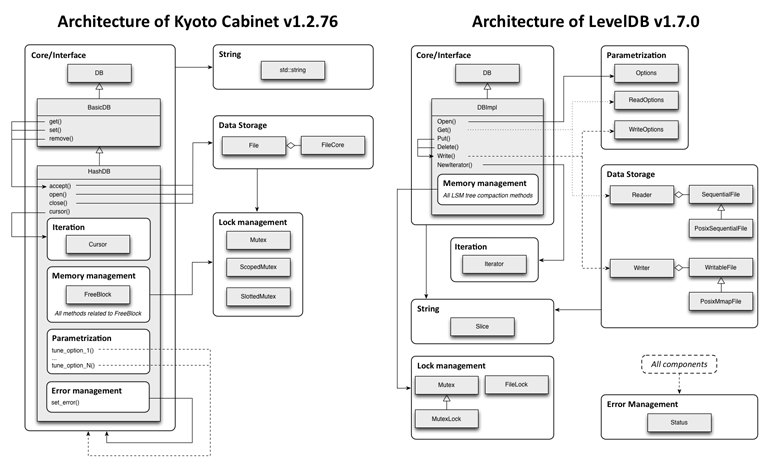
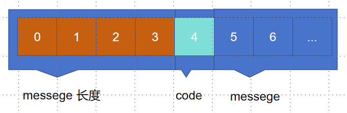
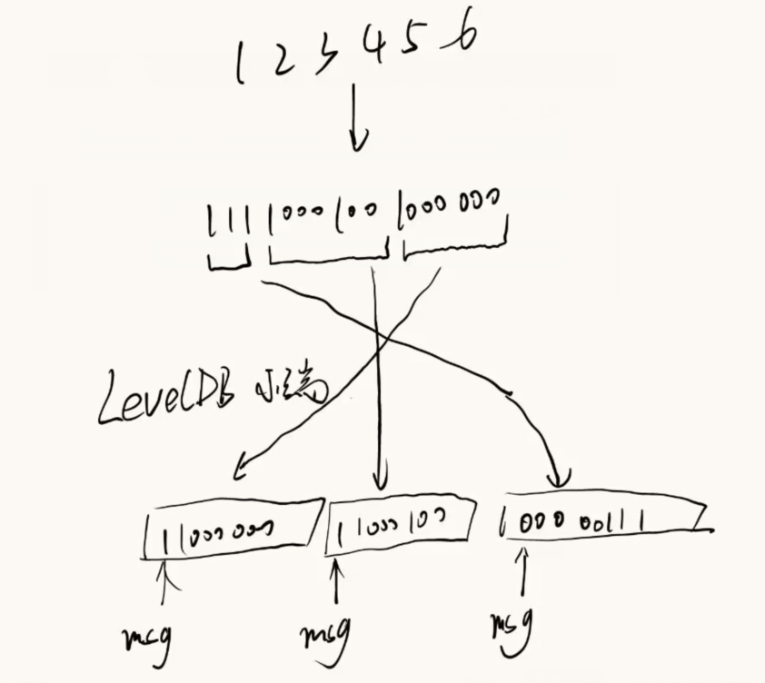
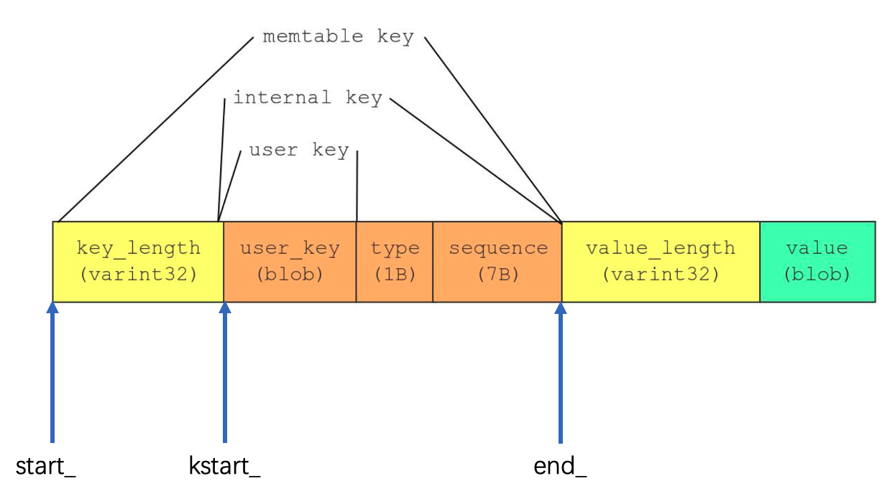
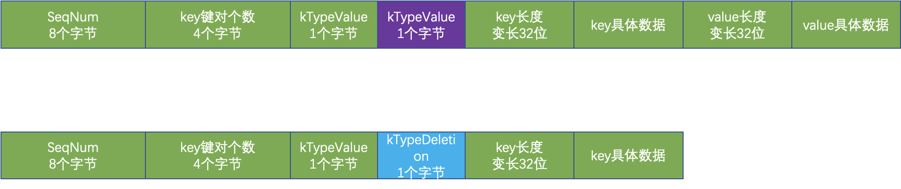

# LevelDB



## 基本组件

#### 字节序

- 将低序字节存储在起始地址，称为小端；
- 将高序字节存储在起始地址，称为大端；

LevelDB 采用小端

#### Slice

查询一个区间的数据

主要操作为拷贝构造函数

```cpp
class LEVELDB_EXPORT Slice {
 public:
  Slice() : data_(""), size_(0) {}
  Slice(const char* d, size_t n) : data_(d), size_(n) {}
  Slice(const std::string& s) : data_(s.data()), size_(s.size()) {}
  Slice(const char* s) : data_(s), size_(strlen(s)) {}
  Slice(const Slice&) = default;
  Slice& operator=(const Slice&) = default;
  const char* data() const { return data_; }
  size_t size() const { return size_; }
  bool empty() const { return size_ == 0; }

  // Return the ith byte in the referenced data.
  // REQUIRES: n < size()
  char operator[](size_t n) const;

  // Drop the first "n" bytes from this slice.
  void remove_prefix(size_t n);

  int compare(const Slice& b) const;

  // Return true iff "x" is a prefix of "*this"
  bool starts_with(const Slice& x) const {
    return ((size_ >= x.size_) && (memcmp(data_, x.data_, x.size_) == 0));
  }

 private:
  const char* data_;
  size_t size_;
};
```

成员变量：`data_`（数据地址），`size_`（数据长度）

成员函数：`remove_prefix`，`start_with`，`compare`

`remove_prefix`，将前 `n bytes` 的数据从 `slice` 中移除

`start_with`，判断 `x` 是否是 `slice` 的前缀

`compare`，判断两个 `slice` 是否相同以及或者谁是谁的前缀

#### Status

用于记录 LevelDB 中状态信息，保存错误码和对应的字符串错误信息(不过不支持自定义)。



##### code

```cpp
enum Code {
    kOk = 0,
    kNotFound = 1,
    kCorruption = 2,
    kNotSupported = 3,
    kInvalidArgument = 4,
    kIOError = 5
};
```

#### 编码

LevelDB 中分为定长和变长编码，其中变长编码目的是为了减少空间占用。其基本思想是：每一个 Byte 最高位 bit 用 0/1 表示该整数是否结束，用剩余 7bit 表示实际的数值，在 protobuf 中被广泛使用。



#### Option

```cpp
struct LEVELDB_EXPORT Options {
  Options();
  const Comparator* comparator;
  bool create_if_missing = false;
  bool error_if_exists = false;
  bool paranoid_checks = false;
  Env* env;
  Logger* info_log = nullptr;
  size_t write_buffer_size = 4 * 1024 * 1024;
  int max_open_files = 1000;
  Cache* block_cache = nullptr;
  size_t block_size = 4 * 1024;
  int block_restart_interval = 16;
  size_t max_file_size = 2 * 1024 * 1024;
  CompressionType compression = kSnappyCompression;
  int zstd_compression_level = 1;
  bool reuse_logs = false;
  const FilterPolicy* filter_policy = nullptr;
};

struct LEVELDB_EXPORT ReadOptions {
  bool verify_checksums = false;
  bool fill_cache = true;
  const Snapshot* snapshot = nullptr;
};

struct LEVELDB_EXPORT WriteOptions {
  WriteOptions() = default;
  bool sync = false;
};

}  // namespace leveldb
```

##### Option 通用

1. `Comparator`：被用来表中key比较，默认是字典序

2. `create_if_missing`：打开数据库，如果数据库不存在，是否创建新的

3. `error_if_exists`：打开数据库，如果数据库存在，是否抛出错误

4. `paranoid_checks`：如果为 true，则实现将对其正在处理的数据进行积极检查，如果检测到任何错误，则会提前停止。 这可能会产生不可预见的后果：例如，一个数据库条目的损坏可能导致大量条目变得不可读或整个数据库变得无法打开。

5. `env`：封装了平台相关接口

6. `info_log`：db 日志句柄

7. `write_buffer_size`：memtable 的大小(默认 4mb)

   - 值大有利于性能提升

   - 但是内存可能会存在两份，太大需要注意oom

   - 过大刷盘之后，不利于数据恢复

8. `max_open_files`：允许打开的最大文件数

9. `block_cache`：block 的缓存

10. `block_size`：每个 block 的数据包大小(未压缩)，默认是 4k

11. `block_restart_interval`：block 中记录完整 key 的间隔

12. `max_file_size`：生成新文件的阈值(对于性能较好的文件系统可以调大该阈值，但会增加数据恢复的时间)，默认 2k

13. `compression`：数据压缩类型，默认是 kSnappyCompression，压缩速度快

14. `reuse_logs`：是否复用之前的 MANIFES 和 log files

15. `filter_policy`：block 块中的过滤策略，支持布隆过滤器

##### Read Option

1. `verify_checknums`：是否对从磁盘读取的数据进行校验
2. `fill_cache`：读取到block数据，是否加入到cache中
3. `snapshot`：记录的是当前的快照

##### Write Option

`sync`：是否同步刷盘，也就是调用完 write 之后是否需要显式 fsync

##### Configs

1. `kNumLevels`：磁盘上最大的 level 个数，默认为 7
2. `kL0_CompactionTrigger`：第 0 层 SSTable 个数到达这个阈值时触发压缩，默认值为 4
3. `kL0_SlowdownWritesTrigger`：第 0 层 SSTable 到达这个阈值时，延迟写入 1ms，将 CPU 尽可能的移交给压缩线程，默认值为 8
4. `kL0_StopWritesTrigger`：第 0 层 SSTable 到达这个阈值时将会停止写，等到压缩结束，默认值为 12
5. `kMaxMemCompactLevel`：新压缩产生的 SSTable 允许最多推送至几层(目标层不允许重叠)，默认为 2
6. `kReadBytesPeriod`：在数据迭代的过程中，也会检查是否满足压缩条件，该参数控制读取的最大字节数
7. `MaxBytesForLevel` 函数：每一层容量大小为上一层的 10 倍
8. `MaxGrandParentOverlapBytes`：$level - n$ 和 $leveldb-n+2$ 之间重叠的字节数，默认大小为 $10*max\_file\_size$

#### SkipList

LevelDB 的线段跳表

##### Node

```cpp
template <typename Key, class Comparator>
struct SkipList<Key, Comparator>::Node {
  explicit Node(const Key& k) : key(k) {}
  Key const key;
  Node* Next(int n);
  void SetNext(int n, Node* x);

  Node* NoBarrier_Next(int n);
  void NoBarrier_SetNext(int n, Node* x);
 private:
  std::atomic<Node*> next_[1];
};
```

在 `Skiplist` 中，`Node` 代表的是跳表中的节点

结构体包含两个变量，当前节点的 Key 值和指向下一个节点的 `next_[1]`

结构体包含了四个方法 `Next、SetNext、NoBarrier_Next、NoBarrier_SetNext`。前两个方法对应加载与读取（内存使用 `barrier` 按需进行），后两个方案对应非屏障方案（可以乱序执行）加载与读取。这四种方案均对 `next_[1]` 进行操作。

##### Iterator

`Skiplist` 中的工具类

```cpp
class Iterator {
   public:
    explicit Iterator(const SkipList* list);
    bool Valid() const;
    const Key& key() const;
    void Next();
    void Prev();
    void Seek(const Key& target);
    void SeekToFirst();
    void SeekToLast();
   private:
    const SkipList* list_;
    Node* node_;
  };
```

有两个成员变量，SkipList 和当前 Node

##### Skiplist

抛开 Iterator 后，和普通的 Skiplist 一样，从 level 高的地方开始找，没找到就跳下一个，下一个如果大于要找的值或者没有下一个，level 就下一层，重复上面的步骤直到找到或者 level == 0 停止

插入的时候会随机一个 height 值，这个值代表 node 的高度，和查询相似，但是每次在 level 要减一的时候，我们会将当前 node 保存起来，在找到最后一个的时候，再从下往上一层一层的添加到 node 的后面。

删除类似插入，找到所有下一层是我们删除的 node 的节点 pre，然后将 pre.next = node.next，然后直到 level == 0，将 node[n] 回收

#### 内存管理

##### 成员变量

- `alloc_ptr_`：当前已使用内存的指针

- `blocks_`：实际分配的内存池

- `alloc_bytes_remaining_`：剩余内存字节数

- `memory_usage_`：记录内存的使用情况

- `kBlockSize`：一个块大小(4k)

#### 成员函数

需要注意的是 `AllocateFallback` 函数

```cpp
char* Arena::AllocateFallback(size_t bytes) {
  if (bytes > kBlockSize / 4) {
    char* result = AllocateNewBlock(bytes);
    return result;
  }

  alloc_ptr_ = AllocateNewBlock(kBlockSize);
  alloc_bytes_remaining_ = kBlockSize;

  char* result = alloc_ptr_;
  alloc_ptr_ += bytes;
  alloc_bytes_remaining_ -= bytes;
  return result;
}
```

当 `bytes` 大于 `kBlockSize/4` 时，是大内存，如果我们直接分配一个 `Block` 的话，那么剩下剩下的空位比较小，那么此 `Block` 复用次数比较少，并且此时可能有 `1/4` 的左侧资源被浪费，所以选择按需分配

当 `bytes` 小于 `kBlockSize/4` 时，此时新开一个 `Block`，既可以大量复用，又可以减少左侧资源的浪费

左侧资源指当前 `Block` 的 `alloc_bytes_remaining_`

#### 引用计数

引用计数是一种内存管理方式。在 LevelDB 中，`memtable/version` 等组件，可能被多个线程共享，因此不能直接删除，需要等到没有线程占用时，才能删除。

#### 各种 key 和 compare

##### 各种 key

- `user_key`：用户输入的数据 `key`(`slice` 格式)

- `ParsedInternalKey`：

  - 是对`InternalKey`的解析，因为`InternalKey`是一个字符串

  - `Slice user_key`;

  - `SequenceNumber sequence`

  -   `ValueType type`

- InternalKey：

  - 内部 `key`，常用来比如 `key` 比较等场景

  - `std::string rep_`

- `memtable key`：
  - 故名思义：存储在 `memtable` 中的 `key`，这个 `key` 比较特殊他是包含 `value` 的

- `lookup key`：

  - 用于 `DBImpl::Get` 中

  - 成员变量

    - `char space_[200]`，`lookup` 中有一个细小的内存优化，就是类似 `string` 的 `sso` 优化。其优化在于，当字符串较短时，直接将其数据存在栈中，而不去堆中动态申请空间，这就避免了申请堆空间所需的开销。

    - `const char* start_`

    - `const char* kstart_;`

    - `const char* end_;`

关系如下图所示



##### 各种 compare

###### 成员函数

- `Compare()`：支持三种操作：大于/等于/小于

- `Name()` ：比较器名字，以 LevelDB 开头

- `FindShortestSeparator`：

  - 这些功能用于减少索引块等内部数据结构的空间需求。

  - 如果 `*start < limit`，则将 `*start` 更改为 `[start,limit)` 中的短字符串。

  - 简单的比较器实现可能会以 `*start` 不变返回，即此方法的实现不执行任何操作也是正确的。

  - 然后在调用 `Compare` 函数

- `FindShortSuccessor`：将 `*key` 更改为 `string >= *key.Simple` 比较器实现可能会在 `*key` 不变的情况下返回，即，此方法的实现是正确的。

特点：必须要支持线程安全

#### WriteBatch

WriteBatch 使用批量写来提高性能，支持 put 和 delete。

##### 成员变量

- `rep_`：WriteBatch 具体数据

- `WriteBatchInternal`：内部工具性质的辅助类

##### 成员函数

- `Put`：存储 `key` 和 `value` 信息

- `Delete`：追加删除 `key` 信息

- `Append`：多个 WriteBatch 还可以继续合并

- `Iterate`：

  - 遍历该 `batch` 结构，为了方便扩展，参数使用的是 `Handler` 基类，对应的是抽象工厂模式

  - `MemTableInserter` 子类：对 `memtable` 的操作

- `ApproximateSize`：内存状态信息



