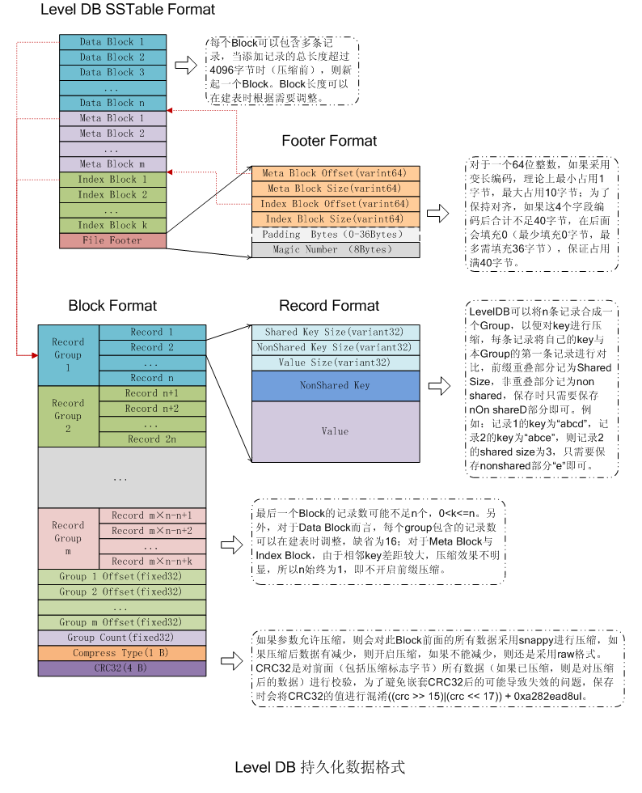
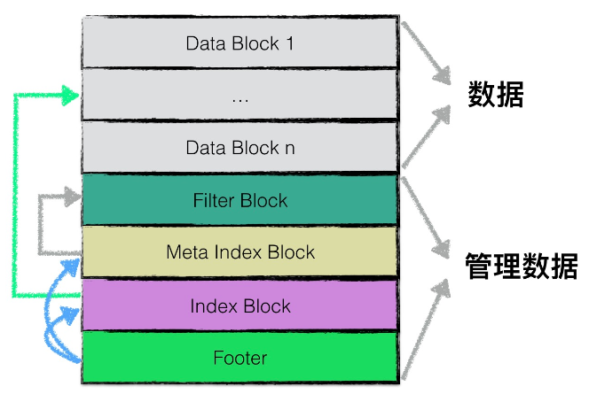
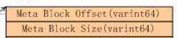
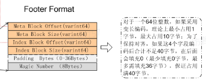
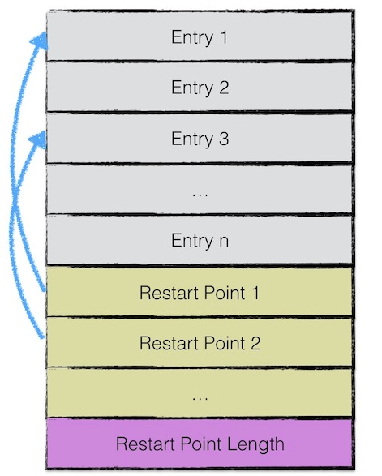
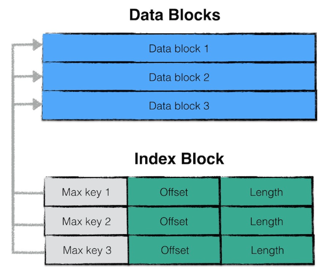
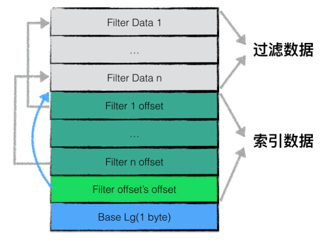
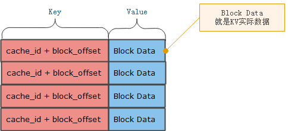
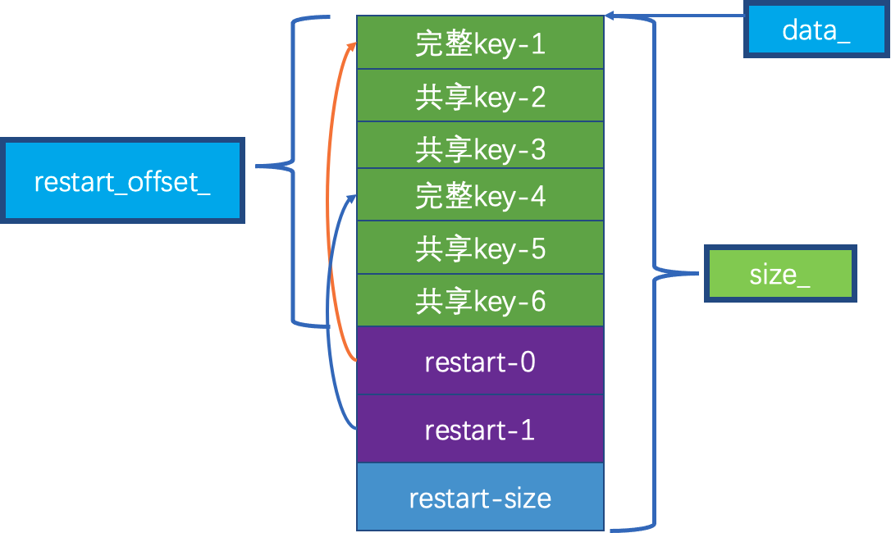

# LevelDB基本组件2


## SSTable





1. `data block`： 用来存储 `key value`数据对；
2. `filter block`：用来存储一些过滤器相关的数据（布隆过滤器），但是若用户不指定 LevelDB使用过滤器，LevelDB 在该 `block` 中不会存储任何内容；
3. `meta Index block`： 用来存储 `filter block` 的索引信息（索引信息指在该 SSTable文件中的偏移量以及数据长度）；
4. `index block`：`index block` 中用来存储每个 `data block` 的索引信息；
5. `footer`：用来存储 `meta index block` 及 `index block` 的索引信息；

### BlockHandle



#### 成员函数

- `set_offset`

- `set_size`

- `EncodeTo`：将 `offset` 和 `size` 进行编码

- `DecodeFrom`：反过来就是解码了

#### 成员变量

- `offset_`：``meta index block/data index block` 偏移量

- `size_`：``meta index block/data index block` 长度

- `kMaxEncodedLength` = 10 + 10

因为这里采用的是变长 64 位，那么在最差条件下可能会占用 10 个字节，所以这里 Max 是按照 10 个字节来计算的

其实 `BlockHandle` 就是一个封装了 `Offset` 和 `Size` 的对象。

### Footer



#### 成员变量

- `kEncodedLength`：2 * `BlockHandle::kMaxEncodedLength` + 8 ，最大长度为 48

- `metaindex_handle_`：指向 `meta index` 块

- `index_handle_`：指向 `data index` 块

- 隐藏的魔数变量：`static const uint64_t kTableMagicNumber = 0xdb4775248b80fb57ull`

#### 成员函数

- set_metaindex_handle

- set_index_handle

- EncodeTo

- DecodeFrom

#### Footer 写入

```cpp
// Write footer
if (ok()) {
  Footer footer;
  footer.set_metaindex_handle(metaindex_block_handle);
  footer.set_index_handle(index_block_handle);
  // 写入 Meta Block 和 Index Block
  std::string footer_encoding;
  footer.EncodeTo(&footer_encoding);
  // 编码
  r->status = r->file->Append(footer_encoding);
  if (r->status.ok()) {
    r->offset += footer_encoding.size();
  }
  // 添加到文件末尾
}
```

#### Footer 读取

```cpp
*table = nullptr;
if (size < Footer::kEncodedLength) {
  return Status::Corruption("file is too short to be an sstable");
}
// Footer 定长，不可能小于 48 字节
char footer_space[Footer::kEncodedLength];
Slice footer_input;
Status s = file->Read(size - Footer::kEncodedLength, Footer::kEncodedLength,
                      &footer_input, footer_space);
// 从文件末尾读出 Footer
if (!s.ok()) return s;

Footer footer;
s = footer.DecodeFrom(&footer_input);
// 解码
if (!s.ok()) return s;
```

### BlockBuilder

`BlockBuilder` 主要是用于 `index_block/data_block/meta_index_block` 的构建。

#### 成员变量

- `const Options* options_`：主要是比如重启点等

- `std::string buffer_`：序列化之后的数据

- `std::vector<uint32_t> restarts_`：内部重启点具体数值，需要注意的是他是偏移量

- `int counter_`：重启点重置的计数器

- `bool finished_`

- `std::string last_key_`：记录上一次的 `key` 

#### 成员函数

- `BlockBuilder`：刚开始 `restarts` 的第一个偏移量肯定是 0

- `Reset`

- `CurrentSizeEstimate`：计算当前 `block` 的大小，看看是否超过了

- `Finish()`：因为 `Flush` 是在循环中进行的，那么最后一次就没办法 `Flush`，所以需要额外进行 `Finish` 一把

- `Add`：记录 `key` 的共享 `key`，这样可以尽可能的少存储变量

##### 关于重启点

Block 里面的 kv 记录是按照 key 大小有序排列的，相邻的两条记录可能 key 部分存在重叠，为了减少 key 的存储量，Key i + 1 的部分只需要存和上一条 Key i 不同的部分，两者共同的部分可以从 Key i 中获得，假设 Key i + 1 是一个重启点，那么 key 里面就会完整的信息。

重启点的意思就是，在这条记录不采用只记载不同的 Key 部分，而是记录所有的 Key 值，Block 尾部就是记录哪些记录是重启点的。

#### 共享 key 压缩

```cpp
// An entry for a particular key-value pair has the form:
//     shared_bytes: varint32
//     unshared_bytes: varint32
//     value_length: varint32
//     key_delta: char[unshared_bytes]
//     value: char[value_length]
// shared_bytes == 0 for restart points.
void BlockBuilder::Add(const Slice& key, const Slice& value) {
  Slice last_key_piece(last_key_);
  // 上一个 key
  assert(!finished_);
  assert(counter_ <= options_->block_restart_interval);
  // block_restart_interval 控制着重启点之间的距离
  assert(buffer_.empty()  // No values yet?
         || options_->comparator->Compare(key, last_key_piece) > 0);
  // check 一下，首先有数据，然后当前 key 比上一次的 key 要大，因为它是有序的
  size_t shared = 0;
  if (counter_ < options_->block_restart_interval) {
    // See how much sharing to do with previous string
    const size_t min_length = std::min(last_key_piece.size(), key.size());
    while ((shared < min_length) && (last_key_piece[shared] == key[shared])) {
      shared++;
    }
    // 检查前缀，计算共享的长度
  } else {
    // Restart compression
    restarts_.push_back(buffer_.size());
    counter_ = 0;
  }
  const size_t non_shared = key.size() - shared;

  // Add "<shared><non_shared><value_size>" to buffer_
  PutVarint32(&buffer_, shared);
  PutVarint32(&buffer_, non_shared);
  PutVarint32(&buffer_, value.size());
	// 记录共享 key 和非共享 key 的大小以及 value 的长度
  // Add string delta to buffer_ followed by value
  buffer_.append(key.data() + shared, non_shared);
  buffer_.append(value.data(), value.size());
	// 存储数据
  // Update state
  last_key_.resize(shared);
  last_key_.append(key.data() + shared, non_shared);
  // 更新 last_key，用于下一次的共享 key 计算
  assert(Slice(last_key_) == key);
  counter_++;
}
```

### data_block



#### 写入流程

- 第一步：``TableBuilder` 使用 `Add` 函数，来将比如 `immemtable` 中的数据 `dump` 下来

- 第二步：如果超过阈值，则需要 `Flush`，并开启新的 `block`

  ```c++
  void TableBuilder::Flush() {
    Rep* r = rep_;
    assert(!r->closed);
    if (!ok()) return;
    if (r->data_block.empty()) return;
    assert(!r->pending_index_entry);
    WriteBlock(&r->data_block, &r->pending_handle);
    if (ok()) {
      r->pending_index_entry = true;
      r->status = r->file->Flush();
      // flush 到磁盘中
    }
    if (r->filter_block != nullptr) {
      r->filter_block->StartBlock(r->offset);
    }
  }
  ```

  

- 第三步：添加重启点数据

- 第四步：压缩和 `crc` 校验

- 第五步：更新整个文件的 `offset` 和当前数据的大小

- 第六步：刷盘

#### 读入流程

读取数据比较简单，先读取到 `index block` 中的数据所在的偏移量，然后根据 `offset` 和保存的 `data block` 所对应数据大小(不包括最后的 `crc32` 和 `compresstype`)，直接读取即可

### index block

首先需要说明的一点是：`index` 的 `block`个数是由`data` 的 `block` 决定的，也就是说当 `data block` 到达 `kBlock` 阈值之后开启新的 `block`，此时 `index block` 也会开启新的，由`pending_index_entry` 变量来辅助控制。



#### 写入流程

```c++
void TableBuilder::Add(const Slice& key, const Slice& value) {
  Rep* r = rep_;
  assert(!r->closed);
  if (!ok()) return;
  if (r->num_entries > 0) {
    assert(r->options.comparator->Compare(key, Slice(r->last_key)) > 0);
  }
	// 上一个数据的 block 刚刚刷新到磁盘
  if (r->pending_index_entry) {
    assert(r->data_block.empty());
    // 找到距离最近的 key 保存下来，不一定是原来的 key
    r->options.comparator->FindShortestSeparator(&r->last_key, key);
    std::string handle_encoding;
    // 作为 index 部分
    // r->pending_handle是每次 data block Flush 之后更新之后的 offset
    r->pending_handle.EncodeTo(&handle_encoding);
    r->index_block.Add(r->last_key, Slice(handle_encoding));
    r->pending_index_entry = false;
  }

  if (r->filter_block != nullptr) {
    r->filter_block->AddKey(key);
  }

  r->last_key.assign(key.data(), key.size());
  r->num_entries++;
  r->data_block.Add(key, value);

  const size_t estimated_block_size = r->data_block.CurrentSizeEstimate();
  if (estimated_block_size >= r->options.block_size) {
    Flush();
  }
}
// 等到最后 Finish 结束时，刷新到磁盘
Status TableBuilder::Finish() {
	...
  // Write index block
  if (ok()) {
    if (r->pending_index_entry) {
      r->options.comparator->FindShortSuccessor(&r->last_key);
      std::string handle_encoding;
      r->pending_handle.EncodeTo(&handle_encoding);
      r->index_block.Add(r->last_key, Slice(handle_encoding));
      r->pending_index_entry = false;
    }
    WriteBlock(&r->index_block, &index_block_handle);
  }
  ...
}
```

### Filter Block

Filter Block 中存的都是 Data Block中 的 key（key 是经过处理再存入到 FilterBlock 中），其作用就是提高 SSTable 的读取效率。当查询一个 key 时，可以快速定位这个 key 是否在当前SSTable 中，其流程是当进行一个 key 查询时，先通过 index block 中的二分法确定 key 在哪个 Data Block 中，取出这个 Data Block 的 offset，凭借这个 Offset 和要查询的 key 去 Filter Block中去查找确定，若判断不存在，则无需对这个 DataBlock 进行数据查找。



为了加快 SSTable 中数据查询的效率，在直接查询 `data_block` 中的内容之前，LevelDB 首先根据 `filter_block` 中的过滤数据判断指定的 `data_block` 中是否有需要查询的数据，若判断不存在，则无需对这个 `data_block` 进行数据查找。

`filter_block` 存储的是 `data_block` 数据的一些过滤信息。这些过滤数据一般指代布隆过滤器的数据，用于加快查询的速度

其中索引数据中，`filter i offset` 表示第 i 个 filter data 在整个 filter block 中的起始偏移量，`filter offset's offset` 表示 filter block 的索引数据在 filter block 中的偏移量。

在读取 filter block 中的内容时，可以首先读出 `filter offset's offset` 的值，然后依次读取 `filter i offset` ，根据这些offset分别读出 `filter data`。

Base Lg默认值为 11，表示每 2KB 的数据，创建一个新的过滤器来存放过滤数据。

#### 成员变量

- `const FilterPolicy* policy_`：目前 LevelDB 中支持的是 bf 过滤器

- `std::string keys_`：平铺的 `key`

- `std::vector<size_t> start_`：每个 `key` 在 `keys_` 中的偏移量

- `std::string result_`：构建的 `filter` 二进制数据，他是以追加的方式

- `std::vector<Slice> tmp_keys_`

- `std::vector<uint32_t> filter_offsets_`

  - 因为是每 `2KB` 的数据来创建一个 `filter`，所以可能存在多个 `filter`，而该变量记录的是 `filter` 的偏移量

  - 因为是 `uint32_t`，所以占用空间为 4 个字节

  - 他记录的是当前 `result` 的大小，单位字节

- `static const size_t kFilterBaseLg = 11`：Generate new filter every 2KB of data

- `static const size_t kFilterBase = 1 << kFilterBaseLg`

#### 成员函数

- `AddKey`：增加 `key` 到待创建的 `filterblock` 中

- `StartBlock`：根据 `datablock` 的偏移量来构建新的 `filterblock`

- `Finish()`：保存内部每个 `filter` 的偏移量，`filter` 的总字节大小， `kFilterBaseLg` 保存

- `GenerateFilter`：生成 `filter`，一个 `filterblock` 中可能包含多个 `filter` ，毕竟 2K 就会创建一个 `filter`

#### 注意点

- 他也受 `data block` 的更新而更新，当 `data block` 开启新的 `block` 时候，`filter block` 也会开启新的(`startblock`)，当然内部会遵循 2KB 一个 `filter` 来进行构建

- `filter` 这部分数据是最后批量写到 SSTable 的

#### 写入流程

1. TableBuilder 构造函数里面进行初始化 `StartBlock(0)`

   ```cpp
   TableBuilder::TableBuilder(const Options& options, WritableFile* file)
       : rep_(new Rep(options, file)) {
     if (rep_->filter_block != nullptr) {
       rep_->filter_block->StartBlock(0);
     }
   }
   ```

2. 跟随 SSTable 数据的写入，`data block` 写一个 key，`filter block` 也写一个 key

   ```cpp
   void TableBuilder::Add(const Slice& key, const Slice& value) {
   ...
     if (r->filter_block != nullptr) {
       r->filter_block->AddKey(key);
     }
   ...
   }
   ```

3. `data block` 超过阈值了，需要更新新的，此时 `filter block` 也需要重新 `StartBlock`

   ```cpp
   void TableBuilder::Flush() {
   ...
     if (r->filter_block != nullptr) {
       r->filter_block->StartBlock(r->offset);
     }
   }
   ```

4. 每执行一次 `StartBlock`，内部就会按照阈值来分配

   ```cpp
   void FilterBlockBuilder::StartBlock(uint64_t block_offset) {
     uint64_t filter_index = (block_offset / kFilterBase);
     assert(filter_index >= filter_offsets_.size());
     while (filter_index > filter_offsets_.size()) {
       GenerateFilter();
     }
   }
   void FilterBlockBuilder::GenerateFilter() {
     // key 个数
     // 当前新添加的 key 的个数，如果没有，就记录上一次 result 的大小
     const size_t num_keys = start_.size();
     if (num_keys == 0) {
       // Fast path if there are no keys for this filter
       filter_offsets_.push_back(result_.size());
       return;
     }
   
     // 根据 start_ 和 key_ 恢复出来真实的 key
     start_.push_back(keys_.size());  // Simplify length computation
     tmp_keys_.resize(num_keys);
     for (size_t i = 0; i < num_keys; i++) {
       const char* base = keys_.data() + start_[i];
       size_t length = start_[i + 1] - start_[i];
       tmp_keys_[i] = Slice(base, length);
     }
   
     // 针对当前已有的数据，构建布隆过滤器，每次都是新加
     filter_offsets_.push_back(result_.size());
     policy_->CreateFilter(&tmp_keys_[0], static_cast<int>(num_keys), &result_);
   
     // 清空，等待下一次
     tmp_keys_.clear();
     keys_.clear();
     start_.clear();
   }
   void CreateFilter(const Slice* keys, int n, std::string* dst) const override {
     // 这个 result 内部保存的就是 bf 的数值。每次都是追加构造的
     // Compute bloom filter size (in both bits and bytes)
     size_t bits = n * bits_per_key_;
   
     // For small n, we can see a very high false positive rate.  Fix it
     // by enforcing a minimum bloom filter length.
     if (bits < 64) bits = 64;
   
     size_t bytes = (bits + 7) / 8;
     bits = bytes * 8;
   
     const size_t init_size = dst->size();
     dst->resize(init_size + bytes, 0);
     // 每次都会加自己已有的长度
     dst->push_back(static_cast<char>(k_));  // Remember # of probes in filter
     char* array = &(*dst)[init_size];
     for (int i = 0; i < n; i++) {
       // Use double-hashing to generate a sequence of hash values.
       // See analysis in [Kirsch,Mitzenmacher 2006].
       uint32_t h = BloomHash(keys[i]);
       const uint32_t delta = (h >> 17) | (h << 15);  // Rotate right 17 bits
       for (size_t j = 0; j < k_; j++) {
         const uint32_t bitpos = h % bits;
         array[bitpos / 8] |= (1 << (bitpos % 8));
         h += delta;
       }
     }
   }
   ```

5. 在TableBuilder结束写时，将filter block数据写回去

   ```cpp
   Status TableBuilder::Finish() {
   ...
     // Write filter block
     if (ok() && r->filter_block != nullptr) {
       WriteRawBlock(r->filter_block->Finish(), kNoCompression,
                     &filter_block_handle);
     }
   ...
   }
   ```

   * 最后 filter Finish 收尾

   ```cpp
   Slice FilterBlockBuilder::Finish() {
     if (!start_.empty()) {
       GenerateFilter();
     }
   
     // Append array of per-filter offsets
     const uint32_t array_offset = result_.size();
     // 写入filter总的大小也就是偏移量
     for (size_t i = 0; i < filter_offsets_.size(); i++) {
       PutFixed32(&result_, filter_offsets_[i]);
       // 写入filter内部每个的偏移量
     }
   
     PutFixed32(&result_, array_offset);
     result_.push_back(kFilterBaseLg);  // Save encoding parameter in result
     // 写入filter block内部拆分的阈值
     return Slice(result_);
   }
   ```

   * WriteRawBlock处理

     ​	结尾也会添加5个字节

#### 读取流程

```cpp
FilterBlockReader::FilterBlockReader(const FilterPolicy* policy,
                                     const Slice& contents)
    : policy_(policy), data_(nullptr), offset_(nullptr), num_(0), base_lg_(0) {
  size_t n = contents.size();
  if (n < 5) return;  // 1 byte for base_lg_ and 4 for start of offset array
  base_lg_ = contents[n - 1];
  // 整个 last_word 就是 FilterBlock 中的 Filter_N Offset，即 Filter Offset 数组在 FilterBlock 中的偏移位。
  uint32_t last_word = DecodeFixed32(contents.data() + n - 5);
  if (last_word > n - 5) return;
  data_ = contents.data();
  offset_ = data_ + last_word; // Filter Offset 数组的起始偏移，实际地址
  num_ = (n - 5 - last_word) / 4; // Filter Offset 个数
}

// 匹配 key 是否在 block_offset 对应的 Filter 中
bool FilterBlockReader::KeyMayMatch(uint64_t block_offset, const Slice& key) {
  // 通过 block_offset 算出整个 key 应该在哪个 Filter 中去查找
  uint64_t index = block_offset >> base_lg_;
  
  // 这里如果 index 大于最大的 Filter offset 个数，这里还是会返回 true，默认匹配。实际去 DataBlock 中去定位查找。
  if (index < num_) {
  // Filter Offset 都是 4Byte 大小的，所以这里都是 *4。
  // start 是这个 Filter 在 FilterBlock 中的起始偏移位，
  // limit 就是这个 Filter 的大小。  
    uint32_t start = DecodeFixed32(offset_ + index * 4);
    uint32_t limit = DecodeFixed32(offset_ + index * 4 + 4);
    if (start <= limit && limit <= static_cast<size_t>(offset_ - data_)) {
      // 将 Filter 封装到 Slice 中，通过过滤策略内部实现去查找确定是否有对应的 key
      Slice filter = Slice(data_ + start, limit - start);
      return policy_->KeyMayMatch(key, filter);
    } else if (start == limit) {
      // 如果 start == limit，表示不存在这个 Filter，所以肯定不存在匹配
      // Empty filters do not match any keys
      return false;
    }
  }
  return true;  // Errors are treated as potential matches
}
```

#### 总结


还是按照这个图，我们先创建这个 Filter Block，然后不断 AddKey 进去，直到满了一页，然后 GenerateFilter，将之前的 Filter Data 写入 Result 中，就这样重复，直到被 Finish，这个时候我们需要持久化这个 Filter Block，我们会先将 Filter offset 插入到 Result 中，注意的是 Offset i 和 Data i 是一一对应的，然后我们会将 Offset’s offset 写入 Result 中，最后加入 Base Lg。

读的时候，首先我们会将这个 Result 进行拆分，我们先根据 Result 的长度和起始地址拿到 offset‘s offset，然后用 `data_`，`offset_` 分别指向 Data 和 Offset 起始的地方，然后根据 Offset 大小得到 Data 的个数。在查找某一个的时候，我们首先会得到它的 index_，也就是第几个 Offset，然后读出相应的 Offset，得到 Data 的起始地址，根据下一个 Offset，得到 Data 的终止地址，然后就可以读出整个 Filter Data，然后通过 Filter Policy 进行查找。

###  Meta Index Block

Meta Index Block用来存储 Filter Block 在整个 SSTable 中的索引信息。Meta Index Block只存储一条记录：

该记录的 key 为："filter." 与过滤器名字组成的常量字符串

该记录的 value 为：Filter Block 在 SSTable 中的索引信息序列化后的内容，索引信息包括：

* 在sstable中的偏移量
* 数据长度。

#### 写入流程

```cpp
Status TableBuilder::Finish() {
...
  if (ok()) {
    BlockBuilder meta_index_block(&r->options);
    if (r->filter_block != nullptr) {
      // Add mapping from "filter.Name" to location of filter data
      std::string key = "filter.";
      key.append(r->options.filter_policy->Name());
      std::string handle_encoding;
      filter_block_handle.EncodeTo(&handle_encoding);
      // filter_block_handle 所在的 offset 和 文件大小，可以通过这个找到 filter block 对象
      meta_index_block.Add(key, handle_encoding);
    }

    // TODO(postrelease): Add stats and other meta blocks
    WriteBlock(&meta_index_block, &metaindex_block_handle);
  }
...
}
```

#### 读取流程

1. 读取固定长度的 `Footer`，得到指向 `meta index block` 地址的数据
2. 调用 `ReadBlock` 函数，解析出 `filter block` 的位置
3. 得到 `filter block` 位置之后，就可以反解析出 `filter block` 信息

## SSTable 中的缓存

### Table Cache

TableCache 缓存的是 Table 对象，每个 DB 一个，它内部使用一个 LRUCache 缓存所有的 table 对象，实际上其内容是文件编号{``file number`, `TableAndFile*``}。

TableAndFile 是一个拥有2个变量的结构体：`RandomAccessFile*` 和 `Table*`；

#### 成员变量

- `Env* const env_`：用于读取 SST 文件

- `const std::string dbname_`：SST 名字

- `const Options& options_`：Cache参数配置

- `Cache* cache_`：缓存基类句柄

#### 成员函数

- `TableCache(const std::string& dbname, const Options& options,int entries)`：注意这里的缓存中单位是条数

- `NewIterator`：该函数为指定的 file 返回一个 iterator (对应的文件长度必须是 "file_size" 字节). 如果 tableptr 不是 NULL，那么 *tableptr 保存的是底层的 Table 指针。返回的 *tableptr是 cache 拥有的，不能被删除，生命周期同返回的 iterator

- `Get`：这是一个查找函数，如果在指定文件中 seek 到 internal key "k" 找到一个 entry，就调用 `(*handle_result)(arg,found_key, found_value)`

- `FindTable`：查找指定的 SSTable，优先去缓存找，找不到则去磁盘读取，读完之后在插入到缓存中

- `Evict`：该函数用以清除指定文件所有 cache 的 entry，函数实现很简单，就是根据 file number 清除 cache 对象

## Block  中的缓存

### Block  Cache



- **key：** 当前 table 对应的缓存 id + BlockData 在 ldb 文件中的偏移位。
- **Value：** 就是真实的 Block Data 数据。

因为打开的 ldb（就是sst）文件中的 Block Data 都是存放于全局一份的 Block Cache 中的，而不同的 ldb 文件其 Block Data 的 offset 可能相同，为了区分不同 ldb 文件中的 Block Data 的 offset，所以要给每个 ldb 文件分配一个唯一的 cache_id，这样 `key = cache_id + block_offset` 的组合就是唯一的了。

#### 读取流程

```cpp
//根据index_value(即offset+size)，读取对应的block
Iterator* Table::BlockReader(void* arg, const ReadOptions& options,
                             const Slice& index_value) {
  Table* table = reinterpret_cast<Table*>(arg);
  Cache* block_cache = table->rep_->options.block_cache;
  Block* block = nullptr;
  Cache::Handle* cache_handle = nullptr;

  BlockHandle handle;
  Slice input = index_value;
  Status s = handle.DecodeFrom(&input);
  // We intentionally allow extra stuff in index_value so that we
  // can add more features in the future.

  if (s.ok()) {
    BlockContents contents;
    if (block_cache != nullptr) {
    // 如果开启了block_cache，则先去此cache中查找
	  // key就是 id + Data Block 的 offset
      char cache_key_buffer[16];
      EncodeFixed64(cache_key_buffer, table->rep_->cache_id);
      EncodeFixed64(cache_key_buffer + 8, handle.offset());
      Slice key(cache_key_buffer, sizeof(cache_key_buffer));
      cache_handle = block_cache->Lookup(key);

	  // 在cache中查找到了直接将地址赋值给block;
      if (cache_handle != nullptr) {
        block = reinterpret_cast<Block*>(block_cache->Value(cache_handle));
      } else {
      // 未找到，则去 SSTable 文件中去查找
        s = ReadBlock(table->rep_->file, options, handle, &contents);
        if (s.ok()) {
          block = new Block(contents);
		  // 若读取的 Block 是直接 new 的，且 fill_cache，则将这个 Block 缓存起来。
          if (contents.cachable && options.fill_cache) {
            cache_handle = block_cache->Insert(key, block, block->size(),
                                               &DeleteCachedBlock);
          }
        }
      }
    } else {
     
      // 未使用 block_cache，则直接去 SSTable 中去读数据。
      s = ReadBlock(table->rep_->file, options, handle, &contents);
      if (s.ok()) {
        block = new Block(contents);
      }
    }
  }

  Iterator* iter;
  if (block != nullptr) {
    iter = block->NewIterator(table->rep_->options.comparator);
	// cache_handle 为 null，表示 block 不在缓存中，在迭代器 iter 析构时，直接删除这个 block。
	// cache_handle 非 null，表示 block 在缓存中，在迭代器 iter 析构时，通过 ReleaseBlock，减少其一次引用计数。
    if (cache_handle == nullptr) {
      iter->RegisterCleanup(&DeleteBlock, block, nullptr);
    } else {
      iter->RegisterCleanup(&ReleaseBlock, block_cache, cache_handle);
    }
  } else {
    // 若未获取到 block，则直接生存一个错误迭代器返回。
    iter = NewErrorIterator(s);
  }
  return iter;
}
```

## Table

### 类图

#### 成员变量

- `Rep* const rep_`

  - `Options options`：Table 相关的参数信息

  - `Status status`：Table 相关的状态信息

  - `RandomAccessFile* file`：Table 所持有的文件

  - `uint64_t cache_id`：Table 本身对应的缓存 id

  - `FilterBlockReader* filter`：filter block 块的读取

  - `const char* filter_data`：保存对应的 filter 数据

  - `BlockHandle metaindex_handle`：解析保存 metaindex_handler

  - `Block* index_block`：index block 数据

#### 成员函数

- `Open`

  - 1.静态函数，而且唯一是公有的接口

  - 2.主要负责解析出基本数据，如 Footer，然后解析出 meta index block + index block + filter block + data block。

  - 3.BlockContents 对象到 Block 的转换，其中主要是计算出 restart_offset_，而且 Block 是可以被遍历的

- `InternalGet`：查找指定的 key，内部先 bf 判断，然后缓存获取，最后在读取文件

- `ReadMeta`：读取元数据，主要是 Footer，然后是 meta index handle，filter handle

- `ReadFilter`：主要是根据 filter handler 还原 filter block 数据

- `NewIterator`：返回 index block 的迭代器，目的是为了确定当前 key 位于哪个 data block 中

#### Block Contents

BlockContents 类主要是用在 ReadBlock 函数中，即保存 block 解析出来的临时数据

### Block



1.  Block 作用：

- 保存 BlockContents 转换后的数据，存储至 cache 中
- 由于 SST 中存储的 block 都存在多个 item(类似一个vector)，因此需要一个迭代器来遍历

2. 核心函数讲解

​	block 中的核心函数主要是通过给定的 contents 解析出 `data_`，`restart_offset_` 的位置。

​	Iter 对于 Block 来说就是一个辅助类，它主要是根据解析出来的 block，然后指向 `restart_offset_`，根据 restart 快速找到某个 key，这里的 seek 主要是运用二分进行快速查找，因为 	block 中的 key 一定是一个单调递增

### 读取流程



1. 构建SST文件名
2. 这里我们一第0层为例，开始遍历immentable数据dump到磁盘上
3. 更新SST元数据，并刷盘

