# LevelDB 迭代器

## Iterator基类

LevelDB各个组件用不同的格式进行数据存取。在LevelDB内部、外部、各个不同阶段又不可避免的需要从不同的视角遍历这些数据。如果每一个层次的数据遍历都需要详细的关心全部数据存储格式，无疑将使得整个过程变得无比的冗余复杂。Iterator的出现正式为了解决这个问题，Iterator在各个层次上，向上层实现提供了：**无须了解下层存储细节的情况下，通过统一接口对下层数据进行遍历的能力。**采用虚函数进行抽象

### 接口

- Seek到某一位置：Seek，SeekToFirst，SeekToLast；
- 访问前驱后继：Next，Prev；
- 判断当前位置是否有效：Valid；
- 获取当前位置数据信息：key，value，status；
- 可以注册多个Cleanup方法，当Iterator析构前做一些清理操作。

### 基本 Iterator

#### MemTable Iterator

在 Memtable Skiplist 的格式上的 Iterator 实现。

MemTableIterator 是对 memtable 的迭代，本质还是对 skiplist 的迭代。

#### Block::Iter 

针对 SST 文件 Block 存储格式的 Iterator 实现。遍历的过程中解析重启点，拼接 key 的共享部分和特有部分，获取对应的 value 值。

#### Version::LevelFileNumIterator

Version中记录了当前所有文件按层次划分的二维数组。其中Level1层之上的文件由于相互之间没有交集且有序，可以利用文件信息中的最大最小Key来进行二分查找。LevelFileNumIterator就是利用这个特点实现的对文件元信息进行遍历的Iterator。其中每个项记录了当前文件最大key到文件元信息的映射关系。这里的文件元信息包含文件号及文件长度。