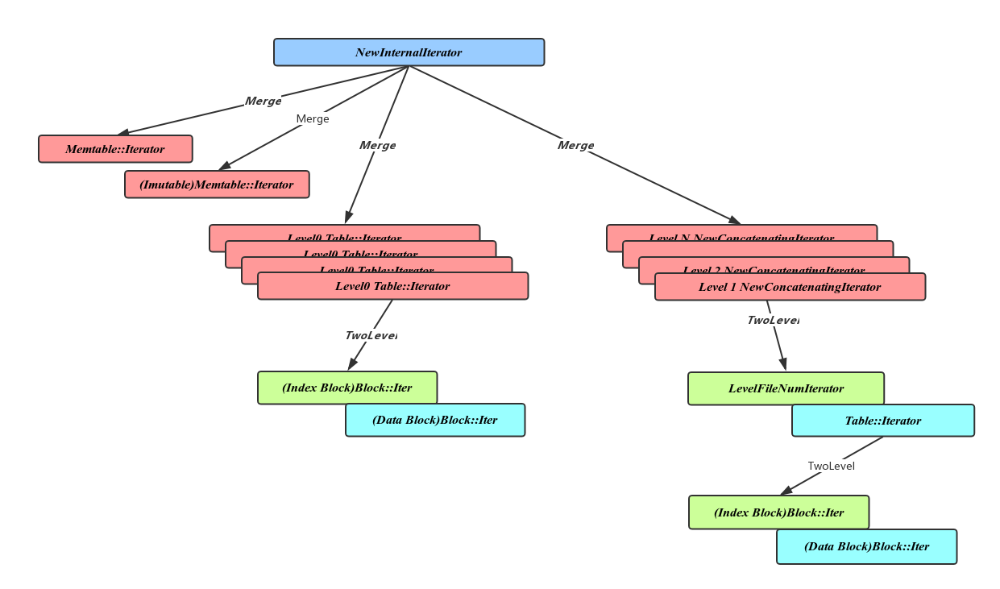
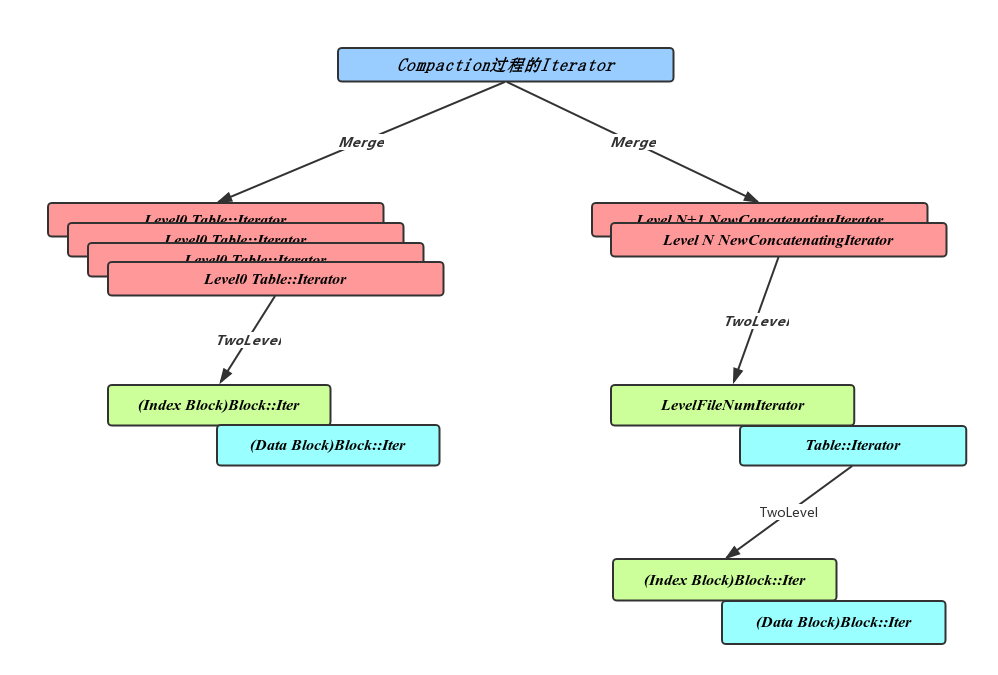
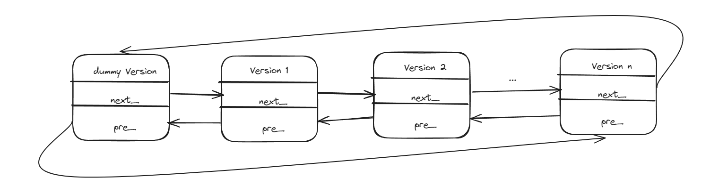
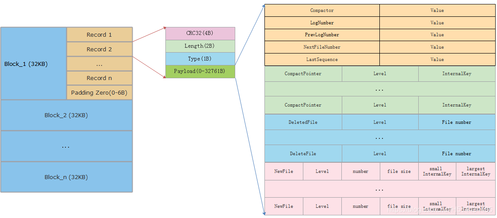
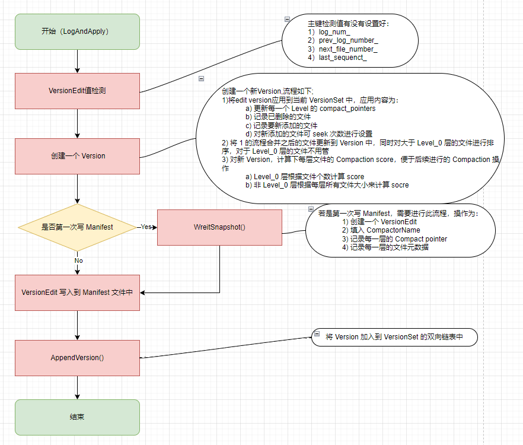
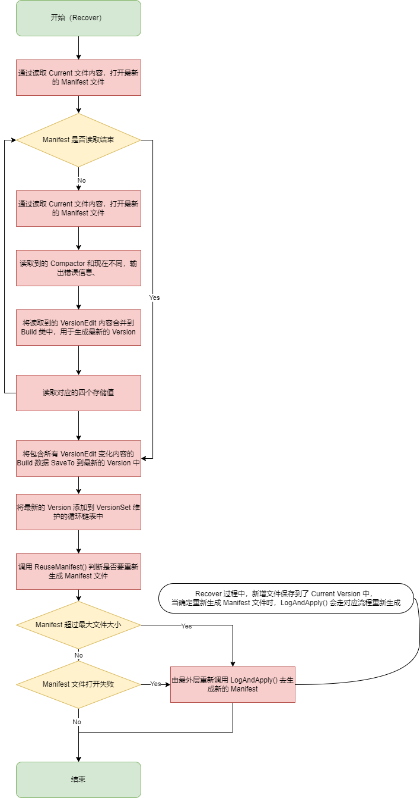
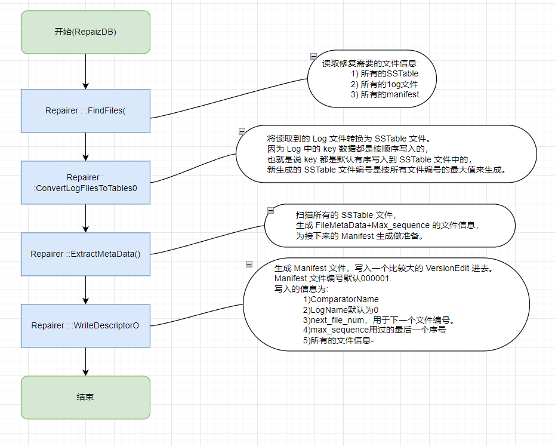
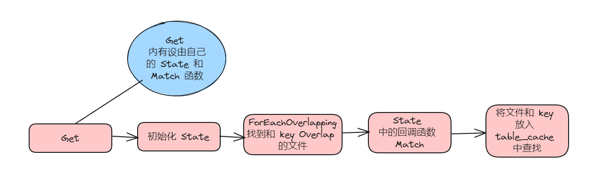
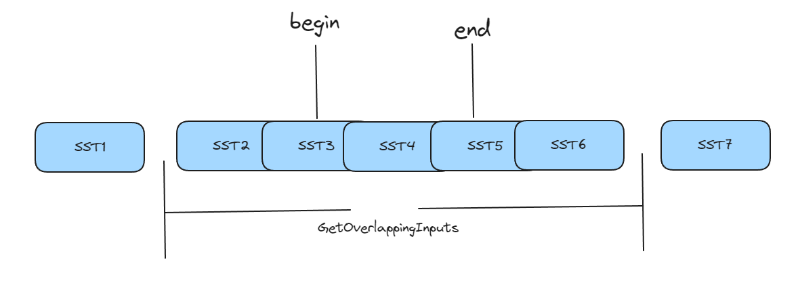

# LevelDB 迭代器

## Iterator基类


LevelDB 各个组件用不同的格式进行数据存取。在 LevelDB 内部、外部、各个不同阶段又不可避免的需要从不同的视角遍历这些数据。如果每一个层次的数据遍历都需要详细的关心全部数据存储格式，无疑将使得整个过程变得无比的冗余复杂。Iterator 的出现正式为了解决这个问题，Iterator在各个层次上，向上层实现提供了：**无须了解下层存储细节的情况下，通过统一接口对下层数据进行遍历的能力。**采用虚函数进行抽象

### 接口

- Seek到某一位置：Seek，SeekToFirst，SeekToLast；
- 访问前驱后继：Next，Prev；
- 判断当前位置是否有效：Valid；
- 获取当前位置数据信息：key，value，status；
- 可以注册多个 Cleanup 方法，当 Iterator 析构前做一些清理操作。

### 基本 Iterator

#### MemTable Iterator

在 Memtable Skiplist 的格式上的 Iterator 实现。

MemTableIterator 是对 memtable 的迭代，本质还是对 skiplist 的迭代。

#### Block::Iter 

针对 SST 文件 Block 存储格式的 Iterator 实现。遍历的过程中解析重启点，拼接 key 的共享部分和特有部分，获取对应的 value 值。

#### Version::LevelFileNumIterator

Version中记录了当前所有文件按层次划分的二维数组。其中Level1层之上的文件由于相互之间没有交集且有序，可以利用文件信息中的最大最小 Key 来进行二分查找。LevelFileNumIterator 就是利用这个特点实现的对文件元信息进行遍历的 Iterator。其中每个项记录了当前文件最大 key 到文件元信息的映射关系。这里的文件元信息包含文件号及文件长度。

### 组合 Iterator 

#### TwoLevelIterator

TwoLevelIterator 实现逻辑上有层次关系的数据的遍历操作。组合了 **index iterator** 和 **data iterator** 两层迭代器，其中 index iterator 记录从数据 key 值到 data iterator 的映射，而 data iterator 则负责真正数据 key 到 value 的映射。生成 TwoLevelIterator 时，需要提供 index Iterator 及 BlockFunction 函数，其中 BlockFunction 实现了 index iterator value 值的反序列化以及对应的 data iterator 的生成。

#### MergingIterator

通过 MergingIterator 可以实现多个有序数据集合的归并操作。其中包含多个 **child iterator** 组成的集合。对 MergingIterator 的遍历会有序的遍历其 child iterator 中的每个元素。

### 功能 Iterator

#### Table::Iterator

对SST文件的遍历，可以利用上面介绍的 TwoLevelIterator，其 **index iterator** 为 Index Block 的 Block::Iter，**data iterator **为 Data Block 的 Block::Iter

#### **NewInternalIterator**

LevelDB 作为整体同样通过 Iterator 向外部用户提供遍历全部数据的能力。这里使用 MergingIterator 将 Memtable，Immutable memtable 及各层 SST 文件的 Iterator 归并起来，使得外部使用者不用关心具体的内部实现而有序的循环 LevelDB 内部的数据，LevelDB 首先实现了 NewInternalIterator，在 NewInternalIterator 的基础上，LevelDB 有封装了 DBIter 来处理快照，过滤已删除 key。



#### Compaction过程Iterator

Compaction过程中需要对多个文件进行归并操作，并将结果输出到新的下层文件。

- 如果有 Level0 文件，则包含所有 level0 文件的 Table::Iterator
- 其他 Level 文件，加入 NewConcatenationIterator，作为一个 TwoLevelIterator，由 Version::LevelFileNumIterator 作为 index iterator，Table::Iterator 作为 data iterator



# 版本管理

## version

`Version`用于表示某次 compaction 或者打开/恢复的数据库状态。为什么需要版本的概念呢？？

针对共享的资源，有三种方式：

- 悲观锁 ，这是最简单的处理方式。加锁保护，读写互斥。效率低。
- 乐观锁，它假设多用户并发的事物在处理时不会彼此互相影响，各事务能够在不产生锁的的情况下处理各自影响的那部分数据。在提交数据更新之前，每个事务会先检查在该事务读取数据后，有没有其他事务又修改了该数据。 果其他事务有更新的话，正在提交的事务会进行回滚；这样做不会有锁竞争更不会产生死锁， 但如果数据竞争的概率较高，效率也会受影响 。
- MVCC，MVCC 是一个数据库常用的概念。Multiversion concurrency control 多版本并发控制。每一个执行操作的用户，看到的都是数据库特定时刻的的快照 (snapshot), writer 的任何未完成的修改都不会被其他的用户所看到；当对数据进行更新的时候并是不直接覆盖，而是先进行标记，然后在其他地方添加新的数据(这些变更存储在 versionedit)，从而形成一个新版本，此时再来读取的 reader 看到的就是最新的版本了。所以这种处理策略是维护了多个版本的数据的，但只有一个是最新的(versionset 中维护着全局最新的 seqnum)。

## 数据结构

### 成员变量

- `VersionSet* vset_`：隶属于哪个 versionset

- `Version* next_`

- `Version* prev_`

- `int refs_`：有多少服务还引用着这个版本

- `std::vector<FileMetaData*> files_[config::kNumLevels]`：当前版本所有数据

- `FileMetaData* file_to_compact_`：用于 seek 次数超过阈值之后需要压缩的文件

- `int file_to_compact_level_`：用于 seek 次数超过阈值之后需要压缩的文件所在的 level

- `double compaction_score_`：用于检查 size 超过阈值之后需要压缩的文件

- `int compaction_level_`：用于检查 size 超过阈值之后需要压缩的文件所在的 level

### 成员函数

- 析构函数：删除当前版本中引用技术为 0 的 file

- `NewConcatenatingIterator`：创建两层迭代器

- `AddIterators`：保存每一层的迭代器，其中第 0 层和非 0 层创建的迭代器不一样

- `Get`：用于从 SST 中读取所需要的数据

- `UpdateStats`：当查找文件而没有查找到时，更新 seek 次数状态

- `RecordReadSample`：统计读的样本，主要是用在迭代器中

- `GetOverlappingInputs`：获取指定 level 层与所给范围 key 重叠的 SST 文件

- `OverlapInLevel`：判断是否与当前 level 层有 key 重叠

- `PickLevelForMemTableOutput`：选择内存中数据 dump 到磁盘中的哪一层

- `NumFiles`：表示某一层有多少个 SST 文件

- `ForEachOverlapping`：搜索与指定范围 key 的 SST 集合

### 实现

CompactMemTable 和 BackgroundCompaction 过程中会导致新文件的产生和旧文件的删除。每当这个时候都会有一个新的对应的 Version 生成，并插入 VersionSet 链表头部。

也就是说 Version 是在 Compact 的过程中诞生的，Version 的作用就是实现 SST 的 MVCC，从而做到快照读的作用。

同时，在 Immutable 转化为 SSTable 的时候，也会产生 Version。

总的来说，只要 SSTable 发生变动，都会产生 Version。

## State 类

```cpp
struct State {
  GetStats stats;  // Holds first matching file
  int matches;

  static bool Match(void* arg, int level, FileMetaData* f) {
  State* state = reinterpret_cast<State*>(arg);
  state->matches++;
  if (state->matches == 1) {
    // Remember first match.
    state->stats.seek_file = f;
    state->stats.seek_file_level = level;
  }
  // We can stop iterating once we have a second match.
  return state->matches < 2;
  } 
};

State state;
state.matches = 0;
ForEachOverlapping(ikey.user_key, internal_key, &state, &State::Match);
```

LevelDB 是基于 lsm 树的思想来实现，因此涉及到压缩，而在 LevelDB 中其压缩有两种模式：minor compaction 和 major compaction，而 major compaction 中触发又包括 size 和 seek。因此 State 类记录了 SST 文件记录的次数，是否满足触发 compaction 的条件。

不同的 State 有不同的 Match 函数，所以在传入的时候需要将回调函数写入函数中

## FileMetaData

**SST 文件元信息结构**

* `int refs`：当前文件被引用了多少次，SSTable 可以在不同的 Version 中。

* `int allowed_seeks`：文件允许被 Seek 的次数，超过这个次数，就好把整个文件 Compact 掉。

* `uint64_t number`：这个 number 用来唯一标识一个 SSTable
*  `uint64_t file_size`：文件大小
*  `InternalKey smallest`：最小 key
*  `InternalKey largest`：最大 key

## VersionEdit

compact 会有一些改变 Version 的操作，为了减少 Version 切换的时间点，将这些操作封装成 VersionEdit，等 compact 彻底完成后，将 VersionEdit 和当前 Version 进行合并，得到的最新状态的 Version

### 数据结构

* `typedef std::set<std::pair<int, uint64_t>> DeletedFileSet`：比较器名称

* `std::string comparator_`：日志编号,该日志之前的数据均可删除

* `uint64_t log_number_`：已经弃用

* `uint64_t prev_log_number_`：下一个文件编号(ldb、idb、MAINFEST文件共享一个序号空间)

* `uint64_t next_file_number_`：最后的seq_num

* `SequenceNumber last_sequence_`

* `bool has_comparator_;`
*  `bool has_log_number_;`
* `bool has_prev_log_number_;`
* `bool has_next_file_number_;`

* `bool has_last_sequence_`：记录每一层所对应需要压缩的

* `std::vector<std::pair<int, InternalKey>> compact_pointers_`：相比上次version而言，本次需要删除的文件有哪些

* `DeletedFileSet deleted_files_`：相比上次version而言，本次新增的文件有哪些

* `std::vector<std::pair<int, FileMetaData>> new_files_;`

## VersionSet



本质上 VersionSet 就是一个双向循环链表，其中， dummy Version 是整个双向链表的头，不包含任何数据。

当一个 Version 不再被任何引用的时候，会自动删除掉

同时维护了每一个 Level 层下一次 Compact 要选取的 Start_key，全局的文件编号分配，当前的 manifest_file_number，当前 manifest 文件句柄及文件操作封装。

VersionSet 在构造的时候会默认 appendVersion 一次，这个新加入到循环链表中的 Version 也没有存任何数据，可能只是用来初始化 Current_ 变量的。

## Manifest

为了重启 LevelDB 后可以恢复到退出前的状态，需要将 DB 中的状态保存下来，这些信息就保存在 Manifest 中。当 LevelDB 出现异常时，为了能尽可能多的恢复，Manifest 中不仅保存当前的状态，也会将历史的状态也保存起来，考虑到每次状态的完全保存需要空间和耗费的时间比较多，当前采用的方式是，只在Manifest开始保存完整的状态信息（通过VersionSet::WriteSnapShot() 来实现），接下来只保存每次 compact 产生的 VersionEdit。



### Version 产生流程

* Memtable 转为新的 SSTable 或者进 行Compact 之后 SSTable 产生变化时调用 `VersionSet::LogAndApply() `产生新的 Version。

  

* LevelDB 上电还原 Version 过程，调用接口 `VersionSet::Recover()`。

  

* LevelDB 异常损坏，修复 LevelDB 过程，调用接口 `RepairDB()` 产生新的 Version。



### 代码分析

#### AddIterators

```cpp
// 注意，file_ 的一维是 Level，二维才是具体的文件，其中可以通过 number 来找到文件，number 是文件的唯一标识，类似于主键，然后通过 file size 解析文件内容。
void Version::AddIterators(const ReadOptions& options,
                           std::vector<Iterator*>* iters) {
  // Merge all level zero files together since they may overlap
  // Level = 0
  for (size_t i = 0; i < files_[0].size(); i++) {
    iters->push_back(vset_->table_cache_->NewIterator(
        options, files_[0][i]->number, files_[0][i]->file_size));
  }

  // Level > 0
  // Level > 0 是时候不会 Overlap，并且是有序的
  // 打开 Level > 0 时的文件时需要 Lazy Open
  for (int level = 1; level < config::kNumLevels; level++) {
    if (!files_[level].empty()) {
      iters->push_back(NewConcatenatingIterator(options, level));
    }
  }
}
```

对于 $level=0$ 的 SSTable 文件，直接通过 `TableCache::NewIterator()` 接口创建，这会直接载入 SST 所有的元数据到内存中。

对于 $level>0$​ 级别的 SSTable 文件，通过函数 `NewTwoLevelIterator()` 创建一个 TwoLevelIterator，使用懒加载模式。

#### ForEachOverlapping

```cpp
void Version::ForEachOverlapping(Slice user_key, Slice internal_key, void* arg,
                                 bool (*func)(void*, int, FileMetaData*)) {
  const Comparator* ucmp = vset_->icmp_.user_comparator();

	// Level = 0 的时候，遍历整个 Level，找到 Overlap 的文件
  std::vector<FileMetaData*> tmp;
  tmp.reserve(files_[0].size());
  for (uint32_t i = 0; i < files_[0].size(); i++) {
    FileMetaData* f = files_[0][i];
    if (ucmp->Compare(user_key, f->smallest.user_key()) >= 0 &&
        ucmp->Compare(user_key, f->largest.user_key()) <= 0) {
      tmp.push_back(f);
    }
  }
  // 根据文件序号对 Level_0 拿到的数据进行排序
  if (!tmp.empty()) {
    std::sort(tmp.begin(), tmp.end(), NewestFirst);
    for (uint32_t i = 0; i < tmp.size(); i++) {
      // 排序之后开始搜索，找到直接返回
      if (!(*func)(arg, 0, tmp[i])) {
        return;
      }
    }
  }

  // Search other levels.
  for (int level = 1; level < config::kNumLevels; level++) {
    size_t num_files = files_[level].size();
    if (num_files == 0) continue;

    // 其他层使用二分来查找，因为 Level > 0 的时候，文件都是有序的
    uint32_t index = FindFile(vset_->icmp_, files_[level], internal_key);
    if (index < num_files) {
      FileMetaData* f = files_[level][index];
      if (ucmp->Compare(user_key, f->smallest.user_key()) < 0) {
        // All of "f" is past any data for user_key
      } else {
        if (!(*func)(arg, level, f)) {
          return;
        }
      }
    }
  }
}
```

注册的回调函数为

```cpp
ForEachOverlapping(ikey.user_key, internal_key, &state, &State::Match);
```

NewestFirst 是

```cpp
static bool NewestFirst(FileMetaData* a, FileMetaData* b) {
  return a->number > b->number;
}
```

原理是 SST 的文件号都是递增的

#### Get

```cpp
Status Version::Get(const ReadOptions& options, const LookupKey& k,
                    std::string* value, GetStats* stats) {
  // 初始化 stats
  stats->seek_file = nullptr;
  stats->seek_file_level = -1;

  struct State {
    Saver saver;
    GetStats* stats;
    const ReadOptions* options;
    Slice ikey;
    FileMetaData* last_file_read;
    int last_file_read_level;

    VersionSet* vset;
    Status s;
    bool found;

    static bool Match(void* arg, int level, FileMetaData* f) {
      State* state = reinterpret_cast<State*>(arg);

      if (state->stats->seek_file == nullptr &&
          state->last_file_read != nullptr) {
        // We have had more than one seek for this read.  Charge the 1st file.
        state->stats->seek_file = state->last_file_read;
        state->stats->seek_file_level = state->last_file_read_level;
      }

      state->last_file_read = f;
      state->last_file_read_level = level;

      state->s = state->vset->table_cache_->Get(*state->options, f->number,
                                                f->file_size, state->ikey,
                                                &state->saver, SaveValue);
      if (!state->s.ok()) {
        state->found = true;
        return false;
      }
      switch (state->saver.state) {
        case kNotFound:
          return true;  // Keep searching in other files
        case kFound:
          state->found = true;
          return false;
        case kDeleted:
          return false;
        case kCorrupt:
          state->s =
              Status::Corruption("corrupted key for ", state->saver.user_key);
          state->found = true;
          return false;
      }

      // Not reached. Added to avoid false compilation warnings of
      // "control reaches end of non-void function".
      return false;
    }
  };
	// 初始化 state
  State state;
  state.found = false;
  state.stats = stats;
  state.last_file_read = nullptr;
  state.last_file_read_level = -1;

  state.options = &options;
  state.ikey = k.internal_key();
  state.vset = vset_;

  state.saver.state = kNotFound;
  state.saver.ucmp = vset_->icmp_.user_comparator();
  state.saver.user_key = k.user_key();
  state.saver.value = value;

  // 通过 ForEachOverlapping 找到 Overlap 的文件，然后 Match 是否有 LookupKey
  ForEachOverlapping(state.saver.user_key, state.ikey, &state, &State::Match);

  return state.found ? state.s : Status::NotFound(Slice());
}
```



#### RecordReadSample

我们知道，major compaction 机制之一就是要看 seek 次数的查找阈值

为了有效的统计每个 SST 被访问的次数，RecordReadSample 根据采样频率对 key 进行采样，判断是否需要 compaction

```cpp
bool Version::RecordReadSample(Slice internal_key) {
  ParsedInternalKey ikey;
  if (!ParseInternalKey(internal_key, &ikey)) {
    return false;
  }

  struct State {
    GetStats stats;  // Holds first matching file
    int matches;

    static bool Match(void* arg, int level, FileMetaData* f) {
      State* state = reinterpret_cast<State*>(arg);
      state->matches++;
      if (state->matches == 1) {
        // match = 0 的时候，第一次 match 的文件一定是 key overlap 的最新的文件
        state->stats.seek_file = f;
        state->stats.seek_file_level = level;
      }
      // We can stop iterating once we have a second match.
      return state->matches < 2;
    }
  };

  State state;
  state.matches = 0;
  ForEachOverlapping(ikey.user_key, internal_key, &state, &State::Match);

  // Must have at least two matches since we want to merge across
  // files. But what if we have a single file that contains many
  // overwrites and deletions?  Should we have another mechanism for
  // finding such files?
  if (state.matches >= 2) {
    // 1MB cost is about 1 seek (see comment in Builder::Apply).
    return UpdateStats(state.stats);
  }
  return false;
}
```

#### GetOverlappingInputs

在所给定的 Level 中找出和 [begin, end] 有重合的 SSTable 文件。

其中由于第0层，多个文件存在重叠，该函数常被用来压缩时候使用，而根据 LevelDB 的设计，$Level$ 层和 $Level+1$ 层 merge 时候，$Level$​ 中所有重叠的 SST 都会参与，这一点需要特别注意。

```cpp
void Version::GetOverlappingInputs(int level, const InternalKey* begin,
                                   const InternalKey* end,
                                   std::vector<FileMetaData*>* inputs) {
  assert(level >= 0);
  assert(level < config::kNumLevels);
  inputs->clear();
  Slice user_begin, user_end;
  if (begin != nullptr) {
    user_begin = begin->user_key();
  }
  if (end != nullptr) {
    user_end = end->user_key();
  }
  // 将 key 从 begin 和 end 中提取出来
  const Comparator* user_cmp = vset_->icmp_.user_comparator();
  // 从所有的文件中找到 file_start <= user_begin || user_end <= file_limit 
  for (size_t i = 0; i < files_[level].size();) {
    FileMetaData* f = files_[level][i++];
    const Slice file_start = f->smallest.user_key();
    const Slice file_limit = f->largest.user_key();
    // compare(a, b) --> (a < b) = -1, (a == b) = 0, (a > b) = 1
    if (begin != nullptr && user_cmp->Compare(file_limit, user_begin) < 0) {
      // "f" is completely before specified range; skip it
    } else if (end != nullptr && user_cmp->Compare(file_start, user_end) > 0) {
      // "f" is completely after specified range; skip it
    } else {
      inputs->push_back(f);
      if (level == 0) {
        // 0 层是特殊的，因为 0 层可能出现重叠的现象，所以需要扩大搜索范围，所以需要从新搜索
        if (begin != nullptr && user_cmp->Compare(file_start, user_begin) < 0) {
          user_begin = file_start;
          inputs->clear();
          i = 0;
        } else if (end != nullptr &&
                   user_cmp->Compare(file_limit, user_end) > 0) {
          user_end = file_limit;
          inputs->clear();
          i = 0;
        }
      }
    }
  }
}
```

$Level = 0$​ 的时候，找到 begin 和 end 所在的最大不相交的 SST 文件



#### OverlapInLevel

很直观的查询 smalliest_user_key 和 largest_user_key 之间有哪些文件，在指定的 Level 中。

```cpp
bool SomeFileOverlapsRange(const InternalKeyComparator& icmp,
                           bool disjoint_sorted_files,
                           const std::vector<FileMetaData*>& files,
                           const Slice* smallest_user_key,
                           const Slice* largest_user_key) {
  const Comparator* ucmp = icmp.user_comparator();
  if (!disjoint_sorted_files) {
    // Need to check against all files
    for (size_t i = 0; i < files.size(); i++) {
      const FileMetaData* f = files[i];
      if (AfterFile(ucmp, smallest_user_key, f) ||
          BeforeFile(ucmp, largest_user_key, f)) {
        // No overlap
      } else {
        return true;  // Overlap
      }
    }
    return false;
  }

  // Binary search over file list
  uint32_t index = 0;
  if (smallest_user_key != nullptr) {
    // Find the earliest possible internal key for smallest_user_key
    InternalKey small_key(*smallest_user_key, kMaxSequenceNumber,
                          kValueTypeForSeek);
    index = FindFile(icmp, files, small_key.Encode());
  }

  if (index >= files.size()) {
    // beginning of range is after all files, so no overlap.
    return false;
  }

  return !BeforeFile(ucmp, largest_user_key, files[index]);
}
bool Version::OverlapInLevel(int level, const Slice* smallest_user_key,
                             const Slice* largest_user_key) {
  return SomeFileOverlapsRange(vset_->icmp_, (level > 0), files_[level],
                               smallest_user_key, largest_user_key);
}
```

#### PickLevelForMemTableOutput

minor compaction 时，选择要 dump 的 Level 级别。由于第 0 层文件频繁被访问，而且有严格的数量限制，另外多个 SST 之间还存在重叠，所以为了减少读放大，我们是否可以考虑将内存中的文件 dump 到磁盘时尽可能送到高层呢？PickLevelForMemTableOutput 函数就是起这个作用的，该函数内部选择目标 Level，有如下几个原则：

1. 大于 $Level 0$ 的各层文件间是有序的，如果放到对应的层数会导致文件间不严格有序，会影响读取，则不再尝试。
2. 如果放到 $Level + 1$ 层，与 $Level + 2$ 层的文件重叠很大，就会导致 compact 到该文件时，overlap 文件过大，则不再尝试。
3. 最大返回 $Level 2$，这应该是个经验值。

```cpp
int Version::PickLevelForMemTableOutput(const Slice& smallest_user_key,
                                        const Slice& largest_user_key) {
  int level = 0;
  if (!OverlapInLevel(0, &smallest_user_key, &largest_user_key)) {
    // Push to next level if there is no overlap in next level,
    // and the #bytes overlapping in the level after that are limited.
    InternalKey start(smallest_user_key, kMaxSequenceNumber, kValueTypeForSeek);
    InternalKey limit(largest_user_key, 0, static_cast<ValueType>(0));
    std::vector<FileMetaData*> overlaps;
    // kMaxMemCompactLevel = 2
    while (level < config::kMaxMemCompactLevel) {
      if (OverlapInLevel(level + 1, &smallest_user_key, &largest_user_key)) {
        break;
      }
      // kNumLevels = 7
      if (level + 2 < config::kNumLevels) {
        // Check that file does not overlap too many grandparent bytes.
        GetOverlappingInputs(level + 2, &start, &limit, &overlaps);
        const int64_t sum = TotalFileSize(overlaps);
        if (sum > MaxGrandParentOverlapBytes(vset_->options_)) {
          break;
        }
      }
      level++;
    }
  }
  return level;
}
```

