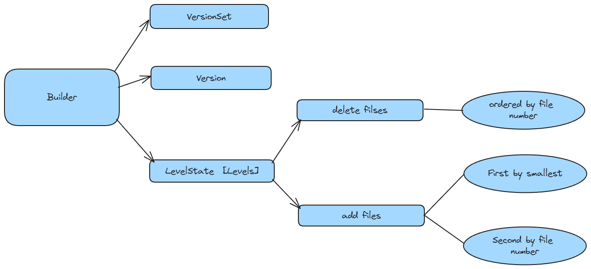

# VersionSet

## 成员变量

- `Env* const env_`
- `const std::string dbname_`
- `const Options* const options_`
- `TableCache* const table_cache_`
- `const InternalKeyComparator icmp_`
- `uint64_t next_file_number_`：下一个文件编号
- `uint64_t manifest_file_number_`：Manifest 文件编号
- `uint64_t last_sequence_`：最后一个 Seq_num
- `uint64_t log_number_`：记录的当前日志编号
- `WritableFile* descriptor_file_`：用于写 Manifest 文件
- `log::Writer* descriptor_log_`：用于写 Manifest 文件，其中 log 格式和 wal 保持一致
- `Version dummy_versions_`：固定指向双向链表的 head，而且其 Pre 指向最新 current
- `Version* current_`：指向当前最新版本
- `std::string compact_pointer_[config::kNumLevels]`
- 记录每一层在下一次需要压缩的 largest key(InternalKey)
  
- 该值取自 VersionEdit

## 成员函数

```cpp
class VersionSet {
 public:
 // 构造函数，根据参数进行初始化
  VersionSet(const std::string& dbname, const Options* options,
             TableCache* table_cache, const InternalKeyComparator*);
  VersionSet(const VersionSet&) = delete;
  VersionSet& operator=(const VersionSet&) = delete;

  ~VersionSet();
  // 将 Edit 应用到当前版本，生成新版本，并将当前状态进行持久化
  // 其中在持久化时候不需要加锁
  Status LogAndApply(VersionEdit* edit, port::Mutex* mu)
      EXCLUSIVE_LOCKS_REQUIRED(mu);

  // 从持久化的状态恢复(打开 DB 时候会调用该函数)
  Status Recover(bool* save_manifest);

  // 获取当前版本
  Version* current() const { return current_; }

  // 获取 manifest 文件编号
  uint64_t ManifestFileNumber() const { return manifest_file_number_; }

  // 分配并返回全局新的文件编号，该编号从 manifest 读取并且初始化的
  uint64_t NewFileNumber() { return next_file_number_++; }

  // 重用 FileNum，比如说 manifest
  void ReuseFileNumber(uint64_t file_number) {
    if (next_file_number_ == file_number + 1) {
      next_file_number_ = file_number;
    }
  }

  // 某一层文件总个数
  int NumLevelFiles(int level) const;

  // 某一层文件总字节
  int64_t NumLevelBytes(int level) const;

  // 返回当前最大的 Sequence
  uint64_t LastSequence() const { return last_sequence_; }

  // 设置最大的 Sequence
  void SetLastSequence(uint64_t s) {
    assert(s >= last_sequence_);
    last_sequence_ = s;
  }

  // 标记 number 已经被使用
  void MarkFileNumberUsed(uint64_t number);

  // 获取当前日志编号
  uint64_t LogNumber() const { return log_number_; }

  // 返回前一个已经压缩的日志编号，目前并未使用，默认 0 表示没这个文件
  uint64_t PrevLogNumber() const { return prev_log_number_; }

  // 选择参与压缩的 Level 和文件
  Compaction* PickCompaction();

  // 返回在 Level 层，[begin,end] 范围内可以压缩的文件
  Compaction* CompactRange(int level, const InternalKey* begin,
                           const InternalKey* end);

  // 获取 Level+1 层重叠部分的字节数
  int64_t MaxNextLevelOverlappingBytes();

  // 为参与压缩的文件创建一个迭代器
  Iterator* MakeInputIterator(Compaction* c);

  // 判断是否需要压缩（size / seek 触发）
  bool NeedsCompaction() const {
    Version* v = current_;
    return (v->compaction_score_ >= 1) || (v->file_to_compact_ != nullptr);
  }
  // 添加当前所有有效的 SST
  void AddLiveFiles(std::set<uint64_t>* live);
  // 获取该 key 近似的偏移量
  uint64_t ApproximateOffsetOf(Version* v, const InternalKey& key);
  // 每一行一个 Level 文件元数据，主要是文件的大小（human-readable）
  struct LevelSummaryStorage {
    char buffer[100];
  };
  const char* LevelSummary(LevelSummaryStorage* scratch) const;

 private:
  class Builder;

  friend class Compaction;
  friend class Version;
  // 复用 Manifest 文件
  bool ReuseManifest(const std::string& dscname, const std::string& dscbase);
  // 收尾工作，计算下一次需要压缩文件
  void Finalize(Version* v);
  // 获取给定 input 范围的最大值阖最小值
  void GetRange(const std::vector<FileMetaData*>& inputs, InternalKey* smallest,
                InternalKey* largest);
  
  void GetRange2(const std::vector<FileMetaData*>& inputs1,
                 const std::vector<FileMetaData*>& inputs2,
                 InternalKey* smallest, InternalKey* largest);
  // 在 Level+1 层获取所有与当前的文件集合有 Key 重合的文件。
  void SetupOtherInputs(Compaction* c);

  // 将当前的状态写入到日志
  Status WriteSnapshot(log::Writer* log);

  // 将新版本追加到 VersionSet 中，并更新 Current
  void AppendVersion(Version* v);
};
```

## Builder

### 成员变量



### 成员函数


* 构造函数

* 析构函数

  由于 levels_[level].added_filse 是动态分配的，析构函数不释放会造成内存泄漏

  ```cpp
  ~Builder() {
    for (int level = 0; level < config::kNumLevels; level++) {
      const FileSet* added = levels_[level].added_files;
      // 不能直接 delete，可能有其他还在共享这些 file，所以只能复制出去
      std::vector<FileMetaData*> to_unref;
      to_unref.reserve(added->size());
      for (FileSet::const_iterator it = added->begin(); it != added->end();
           ++it) {
        to_unref.push_back(*it);
      }
      delete added;
      for (uint32_t i = 0; i < to_unref.size(); i++) {
        FileMetaData* f = to_unref[i];
        f->refs--;
        if (f->refs <= 0) {
          delete f;
        }
      }
    }
    base_->Unref();
  }
  ```

  

* `void MaybeAddFile(Version* v, int level, FileMetaData* f)`：在 `delete files count == 0`，并且 f 和 `files_[level]` 没有重叠时，加入 files

* Apply：将 Edit 中的内容应用到 Current State

  ```cpp
  void Apply(const VersionEdit* edit) {
    // 将 Edit 下一次需要压缩的 Level 和最大 Key 更新到 VersionSet 中
    for (size_t i = 0; i < edit->compact_pointers_.size(); i++) {
      const int level = edit->compact_pointers_[i].first;
      vset_->compact_pointer_[level] =
        edit->compact_pointers_[i].second.Encode().ToString();
    }
  
    // 将 Edit 中需要删除的文件（ Level + Number ）更新到 VersionSet 中
    for (const auto& deleted_file_set_kvp : edit->deleted_files_) {
      const int level = deleted_file_set_kvp.first;
      const uint64_t number = deleted_file_set_kvp.second;
      levels_[level].deleted_files.insert(number);
    }
  
    // 新增文件也要写入 VersionSet 中，并且要设置其元数据信息
    for (size_t i = 0; i < edit->new_files_.size(); i++) {
      const int level = edit->new_files_[i].first;
      FileMetaData* f = new FileMetaData(edit->new_files_[i].second);
      f->refs = 1;
      
      f->allowed_seeks = static_cast<int>((f->file_size / 16384U));
      if (f->allowed_seeks < 100) f->allowed_seeks = 100;
  		// 新增的文件要从已删除文件中擦除
      levels_[level].deleted_files.erase(f->number);
      levels_[level].added_files->insert(f);
    }
  }
  ```

  

* SaveTo：将 Current State 持久化

  ```cpp
  void SaveTo(Version* v) {
    BySmallestKey cmp;
    cmp.internal_comparator = &vset_->icmp_;
    for (int level = 0; level < config::kNumLevels; level++) {
      // 提出当前 Version 的 files[level]，还有 vector 的首尾迭代器
      const std::vector<FileMetaData*>& base_files = base_->files_[level];
      std::vector<FileMetaData*>::const_iterator base_iter = base_files.begin();
      std::vector<FileMetaData*>::const_iterator base_end = base_files.end();
      // 已经存在的 SST 加上新增的 SST
      const FileSet* added_files = levels_[level].added_files;
      v->files_[level].reserve(base_files.size() + added_files->size());
      // 整体是一个为了减少复杂度的一个东西，我们可以看到 base_iter 是递增的，也就是说每一个 base_iter 只会被 MaybeAddFile 一次。复杂度主要落在二分和 MaybeAddFile 上
      for (const auto& added_file : *added_files) {
        // Add all smaller files listed in base_
        for (std::vector<FileMetaData*>::const_iterator bpos =
             std::upper_bound(base_iter, base_end, added_file, cmp);
             base_iter != bpos; ++base_iter) {
          MaybeAddFile(v, level, *base_iter);
        }
  
        MaybeAddFile(v, level, added_file);
      }
  
      // 将剩下的保存起来
      for (; base_iter != base_end; ++base_iter) {
        MaybeAddFile(v, level, *base_iter);
      }
    }
  }
  ```
  
  

## 成员函数详解

#### 构造函数

会创建一个空的 version(**因为此时 VersionSet 成员变量都是默认值**)，毕竟总得有个 Version 让你来 Apply 的吧。

#### 析构函数

```cpp
VersionSet::~VersionSet() {
  // 引用技术减 1
  current_->Unref();
  // 确保是空的
  assert(dummy_versions_.next_ == &dummy_versions_);  // List must be empty
  // 删除 manifest 创建的资源
  delete descriptor_log_;
  delete descriptor_file_;
}
```

由于每个 DB 只会有一个 VersionSet 对象，所以 VersionSet 释放，意味着 DB 要 close 了。

#### Finalize

当产生新版本时，遍历所有的层，比较该层文件总大小与基准大小，得到一个最应当 compact 的层。

double compaction_score_ 和 int compaction_level_：主要就是在Finalize函数中进行计算、

- Level = 0 看文件个数，降低 seek 的次数，提高读性能，个数 / 4
- Level > 0 看文件大小，减少磁盘占用，大小 / ($10M^{level}$​​)

```cpp
void VersionSet::Finalize(Version* v) {
  // Precomputed best level for next compaction
  int best_level = -1;
  double best_score = -1;

  for (int level = 0; level < config::kNumLevels - 1; level++) {
    double score;
    // Level 0 有4个文件，score = 1.0
  	// Level 1 文件大小为 9M，score = 0.9
  	// 那么 compact 的 Level 就是 0，score = 1.0
    if (level == 0) {
      // We treat level-0 specially by bounding the number of files
      // instead of number of bytes for two reasons:
      //
      // (1) With larger write-buffer sizes, it is nice not to do too
      // many level-0 compactions.
      //
      // (2) The files in level-0 are merged on every read and
      // therefore we wish to avoid too many files when the individual
      // file size is small (perhaps because of a small write-buffer
      // setting, or very high compression ratios, or lots of
      // overwrites/deletions).
      score = v->files_[level].size() /
              static_cast<double>(config::kL0_CompactionTrigger);
    } else {
      // Compute the ratio of current size to size limit.
      const uint64_t level_bytes = TotalFileSize(v->files_[level]);
      score =
          static_cast<double>(level_bytes) / MaxBytesForLevel(options_, level);
    }

    if (score > best_score) {
      best_level = level;
      best_score = score;
    }
  }

  v->compaction_level_ = best_level;
  v->compaction_score_ = best_score;
}
// 10**level，即 level 1 = 10M, level 2 = 100M, ...  
static double MaxBytesForLevel(const Options* options, int level) {
  // Note: the result for level zero is not really used since we set
  // the level-0 compaction threshold based on number of files.

  // Result for both level-0 and level-1
  double result = 10. * 1048576.0;//10M
  while (level > 1) {
    result *= 10;
    level--;
  }
  return result;
}
```

可以看到 Level 0 与其他层不同，看的是文件个数，因为 Level 0 的文件是重叠的，每次读取都需要遍历所有文件，所以文件个数更加影响性能。

在 Major Compaction 中，我们会使用到compaction_level_ 和 compaction_score_ 的

```cpp
// We prefer compactions triggered by too much data in a level over
// the compactions triggered by seeks.
const bool size_compaction = (current_->compaction_score_ >= 1);//文件数过多
const bool seek_compaction = (current_->file_to_compact_ != nullptr);//seek了多次文件但是没有查到，记录到的file_to_c
```


#### LogAndApply

```cpp
Status VersionSet::LogAndApply(VersionEdit* edit, port::Mutex* mu) {
  if (edit->has_log_number_) {
    assert(edit->log_number_ >= log_number_);
    assert(edit->log_number_ < next_file_number_);
  } else {
    edit->SetLogNumber(log_number_);
  }

  if (!edit->has_prev_log_number_) {
    edit->SetPrevLogNumber(prev_log_number_);
  }

  edit->SetNextFile(next_file_number_);
  edit->SetLastSequence(last_sequence_);
  // 设置新的 Version 信息
  // 产生新的版本，新版本是 Version + Edit
  Version* v = new Version(this);
  {
    Builder builder(this, current_);
    builder.Apply(edit);
    builder.SaveTo(v);
  }
  // 选择下一次需要压缩的文件，由于是单线程的，所以要找到最适合 Compact 的 Level
  Finalize(v);

  // 写入 Manifest 文件中
  std::string new_manifest_file;
  Status s;
  // 第一次时，VersionEdit 的日志文件还没被创建，比如刚打开一全新的数据库时，此时需要将当前的版本的状态作为 base 状态写入快照。
  if (descriptor_log_ == nullptr) {
    assert(descriptor_file_ == nullptr);
    new_manifest_file = DescriptorFileName(dbname_, manifest_file_number_);
    s = env_->NewWritableFile(new_manifest_file, &descriptor_file_);
    // 此时需要开启一个新的 Manifest 文件，所以将当前版本记录下来，作为未来恢复的一个版本
    if (s.ok()) {
      descriptor_log_ = new log::Writer(descriptor_file_);
      s = WriteSnapshot(descriptor_log_);
    }
  }

  // 在 Manifest 刷盘的时候，此时不需要加锁
  {
    mu->Unlock();
		// 如果有已经打开的，直接追加
    if (s.ok()) {
      std::string record;
      edit->EncodeTo(&record);
      s = descriptor_log_->AddRecord(record);
      if (s.ok()) {
        s = descriptor_file_->Sync();
      }
      if (!s.ok()) {
        Log(options_->info_log, "MANIFEST write: %s\n", s.ToString().c_str());
      }
    }

    // 如果产生了新的 Manifest 文件，由于 Current 指向最新的，此时 Current 文件也需要更新
    if (s.ok() && !new_manifest_file.empty()) {
      s = SetCurrentFile(env_, dbname_, manifest_file_number_);
    }

    mu->Lock();
  }

  // 更新版本的 AppendVersion，并更新最新的 log_number
  if (s.ok()) {
    AppendVersion(v);
    log_number_ = edit->log_number_;
    prev_log_number_ = edit->prev_log_number_;
  } else {
    delete v;
    if (!new_manifest_file.empty()) {
      delete descriptor_log_;
      delete descriptor_file_;
      descriptor_log_ = nullptr;
      descriptor_file_ = nullptr;
      env_->RemoveFile(new_manifest_file);
    }
  }

  return s;
}
```

#### Recover

从 Manifest 文件中恢复数据，主要是元数据。

```cpp
Status VersionSet::Recover(bool* save_manifest) {
  struct LogReporter : public log::Reader::Reporter {
    Status* status;
    void Corruption(size_t bytes, const Status& s) override {
      if (this->status->ok()) *this->status = s;
    }
  };

  // 读取 Current 文件
  std::string current;
  Status s = ReadFileToString(env_, CurrentFileName(dbname_), &current);
  if (!s.ok()) {
    return s;
  }
  if (current.empty() || current[current.size() - 1] != '\n') {
    return Status::Corruption("CURRENT file does not end with newline");
  }
  current.resize(current.size() - 1);

  std::string dscname = dbname_ + "/" + current;
  SequentialFile* file;
  s = env_->NewSequentialFile(dscname, &file);
  if (!s.ok()) {
    if (s.IsNotFound()) {
      return Status::Corruption("CURRENT points to a non-existent file",
                                s.ToString());
    }
    return s;
  }

  bool have_log_number = false;
  bool have_prev_log_number = false;
  bool have_next_file = false;
  bool have_last_sequence = false;
  uint64_t next_file = 0;
  uint64_t last_sequence = 0;
  uint64_t log_number = 0;
  uint64_t prev_log_number = 0;
  Builder builder(this, current_);
  int read_records = 0;
	// 保存每一个 VersionEdit
  {
    LogReporter reporter;
    reporter.status = &s;
    log::Reader reader(file, &reporter, true /*checksum*/,
                       0 /*initial_offset*/);
    Slice record;
    std::string scratch;
    while (reader.ReadRecord(&record, &scratch) && s.ok()) {
      ++read_records;
      VersionEdit edit;
      s = edit.DecodeFrom(record);
      if (s.ok()) {
        if (edit.has_comparator_ &&
            edit.comparator_ != icmp_.user_comparator()->Name()) {
          s = Status::InvalidArgument(
              edit.comparator_ + " does not match existing comparator ",
              icmp_.user_comparator()->Name());
        }
      }

      if (s.ok()) {
        builder.Apply(&edit);
      }

      if (edit.has_log_number_) {
        log_number = edit.log_number_;
        have_log_number = true;
      }

      if (edit.has_prev_log_number_) {
        prev_log_number = edit.prev_log_number_;
        have_prev_log_number = true;
      }

      if (edit.has_next_file_number_) {
        next_file = edit.next_file_number_;
        have_next_file = true;
      }

      if (edit.has_last_sequence_) {
        last_sequence = edit.last_sequence_;
        have_last_sequence = true;
      }
    }
  }
  delete file;
  file = nullptr;

  if (s.ok()) {
    if (!have_next_file) {
      s = Status::Corruption("no meta-nextfile entry in descriptor");
    } else if (!have_log_number) {
      s = Status::Corruption("no meta-lognumber entry in descriptor");
    } else if (!have_last_sequence) {
      s = Status::Corruption("no last-sequence-number entry in descriptor");
    }

    if (!have_prev_log_number) {
      prev_log_number = 0;
    }

    MarkFileNumberUsed(prev_log_number);
    MarkFileNumberUsed(log_number);
  }

  if (s.ok()) {
    // 将所有 Edit 应用到新版本中
    Version* v = new Version(this);
    builder.SaveTo(v);
    // 计算下一次 Compaction 的文件
    Finalize(v);
    // 追加到 VersionSet 中
    AppendVersion(v);
    // 指向最新
    manifest_file_number_ = next_file;
    next_file_number_ = next_file + 1;
    last_sequence_ = last_sequence;
    log_number_ = log_number;
    prev_log_number_ = prev_log_number;

    // 是否复用已有的 Manifest
    if (ReuseManifest(dscname, current)) {
      // No need to save new manifest
    } else {
      *save_manifest = true;
    }
  } else {
    std::string error = s.ToString();
    Log(options_->info_log, "Error recovering version set with %d records: %s",
        read_records, error.c_str());
  }

  return s;
}
```

#### ReuseManiFest

考虑到 Manifest 只有在 DB Open 时候才会有机会创建新的，这样导致两个结果：

- Manifest 文件会越来越大
- Manifest 内部会包含很多过期的无效的版本，后期恢复时候非常缓慢。

 因此用户可以按需使用

```cpp
bool VersionSet::ReuseManifest(const std::string& dscname,
                               const std::string& dscbase) {
  // 检查参数是否打开
  if (!options_->reuse_logs) {
    return false;
  }
  FileType manifest_type;
  uint64_t manifest_number;
  uint64_t manifest_size;
  // 确保文件不会太大
  if (!ParseFileName(dscbase, &manifest_number, &manifest_type) ||
      manifest_type != kDescriptorFile ||
      !env_->GetFileSize(dscname, &manifest_size).ok() ||
      // Make new compacted MANIFEST if old one is too big
      manifest_size >= TargetFileSize(options_)) {
    return false;
  }

  assert(descriptor_file_ == nullptr);
  assert(descriptor_log_ == nullptr);
  Status r = env_->NewAppendableFile(dscname, &descriptor_file_);
  if (!r.ok()) {
    Log(options_->info_log, "Reuse MANIFEST: %s\n", r.ToString().c_str());
    assert(descriptor_file_ == nullptr);
    return false;
  }

  Log(options_->info_log, "Reusing MANIFEST %s\n", dscname.c_str());
  descriptor_log_ = new log::Writer(descriptor_file_, manifest_size);
  manifest_file_number_ = manifest_number;
  return true;
}
```

#### WriteSnapshot

主要是新打开 DB 时候将当前的 Version 作为 Base Version 写入快照

#### ApproximateOffsetOf

查询某个key大约需要访问的总字节数(主要是SST的大小)

```cpp
uint64_t VersionSet::ApproximateOffsetOf(Version* v, const InternalKey& ikey) {
  uint64_t result = 0;
  for (int level = 0; level < config::kNumLevels; level++) {
    const std::vector<FileMetaData*>& files = v->files_[level];
    for (size_t i = 0; i < files.size(); i++) {
      // 文件在 ikey 前面，需要访问到
      if (icmp_.Compare(files[i]->largest, ikey) <= 0) {
        result += files[i]->file_size;
      // 文件在 ikey 后面，不需要访问到
      } else if (icmp_.Compare(files[i]->smallest, ikey) > 0) {
        if (level > 0) {
          // Level > 0 是有序的，所以后面不用管了，直接进入下一个 Level
          break;
        }
      // 定位到文件，去内部找大概在什么位置
      } else {
        Table* tableptr;
        Iterator* iter = table_cache_->NewIterator(
            ReadOptions(), files[i]->number, files[i]->file_size, &tableptr);
        if (tableptr != nullptr) {
          result += tableptr->ApproximateOffsetOf(ikey.Encode());
        }
        delete iter;
      }
    }
  }
  return result;
}
```

#### AddLiveFiles

读取所有版本的数据

#### MaxNextLevelOverlappingBytes

找到 $Level\ i$ 的文件对应 Overlap $Level\ i + 1 $的哪些文件，找到其中 Overlap $Level\ i + 1 $中文件最多的那一个

```cpp
int64_t VersionSet::MaxNextLevelOverlappingBytes() {
  int64_t result = 0;
  std::vector<FileMetaData*> overlaps;
  for (int level = 1; level < config::kNumLevels - 1; level++) {
    for (size_t i = 0; i < current_->files_[level].size(); i++) {
      const FileMetaData* f = current_->files_[level][i];
      current_->GetOverlappingInputs(level + 1, &f->smallest, &f->largest,
                                     &overlaps);
      const int64_t sum = TotalFileSize(overlaps);
      if (sum > result) {
        result = sum;
      }
    }
  }
  return result;
}
```

#### GetRange

给定集合的最大阈值和最小阈值

#### GetRange2

两个集合的最大阈值和最小阈值

#### MakeInputIterator

创建多层合并迭代器，用于 Compaction 后的数据进行 Merge。

- 第 0 层需要互相 Merge，因此可能涉及到文件有多个
- 其他层，只需要创建一个即可

```cpp
Iterator* VersionSet::MakeInputIterator(Compaction* c) {
  ReadOptions options;
  options.verify_checksums = options_->paranoid_checks;
  options.fill_cache = false;

  const int space = (c->level() == 0 ? c->inputs_[0].size() + 1 : 2);
  Iterator** list = new Iterator*[space];
  int num = 0;
  // Level c 和 Level c+1
  for (int which = 0; which < 2; which++) {
    if (!c->inputs_[which].empty()) {
      // Level 0
      // 需要全部加入 list 中
      if (c->level() + which == 0) {
        const std::vector<FileMetaData*>& files = c->inputs_[which];
        for (size_t i = 0; i < files.size(); i++) {
          list[num++] = table_cache_->NewIterator(options, files[i]->number,
                                                  files[i]->file_size);
        }
      } else {
        // 两层迭代器，主要是 SST 和内部的 Block 的 index
        // 其他层，只需要创建一个
        list[num++] = NewTwoLevelIterator(
            new Version::LevelFileNumIterator(icmp_, &c->inputs_[which]),
            &GetFileIterator, table_cache_, options);
      }
    }
  }
  assert(num <= space);
  // 创建 Merge 迭代器
  Iterator* result = NewMergingIterator(&icmp_, list, num);
  delete[] list;
  return result;
}
```

#### PickCompaction

```cpp
Compaction* VersionSet::PickCompaction() {
	// 判断是否需要 Compact
  Compaction* c;
  int level;

  // 大小阈值
  const bool size_compaction = (current_->compaction_score_ >= 1);
  // seek 阈值
  const bool seek_compaction = (current_->file_to_compact_ != nullptr);
  // 优先选择大小
  // 因为压缩会消耗 CPU，因此保证每次不能太多，而大小阈值权重相比 seek 更大
  if (size_compaction) {
    // 用于检查 size 超过阈值之后需要压缩的文件所在的 Level
    level = current_->compaction_level_;
    assert(level >= 0);
    assert(level + 1 < config::kNumLevels);
    c = new Compaction(options_, level);

    // Pick the first file that comes after compact_pointer_[level]
    for (size_t i = 0; i < current_->files_[level].size(); i++) {
      FileMetaData* f = current_->files_[level][i];
      // 查找第一个在 compact_pointer_[level] 之后的文件，得到需要压缩的范围
      if (compact_pointer_[level].empty() ||
          icmp_.Compare(f->largest.Encode(), compact_pointer_[level]) > 0) {
        c->inputs_[0].push_back(f);
        break;
      }
    }
    // 如果为 empty，就使用第一个开始慢慢压缩
    if (c->inputs_[0].empty()) {
      c->inputs_[0].push_back(current_->files_[level][0]);
    }
  } else if (seek_compaction) {
    // seek 次数超过限制之后需要压缩的文件所在的 Level
    level = current_->file_to_compact_level_;
    // 保存 seek 次数超过限制的 SST 文件
    c = new Compaction(options_, level);
    c->inputs_[0].push_back(current_->file_to_compact_);
  } else {
    return nullptr;
  }

  c->input_version_ = current_;
  c->input_version_->Ref();

  // Level 0 存在重叠，所以特殊处理
  if (level == 0) {
    InternalKey smallest, largest;
    // 获取当前最大范围的 key
    GetRange(c->inputs_[0], &smallest, &largest);
    // 得到重叠的所有文件
    current_->GetOverlappingInputs(0, &smallest, &largest, &c->inputs_[0]);
    assert(!c->inputs_[0].empty());
  }
	// Level i+1 的 SST 确定
  SetupOtherInputs(c);

  return c;
}
```

#### SetupOtherInputs

由于 GetOverlappingInputs 是开区间，所以如果现在有一个文件范围是 [l1, u1]，一个文件是 [l2, u2]，并且`user_key(u1) == user_key(l2)` 这个时候如果我们将 [l1, u1]，compact 到下一 Level，下一次查询就会在 Level 层提前返回数据，所以这个时候我们需要将 [l2, u2] 这个文件也列入 Compact 文件中，于是就有了 AddBoundaryInputs

```cpp
FileMetaData* FindSmallestBoundaryFile(
    const InternalKeyComparator& icmp,
    const std::vector<FileMetaData*>& level_files,
    const InternalKey& largest_key) {
  const Comparator* user_cmp = icmp.user_comparator();
  FileMetaData* smallest_boundary_file = nullptr;
  for (size_t i = 0; i < level_files.size(); ++i) {
    FileMetaData* f = level_files[i];
    if (icmp.Compare(f->smallest, largest_key) > 0 &&
        user_cmp->Compare(f->smallest.user_key(), largest_key.user_key()) ==
            0) {
      if (smallest_boundary_file == nullptr ||
          icmp.Compare(f->smallest, smallest_boundary_file->smallest) < 0) {
        smallest_boundary_file = f;
      }
    }
  }
  return smallest_boundary_file;
}
void AddBoundaryInputs(const InternalKeyComparator& icmp,
                       const std::vector<FileMetaData*>& level_files,
                       std::vector<FileMetaData*>* compaction_files) {
  InternalKey largest_key;

  // Quick return if compaction_files is empty.
  if (!FindLargestKey(icmp, *compaction_files, &largest_key)) {
    return;
  }

  bool continue_searching = true;
  while (continue_searching) {
    FileMetaData* smallest_boundary_file =
        FindSmallestBoundaryFile(icmp, level_files, largest_key);

    // If a boundary file was found advance largest_key, otherwise we're done.
    if (smallest_boundary_file != NULL) {
      compaction_files->push_back(smallest_boundary_file);
      largest_key = smallest_boundary_file->largest;
    } else {
      continue_searching = false;
    }
  }
}
```

找出所有的边界文件，并将其加入 Compaction 文件中

```cpp
void VersionSet::SetupOtherInputs(Compaction* c) {
  const int level = c->level();
  InternalKey smallest, largest;
	// 处理 Level 层的临界值，因为随着压缩，同一个 User_key 可能在不同的 SST 中
  AddBoundaryInputs(icmp_, current_->files_[level], &c->inputs_[0]);
  // 获取 Level 层的范围
  GetRange(c->inputs_[0], &smallest, &largest);
	// 获取 Level + 1 层被 Level 层 Overlap 的文件
  current_->GetOverlappingInputs(level + 1, &smallest, &largest,
                                 &c->inputs_[1]);
  // 处理 Level + 1 层的临界值
  AddBoundaryInputs(icmp_, current_->files_[level + 1], &c->inputs_[1]);

  // 得到整个 Compaction 影响的范围
  InternalKey all_start, all_limit;
  GetRange2(c->inputs_[0], c->inputs_[1], &all_start, &all_limit);

  // See if we can grow the number of inputs in "level" without
  // changing the number of "level+1" files we pick up.
  if (!c->inputs_[1].empty()) {
    std::vector<FileMetaData*> expanded0;
    current_->GetOverlappingInputs(level, &all_start, &all_limit, &expanded0);
    AddBoundaryInputs(icmp_, current_->files_[level], &expanded0);
    // 老的 Level 层的文件个数
    const int64_t inputs0_size = TotalFileSize(c->inputs_[0]);
    // Level + 1 层的文件个数
    const int64_t inputs1_size = TotalFileSize(c->inputs_[1]);
    // 扩展后 Level 层的文件个数
    const int64_t expanded0_size = TotalFileSize(expanded0);
    // 如果扩展新增文件，并且参与压缩的大小小于阈值（默认 50M ）
    if (expanded0.size() > c->inputs_[0].size() &&
        inputs1_size + expanded0_size <
            ExpandedCompactionByteSizeLimit(options_)) {
      InternalKey new_start, new_limit;
      // 计算扩展的范围
      GetRange(expanded0, &new_start, &new_limit);
      std::vector<FileMetaData*> expanded1;
      // 重新计算 Level + 1 重叠的文件
      current_->GetOverlappingInputs(level + 1, &new_start, &new_limit,
                                     &expanded1);
      AddBoundaryInputs(icmp_, current_->files_[level + 1], &expanded1);
      // 如果并未新增
      if (expanded1.size() == c->inputs_[1].size()) {
        Log(options_->info_log,
            "Expanding@%d %d+%d (%ld+%ld bytes) to %d+%d (%ld+%ld bytes)\n",
            level, int(c->inputs_[0].size()), int(c->inputs_[1].size()),
            long(inputs0_size), long(inputs1_size), int(expanded0.size()),
            int(expanded1.size()), long(expanded0_size), long(inputs1_size));
        smallest = new_start;
        largest = new_limit;
        c->inputs_[0] = expanded0;
        c->inputs_[1] = expanded1;
        // 重新计算最大最小，以及范围
        GetRange2(c->inputs_[0], c->inputs_[1], &all_start, &all_limit);
      }
    }
  }

  // (parent == level+1; grandparent == level+2)
  // 计算压缩之后和 grandparent Overlap 的字节数
  if (level + 2 < config::kNumLevels) {
    current_->GetOverlappingInputs(level + 2, &all_start, &all_limit,
                                   &c->grandparents_);
  }

  // 填充下一次 compact 的起始 key
  compact_pointer_[level] = largest.Encode().ToString();
  // 将其记录到 VersionEdit 中
  c->edit_.SetCompactPointer(level, largest);
}
```

#### CompactRange

// 该函数主要用于手动触发压缩。

```cpp
Compaction* VersionSet::CompactRange(int level, const InternalKey* begin,
                                     const InternalKey* end) {
  std::vector<FileMetaData*> inputs;
  // 获取与指定范围的 key Overlap 的所有文件
  current_->GetOverlappingInputs(level, begin, end, &inputs);
  if (inputs.empty()) {
    return nullptr;
  }

  // 避免一次压缩太多文件
  // 但是针对 0 层不需要处理，因为 0 层本来就是允许重叠的，所以会选择很多个
  if (level > 0) {
    const uint64_t limit = MaxFileSizeForLevel(options_, level);
    uint64_t total = 0;
    for (size_t i = 0; i < inputs.size(); i++) {
      uint64_t s = inputs[i]->file_size;
      total += s;
      if (total >= limit) {
        inputs.resize(i + 1);
        break;
      }
    }
  }

  Compaction* c = new Compaction(options_, level);
  c->input_version_ = current_;
  c->input_version_->Ref();
  c->inputs_[0] = inputs;
  SetupOtherInputs(c);
  return c;
}
```

