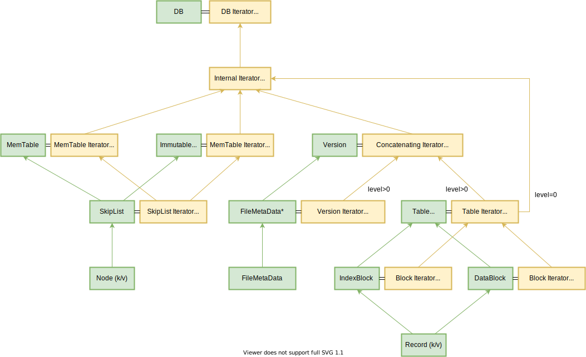
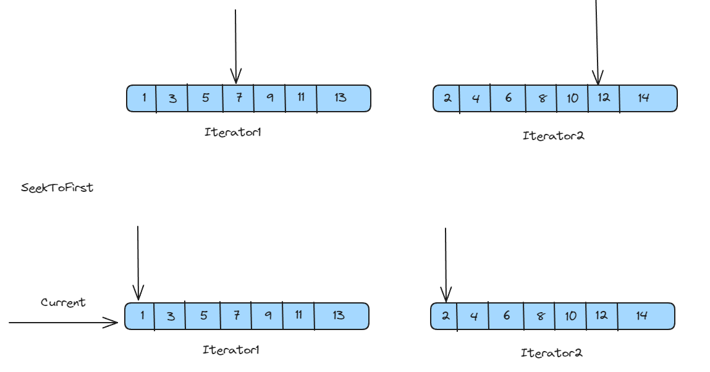
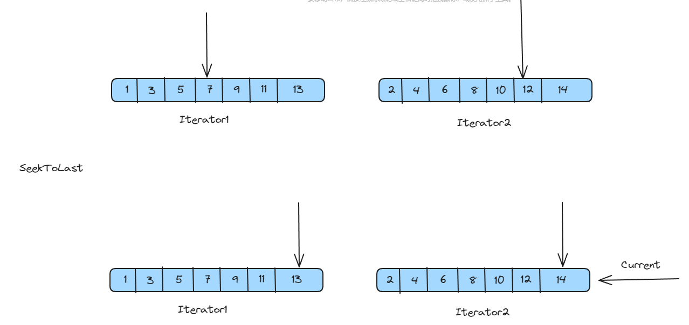
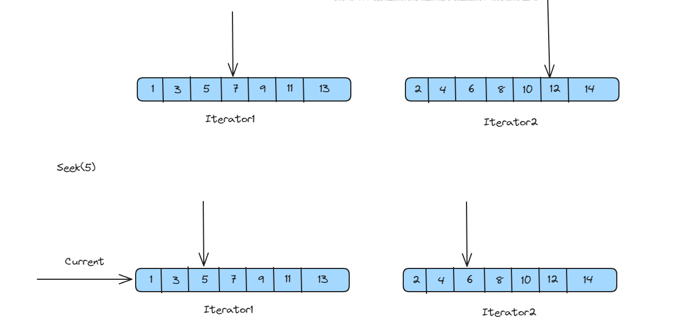
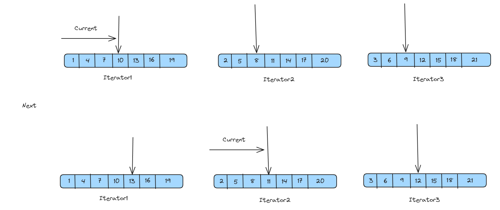
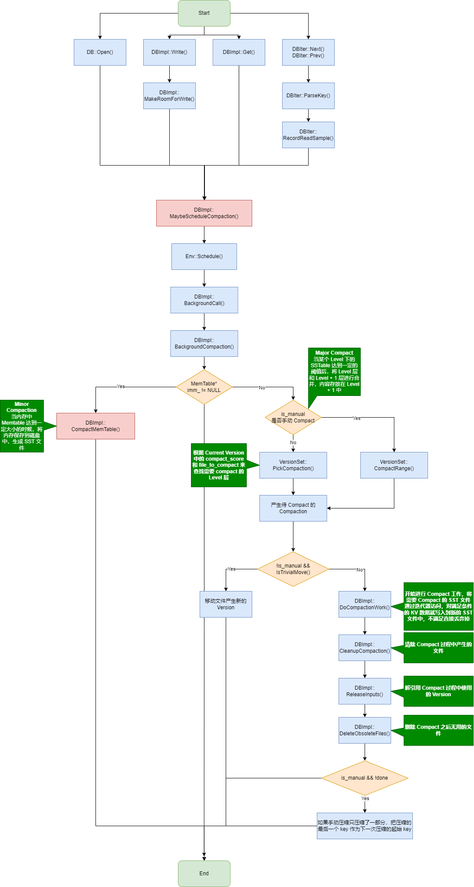

# Iterator



## MergingIterator

用于合并多个 SST 文件的迭代器

### 成员变量

* `const Comparator* comparator_`：
* `IteratorWrapper* children_`：防止迭代器过多，在堆上分配
* `int n_`：实时记录 Iterator 个数
* `IteratorWrapper* current_`：当前使用的迭代器
* `Direction direction_`：迭代方向

### 成员函数

#### FindSmallest

找到 key 最小的 Iterator

#### FindLargest

找到 key 最大的 Iterator

#### 构造函数

为每一个 Iterator 分配一个 MergingIterator

#### SeekToFirst



```cpp
void SeekToFirst() override {
  for (int i = 0; i < n_; i++) {
    // 所有的都归 0
    children_[i].SeekToFirst();
  }
  // 找到 key 最小的 MergingIterator，注意现在的情况是当前所有的都被指向第 0 位的比较
  FindSmallest();
  direction_ = kForward;
}
```

#### SeekToLast



#### Seek



```cpp
void Seek(const Slice& target) override {
  // 将所有 Iterator 都 seek 到 >= target 的最小的位置
  for (int i = 0; i < n_; i++) {
    children_[i].Seek(target);
  }
  // 然后选一个最小的
  FindSmallest();
  direction_ = kForward;
}
```

#### Next



这里的 Next 不是我们理解的链表的那个 Next，它是先将所有 children 指向 key >= key() 的位置，然后从其中找一个最小的。

如上图所示，先将 Iterator2 里指向其中 11 的位置，然后将 Iterator3 里指向 12 的位置，最后将 Iterator1 里指向 13 的位置。

然后在 Iterator1，2，3 中找到 key 最小的那一个。

```cpp
void Next() override {
  assert(Valid());

  if (direction_ != kForward) {
    for (int i = 0; i < n_; i++) {
      IteratorWrapper* child = &children_[i];
      if (child != current_) {
        child->Seek(key());
        if (child->Valid() &&
            comparator_->Compare(key(), child->key()) == 0) {
          child->Next();
        }
      }
    }
    direction_ = kForward;
  }

  current_->Next();
  FindSmallest();
}
```

# Compaction





上面是对于 Compact 过程的两种关系图

在 leveldb 中，compaction 共有两种，分别叫 minor compaction 和 major compaction。

- minor compaction，将 immtable dump 到 SStable
- major compaction，level 之间的 SSTable compaction。

`leveldb::Compaction` 用来记录筛选文件的结果，其中 `inputs[2]` 记录了参与 compact 的两层文件，是最重要的两个变量

