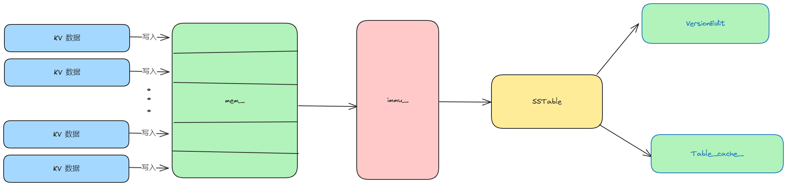
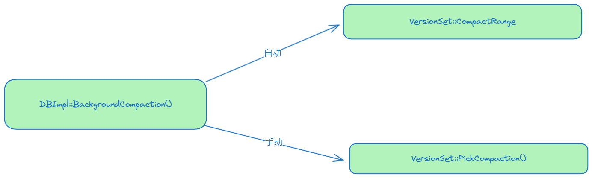

# Minor Compaction



Minjor Compaction 就是将内存中的 Memtable 持久化到磁盘变成 SSTable 过程。

DBImpl 中有两个 Memtable

```cpp
 MemTable* mem_; // 可读可修改
 MemTable* imm_ GUARDED_BY(mutex_); // 只读
```

## KV 写入流程

当我们写入 KV 数据时，数据首先写入 `mem_` 中

```cpp
if (status.ok())
{
  status = WriteBatchInternal::InsertInto(write_batch, mem_);
}
```

当 mem_ 大小达到一定条件的时候 `(mem_->ApproximateMemoryUsage() > options_.write_buffer_size`，时，将这个 `mem_` 转化为 `imm_`，然后新建一个 `mem_`

```cpp
imm_ = mem_;
has_imm_.store(true, std::memory_order_release);
mem_ = new MemTable(internal_comparator_);
mem_->Ref();
```

新生成的 imm_ 会通过方法 `DBImpl::MaybeScheduleCompaction()` 持久到硬盘

## Minor Compaction 流程

Minjor Compaction 的处理是在方法 `DBImpl::CompactMemTable()` 中实现的。
大致流程分为三步：

1. 将 Immutable 生成 SSTable 文件、同时将文件信息放入 Table_Cache 中；
2. 生成新的 Version 文件；
3. 删除无用文件。

```cpp
void DBImpl::CompactMemTable() {
  mutex_.AssertHeld();
  assert(imm_ != nullptr);

  // Save the contents of the memtable as a new Table
  VersionEdit edit;
  Version* base = versions_->current();
  base->Ref();
  // 1、生成新的SSTable文件。
  Status s = WriteLevel0Table(imm_, &edit, base);
  base->Unref();

  if (s.ok() && shutting_down_.load(std::memory_order_acquire)) {
    s = Status::IOError("Deleting DB during memtable compaction");
  }

  // Replace immutable memtable with the generated Table
  if (s.ok()) {

	// 2、记录 VersionEdit 信息，
	// 通过 LogAndApply() 生存新的 Version。
	// LogAndApply() 还做了以下事情：
  //   1）记录了compaction_score_最高的那一层的level及score。
	//   2）检测更新manifest和Current文件。
    edit.SetPrevLogNumber(0);
    edit.SetLogNumber(logfile_number_);  // Earlier logs no longer needed
	
    s = versions_->LogAndApply(&edit, &mutex_);
  }

  if (s.ok()) {
    // Commit to the new state
    imm_->Unref();
    imm_ = nullptr;
    has_imm_.store(false, std::memory_order_release);
	// 3、因为进行了Compact，此处主要涉及到logFile、Manifest、Current，
	//   所以调用此方法，对已经无用的文件进行删除。
    DeleteObsoleteFiles();
  } else {
    RecordBackgroundError(s);
  }
}
```

### WriteOnLevel0

```cpp
// 将 Memtable 落地为 SSTable。
Status DBImpl::WriteLevel0Table(MemTable* mem, VersionEdit* edit,
                                Version* base) {
  mutex_.AssertHeld();
  const uint64_t start_micros = env_->NowMicros();
  FileMetaData meta;
  // 获取新 SSTable 的文件名即 FileNum
  meta.number = versions_->NewFileNumber();
  // 保存此 File，防止被删除
  pending_outputs_.insert(meta.number);
  // 对此 Memable 创建访问的迭代器
  Iterator* iter = mem->NewIterator();
  Log(options_.info_log, "Level-0 table #%llu: started",
      (unsigned long long)meta.number);

  Status s;
  {
    mutex_.Unlock();
	// 按 SSTable 格式生存 SSTable 文件到磁盘，
	// 并将 SSTable 文件加入到 table_cache_ 中
    s = BuildTable(dbname_, env_, options_, table_cache_, iter, &meta);
    mutex_.Lock();
  }

  Log(options_.info_log, "Level-0 table #%llu: %lld bytes %s",
      (unsigned long long)meta.number, (unsigned long long)meta.file_size,
      s.ToString().c_str());
  delete iter;
  // 文件已生存，可删除此记录了。
  pending_outputs_.erase(meta.number);

  // Note that if file_size is zero, the file has been deleted and
  // should not be added to the manifest.
  int level = 0;
  if (s.ok() && meta.file_size > 0) {
    const Slice min_user_key = meta.smallest.user_key();
    const Slice max_user_key = meta.largest.user_key();
    if (base != nullptr) {

	  // 新生存的 SSTable 文件，不一定都放在 level_0 层，有可能是 level_1 或者 level_2 层，
	  // 但最多是 level_2 层。此方法就是根据最小和最大 key，找到需要放此 SSTable 的 level。
      level = base->PickLevelForMemTableOutput(min_user_key, max_user_key);
    }

	// 通过 VersionEdit 记录新增的 SSTable，用于后续产生新的 Version。
    edit->AddFile(level, meta.number, meta.file_size, meta.smallest,
                  meta.largest);
  }

  // 记录状态信息
  CompactionStats stats;
  stats.micros = env_->NowMicros() - start_micros;
  stats.bytes_written = meta.file_size;
  stats_[level].Add(stats);
  return s;
}
```

# Major Compaction



## 压缩基本思想

所有重叠的 Level + 1 层文件都要参与 Compact，得到这些文件后反过来看下，如果在不增加 Level + 1 层文件的前提下，看能否增加 Level 层的文件。也就是在不增加 Level + 1 层文件，同时不会导致 Compact 的文件过大的前提下，尽量增加 Level 层的文件数。

## 压缩性能考量

Level 与 Level + 1 层归并压缩之后，最后的文件是要放到 Level + 1 层的，在方法 SetupOtherInputs(c) 中获取到压缩之后的 key 范围 [all_start，all_limit]，并查询出 Level + 2 层与Level + 1 层 Overlap 的 SSTable，存放与 grandparents_ 中，主要是降低level层与level+1层压缩

具体函数讲解可以参考 [LevelDB5]

# DBImpl
