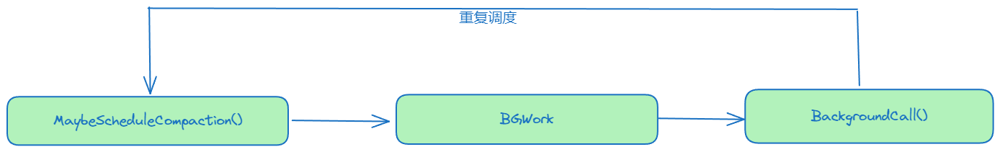

# Minor Compaction


Minjor Compaction 就是将内存中的 Memtable 持久化到磁盘变成 SSTable 过程。

DBImpl 中有两个 Memtable

```cpp
 MemTable* mem_; // 可读可修改
 MemTable* imm_ GUARDED_BY(mutex_); // 只读
```

## KV 写入流程

当我们写入 KV 数据时，数据首先写入 `mem_` 中

```cpp
if (status.ok())
{
  status = WriteBatchInternal::InsertInto(write_batch, mem_);
}
```

当 mem_ 大小达到一定条件的时候 `(mem_->ApproximateMemoryUsage() > options_.write_buffer_size`，时，将这个 `mem_` 转化为 `imm_`，然后新建一个 `mem_`

```cpp
imm_ = mem_;
has_imm_.store(true, std::memory_order_release);
mem_ = new MemTable(internal_comparator_);
mem_->Ref();
```

新生成的 imm_ 会通过方法 `DBImpl::MaybeScheduleCompaction()` 持久到硬盘

## Minor Compaction 流程

Minjor Compaction 的处理是在方法 `DBImpl::CompactMemTable()` 中实现的。
大致流程分为三步：

1. 将 Immutable 生成 SSTable 文件、同时将文件信息放入 Table_Cache 中；
2. 生成新的 Version 文件；
3. 删除无用文件。

```cpp
void DBImpl::CompactMemTable() {
  mutex_.AssertHeld();
  assert(imm_ != nullptr);

  // Save the contents of the memtable as a new Table
  VersionEdit edit;
  Version* base = versions_->current();
  base->Ref();
  // 1、生成新的SSTable文件。
  Status s = WriteLevel0Table(imm_, &edit, base);
  base->Unref();

  if (s.ok() && shutting_down_.load(std::memory_order_acquire)) {
    s = Status::IOError("Deleting DB during memtable compaction");
  }

  // Replace immutable memtable with the generated Table
  if (s.ok()) {

	// 2、记录 VersionEdit 信息，
	// 通过 LogAndApply() 生存新的 Version。
	// LogAndApply() 还做了以下事情：
  //   1）记录了compaction_score_最高的那一层的level及score。
	//   2）检测更新manifest和Current文件。
    edit.SetPrevLogNumber(0);
    edit.SetLogNumber(logfile_number_);  // Earlier logs no longer needed
	
    s = versions_->LogAndApply(&edit, &mutex_);
  }

  if (s.ok()) {
    // Commit to the new state
    imm_->Unref();
    imm_ = nullptr;
    has_imm_.store(false, std::memory_order_release);
	// 3、因为进行了Compact，此处主要涉及到logFile、Manifest、Current，
	//   所以调用此方法，对已经无用的文件进行删除。
    DeleteObsoleteFiles();
  } else {
    RecordBackgroundError(s);
  }
}
```

### WriteOnLevel0

```cpp
// 将 Memtable 落地为 SSTable。
Status DBImpl::WriteLevel0Table(MemTable* mem, VersionEdit* edit,
                                Version* base) {
  mutex_.AssertHeld();
  const uint64_t start_micros = env_->NowMicros();
  FileMetaData meta;
  // 获取新 SSTable 的文件名即 FileNum
  meta.number = versions_->NewFileNumber();
  // 保存此 File，防止被删除
  pending_outputs_.insert(meta.number);
  // 对此 Memable 创建访问的迭代器
  Iterator* iter = mem->NewIterator();
  Log(options_.info_log, "Level-0 table #%llu: started",
      (unsigned long long)meta.number);

  Status s;
  {
    mutex_.Unlock();
	// 按 SSTable 格式生存 SSTable 文件到磁盘，
	// 并将 SSTable 文件加入到 table_cache_ 中
    s = BuildTable(dbname_, env_, options_, table_cache_, iter, &meta);
    mutex_.Lock();
  }

  Log(options_.info_log, "Level-0 table #%llu: %lld bytes %s",
      (unsigned long long)meta.number, (unsigned long long)meta.file_size,
      s.ToString().c_str());
  delete iter;
  // 文件已生存，可删除此记录了。
  pending_outputs_.erase(meta.number);

  // Note that if file_size is zero, the file has been deleted and
  // should not be added to the manifest.
  int level = 0;
  if (s.ok() && meta.file_size > 0) {
    const Slice min_user_key = meta.smallest.user_key();
    const Slice max_user_key = meta.largest.user_key();
    if (base != nullptr) {

	  // 新生存的 SSTable 文件，不一定都放在 level_0 层，有可能是 level_1 或者 level_2 层，
	  // 但最多是 level_2 层。此方法就是根据最小和最大 key，找到需要放此 SSTable 的 level。
      level = base->PickLevelForMemTableOutput(min_user_key, max_user_key);
    }

	// 通过 VersionEdit 记录新增的 SSTable，用于后续产生新的 Version。
    edit->AddFile(level, meta.number, meta.file_size, meta.smallest,
                  meta.largest);
  }

  // 记录状态信息
  CompactionStats stats;
  stats.micros = env_->NowMicros() - start_micros;
  stats.bytes_written = meta.file_size;
  stats_[level].Add(stats);
  return s;
}
```

# Major Compaction


## 压缩基本思想

所有重叠的 Level + 1 层文件都要参与 Compact，得到这些文件后反过来看下，如果在不增加 Level + 1 层文件的前提下，看能否增加 Level 层的文件。也就是在不增加 Level + 1 层文件，同时不会导致 Compact 的文件过大的前提下，尽量增加 Level 层的文件数。

## 压缩性能考量

Level 与 Level + 1 层归并压缩之后，最后的文件是要放到 Level + 1 层的，在方法 SetupOtherInputs(c) 中获取到压缩之后的 key 范围 [all_start，all_limit]，并查询出 Level + 2 层与Level + 1 层 Overlap 的 SSTable，存放与 grandparents_ 中，主要是降低level层与level+1层压缩

具体函数讲解可以参考 [LevelDB5]

# DBImpl

## 数据结构

```cpp
Env* const env_;
const InternalKeyComparator internal_comparator_;
const InternalFilterPolicy internal_filter_policy_;
const Options options_;  // options_.comparator == &internal_comparator_
// 表示是否启用了 info_log 打印日志，如果启用了后期需要释放内存
const bool owns_info_log_;
// 表示是否启用 block 缓存
const bool owns_cache_;
// 数据库名字
const std::string dbname_;

// table 缓存，用于提高性能，缓存了 SST 的元数据信息
TableCache* const table_cache_;

// 文件所保护只有有一个进程打开db
FileLock* db_lock_;

// State below is protected by mutex_
port::Mutex mutex_;
// 表示db是否关闭
std::atomic<bool> shutting_down_;
port::CondVar background_work_finished_signal_ GUARDED_BY(mutex_);
// 活跃memtable
MemTable* mem_;
MemTable* imm_ GUARDED_BY(mutex_);  // Memtable being compacted
// 表示是否已经有一个imm_，因为只需要一个线程压缩，也只会有一个imm
std::atomic<bool> has_imm_;         // So bg thread can detect non-null imm_
// wal log句柄
WritableFile* logfile_;
// 当前日志编号
uint64_t logfile_number_ GUARDED_BY(mutex_);
log::Writer* log_;
// 用于采样
uint32_t seed_ GUARDED_BY(mutex_);  // For sampling.

// 用于批量写
std::deque<Writer*> writers_ GUARDED_BY(mutex_);
WriteBatch* tmp_batch_ GUARDED_BY(mutex_);
// 快照，leveldb支持从某个快照读取数据
SnapshotList snapshots_ GUARDED_BY(mutex_);

// 保护某些SST文件不被删除，主要是在CompactMemTable中
std::set<uint64_t> pending_outputs_ GUARDED_BY(mutex_);

// 表示后台压缩线程是否已经被调度或者在运行
bool background_compaction_scheduled_ GUARDED_BY(mutex_);
// 手动压缩句柄
ManualCompaction* manual_compaction_ GUARDED_BY(mutex_);
// 版本管理
VersionSet* const versions_ GUARDED_BY(mutex_);

// Have we encountered a background error in paranoid mode?
Status bg_error_ GUARDED_BY(mutex_);
// 记录压缩状态信息，用于打印
CompactionStats stats_[config::kNumLevels] GUARDED_BY(mutex_);
```

## CompactionState

```cpp
struct DBImpl::CompactionState {
  // 记录压缩产生的数据
  struct Output {
    uint64_t number;
    uint64_t file_size;
    InternalKey smallest, largest;
  };

  Output* current_output() { return &outputs[outputs.size() - 1]; }


  Compaction* const compaction;

  // 记录最小的seq_num,如果小于等于smallest_snapshot，表示可以删除
  SequenceNumber smallest_snapshot;

  std::vector<Output> outputs;

  // State kept for output being generated
  WritableFile* outfile;
  // 构建 SST
  TableBuilder* builder;

  uint64_t total_bytes;
};
```

## 函数详解

### MakeRoomForWrite


**整个 LevelDB 只会有一个压缩线程。**

### MaybeScheduleCompaction

```cpp
void DBImpl::MaybeScheduleCompaction() {
  mutex_.AssertHeld();
  if (background_compaction_scheduled_) {
    // 如果已经被调度了，此时不能调度
  } else if (shutting_down_.load(std::memory_order_acquire)) {
    // DB 被关闭了，此时也不能调度
  } else if (!bg_error_.ok()) {
    // Already got an error; no more changes
  } else if (imm_ == nullptr && manual_compaction_ == nullptr &&
             !versions_->NeedsCompaction()) {
    // No work to be done
  } else {
    // 开始创建线程，开始压缩
    background_compaction_scheduled_ = true;
    env_->Schedule(&DBImpl::BGWork, this);
  }
}
```

是一个递归执行的，但是每次只会创建一个后台线程

### BGWork

```cpp
void DBImpl::BGWork(void* db) {
  reinterpret_cast<DBImpl*>(db)->BackgroundCall();
}
```

是一层接口，本质是调用 `BackgroundCall()`

### BackgroundCall

```cpp
void DBImpl::BackgroundCall() {
  MutexLock l(&mutex_);
  assert(background_compaction_scheduled_);
  if (shutting_down_.load(std::memory_order_acquire)) {
    // No more background work when shutting down.
  } else if (!bg_error_.ok()) {
    // No more background work after a background error.
  } else {
    // 开始后台压缩
    BackgroundCompaction();
  }

  background_compaction_scheduled_ = false;

  // 可能之前产生了太多文件，需要重新调度开始压缩
  MaybeScheduleCompaction();
  background_work_finished_signal_.SignalAll();
}
```



### BackgroundCompaction

```cpp
void DBImpl::BackgroundCompaction() {
  mutex_.AssertHeld();
	// 优先 minor compaction
  if (imm_ != nullptr) {
    CompactMemTable();
    return;
  }

  Compaction* c;
  bool is_manual = (manual_compaction_ != nullptr);
  InternalKey manual_end;
  // 是否是手动压缩
  if (is_manual) {
    ManualCompaction* m = manual_compaction_;
    // 挑选需要压缩的文件
    c = versions_->CompactRange(m->level, m->begin, m->end);
    m->done = (c == nullptr);
    if (c != nullptr) {
      manual_end = c->input(0, c->num_input_files(0) - 1)->largest;
    }
    Log(options_.info_log,
        "Manual compaction at level-%d from %s .. %s; will stop at %s\n",
        m->level, (m->begin ? m->begin->DebugString().c_str() : "(begin)"),
        (m->end ? m->end->DebugString().c_str() : "(end)"),
        (m->done ? "(end)" : manual_end.DebugString().c_str()));
  } else {
    // 非手动压缩直接调用 PickCompaction
    c = versions_->PickCompaction();
  }

  Status status;
  if (c == nullptr) {
    // Nothing to do
  } else if (!is_manual && c->IsTrivialMove()) {
    // 是否可以直接移动 Level -> Level + 1
    assert(c->num_input_files(0) == 1);
    FileMetaData* f = c->input(0, 0);
    // 更新元数据
    c->edit()->RemoveFile(c->level(), f->number);
    c->edit()->AddFile(c->level() + 1, f->number, f->file_size, f->smallest,
                       f->largest);
    // 生成新版本
    status = versions_->LogAndApply(c->edit(), &mutex_);
    if (!status.ok()) {
      RecordBackgroundError(status);
    }
    VersionSet::LevelSummaryStorage tmp;
    Log(options_.info_log, "Moved #%lld to level-%d %lld bytes %s: %s\n",
        static_cast<unsigned long long>(f->number), c->level() + 1,
        static_cast<unsigned long long>(f->file_size),
        status.ToString().c_str(), versions_->LevelSummary(&tmp));
  } else {
    // 不能直接移动，执行压缩和清理工作
    CompactionState* compact = new CompactionState(c);
    // 压缩
    status = DoCompactionWork(compact);
    if (!status.ok()) {
      RecordBackgroundError(status);
    }
    // 删除无用文件
    CleanupCompaction(compact);
    c->ReleaseInputs();
    RemoveObsoleteFiles();
  }
  delete c;
	// 查看压缩情况
  if (status.ok()) {
    // Done
  } else if (shutting_down_.load(std::memory_order_acquire)) {
    // Ignore compaction errors found during shutting down
  } else {
    Log(options_.info_log, "Compaction error: %s", status.ToString().c_str());
  }

  if (is_manual) {
    // 只手动合并了部分的情况
    ManualCompaction* m = manual_compaction_;
    // 合并中途发生错误，视为操作完成
    if (!status.ok()) {
      m->done = true;
    }
    if (!m->done) {
      // We only compacted part of the requested range.  Update *m
      // to the range that is left to be compacted.
      // 设置剩余待合并的范围
      m->tmp_storage = manual_end;
      m->begin = &m->tmp_storage;
    }
    manual_compaction_ = nullptr;
  }
}
```

### CompactMemTable

```cpp
void DBImpl::CompactMemTable() {
  mutex_.AssertHeld();
  assert(imm_ != nullptr);

  // Save the contents of the memtable as a new Table
  // 将文件写入 Level0
  VersionEdit edit;
  // base -> old version
  Version* base = versions_->current();
  base->Ref();
  Status s = WriteLevel0Table(imm_, &edit, base);
  base->Unref();

  if (s.ok() && shutting_down_.load(std::memory_order_acquire)) {
    s = Status::IOError("Deleting DB during memtable compaction");
  }

  // Replace immutable memtable with the generated Table
  if (s.ok()) {
    edit.SetPrevLogNumber(0);
    edit.SetLogNumber(logfile_number_);  // Earlier logs no longer needed
    // 建立新版本
    s = versions_->LogAndApply(&edit, &mutex_);
  }

  if (s.ok()) {
    // Commit to the new state
    imm_->Unref();
    imm_ = nullptr;
    has_imm_.store(false, std::memory_order_release);
    // 清空无效对象
    RemoveObsoleteFiles();
  } else {
    RecordBackgroundError(s);
  }
}
```

### WriteLevel0Table

```cpp
Status DBImpl::WriteLevel0Table(MemTable* mem, VersionEdit* edit,
                                Version* base) {
  mutex_.AssertHeld();
  const uint64_t start_micros = env_->NowMicros();
  // 初始化 FileMetaData
  FileMetaData meta;
  meta.number = versions_->NewFileNumber();
  pending_outputs_.insert(meta.number);
  Iterator* iter = mem->NewIterator();
  Log(options_.info_log, "Level-0 table #%llu: started",
      (unsigned long long)meta.number);

  Status s;
  {
    mutex_.Unlock();
    // 构建 SST 文件
    s = BuildTable(dbname_, env_, options_, table_cache_, iter, &meta);
    mutex_.Lock();
  }

  Log(options_.info_log, "Level-0 table #%llu: %lld bytes %s",
      (unsigned long long)meta.number, (unsigned long long)meta.file_size,
      s.ToString().c_str());
  delete iter;
  pending_outputs_.erase(meta.number);

  // Note that if file_size is zero, the file has been deleted and
  // should not be added to the manifest.
  int level = 0;
  if (s.ok() && meta.file_size > 0) {
    const Slice min_user_key = meta.smallest.user_key();
    const Slice max_user_key = meta.largest.user_key();
    if (base != nullptr) {
      // 找到最适合放的层数，Level0，Level_1 还是 Level_2
      level = base->PickLevelForMemTableOutput(min_user_key, max_user_key);
    }
    // 将 SST 文件添加到 edit 中
    edit->AddFile(level, meta.number, meta.file_size, meta.smallest,
                  meta.largest);
  }

  CompactionStats stats;
  stats.micros = env_->NowMicros() - start_micros;
  stats.bytes_written = meta.file_size;
  stats_[level].Add(stats);
  return s;
}
```

### DoCompactionWork

```cpp
Status DBImpl::DoCompactionWork(CompactionState* compact) {
  const uint64_t start_micros = env_->NowMicros();
  int64_t imm_micros = 0;  // Micros spent doing imm_ compactions

  Log(options_.info_log, "Compacting %d@%d + %d@%d files",
      compact->compaction->num_input_files(0), compact->compaction->level(),
      compact->compaction->num_input_files(1),
      compact->compaction->level() + 1);

  assert(versions_->NumLevelFiles(compact->compaction->level()) > 0);
  assert(compact->builder == nullptr);
  assert(compact->outfile == nullptr);
  // 确定可删除 key 的 sequence
  // 如果没有 snapshots，就以 version 最后为主
  if (snapshots_.empty()) {
    compact->smallest_snapshot = versions_->LastSequence();
  } else {
  // 如果有 snapshots，就以快照读中最小的为主
    compact->smallest_snapshot = snapshots_.oldest()->sequence_number();
  }
// 构建 merge 迭代器，本质上是归并排序
  Iterator* input = versions_->MakeInputIterator(compact->compaction);

  // Release mutex while we're actually doing the compaction work
  mutex_.Unlock();
	// 将 input 迭代器放到第一个位置上
  input->SeekToFirst();
  Status status;
  ParsedInternalKey ikey;
  std::string current_user_key;
  bool has_current_user_key = false;
  SequenceNumber last_sequence_for_key = kMaxSequenceNumber;
  // 当前输入迭代器无效或者数据库已被关闭
  while (input->Valid() && !shutting_down_.load(std::memory_order_acquire)) {
    // Prioritize immutable compaction work
    // 检查 immu 是否存在合并操作
    if (has_imm_.load(std::memory_order_relaxed)) {
      const uint64_t imm_start = env_->NowMicros();
      mutex_.Lock();
      // 调用 CompactMemTable 进行合并
      if (imm_ != nullptr) {
        CompactMemTable();
        // Wake up MakeRoomForWrite() if necessary.
        background_work_finished_signal_.SignalAll();
      }
      mutex_.Unlock();
      imm_micros += (env_->NowMicros() - imm_start);
    }

    Slice key = input->key();
    // 检查是否需要在当前键之前停止
    if (compact->compaction->ShouldStopBefore(key) &&
        compact->builder != nullptr) {
      status = FinishCompactionOutputFile(compact, input);
      if (!status.ok()) {
        break;
      }
    }

    // Handle key/value, add to state, etc.
    bool drop = false;
    // error key
    if (!ParseInternalKey(key, &ikey)) {
      // Do not hide error keys
      current_user_key.clear();
      has_current_user_key = false;
      last_sequence_for_key = kMaxSequenceNumber;
    } else {
      // 上一个 key 是 error key，或者是第一个出现的 key
      if (!has_current_user_key ||
          user_comparator()->Compare(ikey.user_key, Slice(current_user_key)) !=
              0) {
        // First occurrence of this user key
        current_user_key.assign(ikey.user_key.data(), ikey.user_key.size());
        has_current_user_key = true;
        // 初始化或重置 last_sequence_for_key 变量，并确保在此期间不会将任何键值对标记为过时，以保证合并和清理过程的正确性。
        last_sequence_for_key = kMaxSequenceNumber;
      }
      // 丢弃的键值对
      // 如果某个 user_key 的非最新版本小于快照版本，则可以直接丢弃，因为读最新的版本就足够了；
      // 如果某个删除操作的版本小于快照版本，并且在更高层没有相同的 user_key，那么这个删除操作及其之前更早的插入操作可以同时丢弃了。
      if (last_sequence_for_key <= compact->smallest_snapshot) {
        // Hidden by an newer entry for same user key
        drop = true;  // (A)
      } else if (ikey.type == kTypeDeletion &&
                 ikey.sequence <= compact->smallest_snapshot &&
                 compact->compaction->IsBaseLevelForKey(ikey.user_key)) {
        // For this user key:
        // (1) there is no data in higher levels
        // (2) data in lower levels will have larger sequence numbers
        // (3) data in layers that are being compacted here and have
        //     smaller sequence numbers will be dropped in the next
        //     few iterations of this loop (by rule (A) above).
        // Therefore this deletion marker is obsolete and can be dropped.
        drop = true;
      }

      last_sequence_for_key = ikey.sequence;
    }
		// 没有丢弃的键值对
    if (!drop) {
      // Open output file if necessary
      if (compact->builder == nullptr) {
        // 打开输出文件
        status = OpenCompactionOutputFile(compact);
        if (!status.ok()) {
          break;
        }
      }
      // 添加到构建器中
      if (compact->builder->NumEntries() == 0) {
        compact->current_output()->smallest.DecodeFrom(key);
      }
      compact->current_output()->largest.DecodeFrom(key);
      compact->builder->Add(key, input->value());

      // 构建器大小达到阈值后，调用 FinishCompactionOutputFile 完成写入
      if (compact->builder->FileSize() >=
          compact->compaction->MaxOutputFileSize()) {
        status = FinishCompactionOutputFile(compact, input);
        if (!status.ok()) {
          break;
        }
      }
    }
    // 将迭代器移到下一个键值对的位置
    input->Next();
  }

  if (status.ok() && shutting_down_.load(std::memory_order_acquire)) {
    status = Status::IOError("Deleting DB during compaction");
  }
  if (status.ok() && compact->builder != nullptr) {
    status = FinishCompactionOutputFile(compact, input);
  }
  if (status.ok()) {
    status = input->status();
  }
  delete input;
  input = nullptr;

  CompactionStats stats;
  stats.micros = env_->NowMicros() - start_micros - imm_micros;
  for (int which = 0; which < 2; which++) {
    for (int i = 0; i < compact->compaction->num_input_files(which); i++) {
      stats.bytes_read += compact->compaction->input(which, i)->file_size;
    }
  }
  for (size_t i = 0; i < compact->outputs.size(); i++) {
    stats.bytes_written += compact->outputs[i].file_size;
  }

  mutex_.Lock();
  stats_[compact->compaction->level() + 1].Add(stats);
	// 填充到 VersionEdit 产生新的版本
  if (status.ok()) {
    status = InstallCompactionResults(compact);
  }
  if (!status.ok()) {
    RecordBackgroundError(status);
  }
  VersionSet::LevelSummaryStorage tmp;
  Log(options_.info_log, "compacted to: %s", versions_->LevelSummary(&tmp));
  return status;
}
```



### FinishCompactionOutputFile

```cpp
Status DBImpl::FinishCompactionOutputFile(CompactionState* compact,
                                          Iterator* input) {
  assert(compact != nullptr);
  assert(compact->outfile != nullptr);
  assert(compact->builder != nullptr);

  const uint64_t output_number = compact->current_output()->number;
  assert(output_number != 0);

  // Check for iterator errors
  Status s = input->status();
  const uint64_t current_entries = compact->builder->NumEntries();
  if (s.ok()) {
    // 完成构建
    s = compact->builder->Finish();
  } else {
    compact->builder->Abandon();
  }
  const uint64_t current_bytes = compact->builder->FileSize();
  compact->current_output()->file_size = current_bytes;
  compact->total_bytes += current_bytes;
  delete compact->builder;
  compact->builder = nullptr;

  // Finish and check for file errors
  // 持久化到磁盘中
  if (s.ok()) {
    s = compact->outfile->Sync();
  }
  if (s.ok()) {
    s = compact->outfile->Close();
  }
  delete compact->outfile;
  compact->outfile = nullptr;

  if (s.ok() && current_entries > 0) {
    // Verify that the table is usable
    Iterator* iter =
        table_cache_->NewIterator(ReadOptions(), output_number, current_bytes);
    s = iter->status();
    delete iter;
    if (s.ok()) {
      Log(options_.info_log, "Generated table #%llu@%d: %lld keys, %lld bytes",
          (unsigned long long)output_number, compact->compaction->level(),
          (unsigned long long)current_entries,
          (unsigned long long)current_bytes);
    }
  }
  return s;
}
```

1. 首先，进行一系列的断言检查，确保 `compact`、`outfile` 和 `builder` 等关键对象不为空，并且当前输出文件的编号 `output_number` 不为 0。
2. 检查输入迭代器（`input`）的状态，并将其赋值给变量 `s`。
3. 如果输入迭代器状态 `s` 是 OK 的，调用 `compact->builder` 的 `Finish` 方法完成构建过程；否则，调用 `compact->builder` 的 `Abandon` 方法放弃构建。
4. 获取当前构建器（`compact->builder`）的文件大小，并将其赋值给当前输出文件（`compact->current_output()`）的文件大小属性。
5. 更新合并状态（`compact`）的总字节数，将当前构建器的文件大小加到总字节数中。
6. 删除当前构建器（`compact->builder`）。
7. 如果之前的操作都成功，调用当前输出文件（`compact->outfile`）的 `Sync` 方法进行同步操作，确保输出文件已被写入磁盘。
8. 如果同步操作成功，调用当前输出文件的 `Close` 方法关闭输出文件。
9. 删除当前输出文件（`compact->outfile`）。
10. 如果之前的操作都成功，并且当前构建器中存在记录条目（`current_entries > 0`），则进行下一步的验证。
11. 创建一个新的迭代器（`iter`）用于读取生成的输出文件，并获取其状态。
12. 删除新迭代器（`iter`）。
13. 如果验证操作成功（状态为 OK），则记录日志信息，包括生成的输出文件编号、合并层级、记录条目数和文件大小。
14. 返回操作的状态（`s`）。

### OpenCompactionOutputFile

用于初始化构建SST文件的

### InstallCompactionResults

将结果记录到 Version，并更新 VersionEdit，最后持久化
