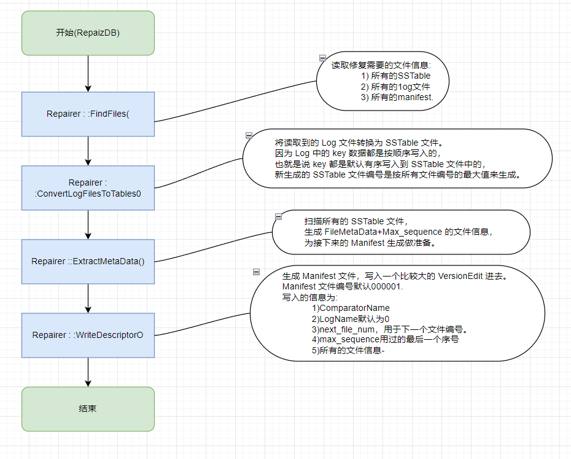

# DBImpl

## Get

```cpp
Status DBImpl::Get(const ReadOptions& options, const Slice& key,
                   std::string* value) {
  Status s;
  MutexLock l(&mutex_);
  SequenceNumber snapshot;
  // 获取 option 的快照，默认是最新的
  if (options.snapshot != nullptr) {
    snapshot =
        static_cast<const SnapshotImpl*>(options.snapshot)->sequence_number();
  } else {
    snapshot = versions_->LastSequence();
  }

  MemTable* mem = mem_;
  MemTable* imm = imm_;
  Version* current = versions_->current();
  mem->Ref();
  if (imm != nullptr) imm->Ref();
  current->Ref();

  bool have_stat_update = false;
  Version::GetStats stats;

  // Unlock while reading from files and memtables
  {
    mutex_.Unlock();
    LookupKey lkey(key, snapshot);
    // 在 mem_ 中找
    if (mem->Get(lkey, value, &s)) {
      // Done
      // 在 immu_ 中找
    } else if (imm != nullptr && imm->Get(lkey, value, &s)) {
      // Done
      // 查 SST
    } else {
      s = current->Get(options, lkey, value, &stats);
      have_stat_update = true;
    }
    mutex_.Lock();
  }

  // seek compact 检查
  if (have_stat_update && current->UpdateStats(stats)) {
    MaybeScheduleCompaction();
  }
  mem->Unref();
  if (imm != nullptr) imm->Unref();
  current->Unref();
  return s;
}
```


## Put

调用 WriteBatch 中的 Write 函数


## Write

- Writer可能被别的线程执行。此处为LevelDB的一个性能优化，根据一定规则将多个请求合并成一个请求，批量执行写入。
- DBImpl::MakeRoomForWrite()循环检查当前数据库状态：
- 如果当前LSM树的Level-0达到 `kL0_SlowdownWritesTrigger` 阈值，延迟所有的Writer 1ms。交出CPU使得compaction线程可以被调度。
- 当前MemTable的大小未达到write_buffer_size，允许该次写。
- 如果MemTable达到阈值，且Immutabl MemTable仍然存在，挂牵当前线程等待`background_work_finished_signal_.Wait();`，等到compaction结束，线程被唤醒。
- 如果当前LSM树的Level-0达到 `kL0_StopWritesTrigger` 阈值，同样的线程被挂起，等地compaction后被唤醒。
- 上述条件都不满足，则MemTable已满，并且Immutable Table不存在，则将当前Memtable设未Immutable，删除过期的Log文件，生成新的MemTable和Log文件，同时触发compaction，允许写入。
  `c++ delete log_; delete logfile_; logfile_ = lfile; logfile_number_ = new_log_number; log_ = new log::Writer(lfile); imm_ = mem_; has_imm_.store(true, std::memory_order_release); // 使用写栅栏写入，当前存在immutable Table mem_ = new MemTable(internal_comparator_);`
- `WriteBatchInternal::InsertInto(write_batch, mem_);`，向MemTable写入是不加锁的，不影响其它线程向队列添加任务。
- `BuildBatchGroup`会遍历所有队列中的Writer，将它们合并为一个Writer。合并的Batch会设置大小上限。但如果写入的为小文件，会降低Batch大小上限，**避免延缓小文件的写入**。当遍历队列的过程中，如果超过大小上限，则停止合并。

```cpp
Status DBImpl::Write(const WriteOptions& options, WriteBatch* updates) {
  Writer w(&mutex_);
  w.batch = updates;
  w.sync = options.sync;
  w.done = false;
// 加锁,因为 w 要插入全局队列 writers_ 中
  MutexLock l(&mutex_);
  writers_.push_back(&w);
// 只有当 w 是位于队列头部且 w 并没有完成时才不用等待
  while (!w.done && &w != writers_.front()) {
    w.cv.Wait();
  }
  // 可能该 w 中的 batch 被其他线程通过下面讲到的合并操作一起完成了
  if (w.done) {
    return w.status;
  }

  // May temporarily unlock and wait.
  Status status = MakeRoomForWrite(updates == nullptr);
  uint64_t last_sequence = versions_->LastSequence();
  Writer* last_writer = &w;
  if (status.ok() && updates != nullptr) {  // nullptr batch is for compactions
     // 合并队列中的各个 batch 到一个新 batch 中
    WriteBatch* write_batch = BuildBatchGroup(&last_writer);
    WriteBatchInternal::SetSequence(write_batch, last_sequence + 1);
    last_sequence += WriteBatchInternal::Count(write_batch);

    {
      // 往磁盘写日志文件开销很大，此时可以释放锁来提高并发，此时其他线程可以将新的 writer 插入到队列 writers_ 中
      mutex_.Unlock();
      // 将 batch 中的每条操作写入日志文件 log_ 中
      status = log_->AddRecord(WriteBatchInternal::Contents(write_batch));
      bool sync_error = false;
      if (status.ok() && options.sync) {
        // 是否要求立马刷盘将 log 写到磁盘，因为我们知道文件系统还有自己的缓存
        status = logfile_->Sync();
        if (!status.ok()) {
          sync_error = true;
        }
      }
      if (status.ok()) {
        // 将 batch 中每条操作插入到 memtable 中
        status = WriteBatchInternal::InsertInto(write_batch, mem_);
      }
      mutex_.Lock();
      if (sync_error) {
        // The state of the log file is indeterminate: the log record we
        // just added may or may not show up when the DB is re-opened.
        // So we force the DB into a mode where all future writes fail.
        RecordBackgroundError(status);
      }
    }
    //因为 updates 已经写入了 log 和 memtable，可以清空了
    if (write_batch == tmp_batch_) tmp_batch_->Clear();

    versions_->SetLastSequence(last_sequence);
  }
  // 因为我们的 updates 可能合并了 writers_ 队列中的很多,当前线程完成了其他线程的 writer，只需唤醒这些已完成 writer 的线程
  while (true) {
     // 从队列头部取出已完成的 writer
    Writer* ready = writers_.front();
    writers_.pop_front();
    if (ready != &w) {
      ready->status = status;
      ready->done = true;
      ready->cv.Signal();
    }
    if (ready == last_writer) break;
  }

  // 队列不空，则唤醒队列头部 writer 所属的线程，参见上面 while (!w.done && &w != writers_.front())
  if (!writers_.empty()) {
    writers_.front()->cv.Signal();
  }

  return status;
}
```


## Delete

同 Put 函数

## Open


## Recover

LevelDB 异常损坏，修复 LevelDB 过程，调用接口 `RepairDB()` 产生新的 Version。



```cpp
Status RepairDB(const std::string& dbname, const Options& options) {
  // 调用 repairer 对象，恢复 DB
  Repairer repairer(dbname, options);
  return repairer.Run();
}
Status Run() {
  // 读取恢复所需的 SSTable，Log，Manifest 文件
  Status status = FindFiles();
  if (status.ok()) {
    // 主要是将内部还没来得及 dump 磁盘的数据，从 wal 恢复生成 SST。此时会添加 /lost 目录
    ConvertLogFilesToTables();
    // 为接下来生成 Manifest 文件做准备
    ExtractMetaData();
    // 生成 Manifest 文件
    status = WriteDescriptor();
  }
  if (status.ok()) {
    unsigned long long bytes = 0;
    for (size_t i = 0; i < tables_.size(); i++) {
      bytes += tables_[i].meta.file_size;
    }
    ...
  }
  return status;
}
```

