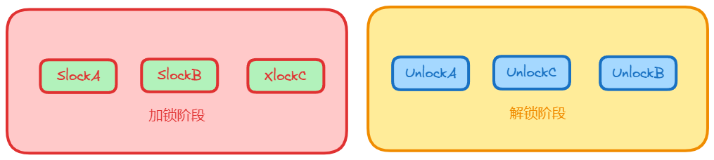

# 两阶段锁

两阶段锁指，所有事务分为两个阶段，一个是加锁，另一个是解锁

从图中可以看出，加锁和解锁是完全分开的，加锁的时候只加锁，解锁的时候只解锁。

上图 C 锁在 A 解锁之后，不能完全分为加锁阶段和解锁阶段，所以不属于两阶段

若并发执行的所有事务均遵守两段锁协议，则对这些事务的任何并发调度策略都是可串行化的。

但是两阶段锁对可串行化是充分条件，而不是必要条件，若对并发事务的一个调度是可串行化的，不一定所有事务都符合两段锁协议。

一个事务的失败可能会引起一连串事务的回滚。为避免这种情况的发生，我们需要进一步加强对两阶段封锁协议的控制，这就是：严格两阶段封锁协议和强两阶段封锁协议。
严格两阶段封锁协议除了要求封锁是两阶段之外，还要求事务持有的所有排它锁必须在事务提交之后方可释放。这个要求保证未提交事务所写的任何数据，在该事务提交之前均以排它锁封锁，防止其他事务读取这些数据。
强两阶段封锁协议，要求事务提交之前不得释放任何锁。使用锁机制的数据库系统，要么使用严格两阶段封锁协议，要么使用强两阶段封锁协议。