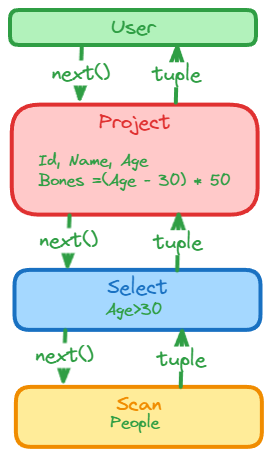

# 火山模型

火山模型将关系代数的每一个操作都抽象为一个 Operator，将整个 SQL 构建成一共 Operator 树，从根结点到子结点递归使用 next() 函数。

例如：

```sql
SELECT Id, Name, Age, (Age - 30) * 50 AS Bonus
FROM People
WHERE Age > 30
```

转化为火山模型后

* User：客户端
* Project：垂直分割（投影），选择字段
* Select（或 Filter）：水平分割（选择)，用于过滤行，也称为谓词
* Scan：扫描数据



这里包含了 3 个 Operator，首先 User 调用最上方的 Operator（Project）希望得到 next tuple，Project 调用子节点（Select），而 Select 又调用子节点（Scan），Scan 获得表中的 tuple 返回给 Select，Select 会检查是否满足过滤条件，如果满足则返回给 Project，如果不满足则请求 Scan 获取 next tuple。Project 会对每一个 tuple 选择需要的字段或者计算新字段并返回新的 tuple 给 User。当 Scan 发现没有数据可以获取时，则返回一个结束标记告诉上游已结束。

## 火山模型的优缺点

### 优点

简单，每个 Operator 可以单独抽象实现、不需要关心其他 Operator 的逻辑。

### 缺点

每次都是计算一个 tuple（Tuple-at-a-time），这样会造成多次调用 next ，也就是造成大量的虚函数调用，这样会造成 CPU 的利用率不高。

## 优化方向

### 编译执行

- 考虑到火山模型大量虚函数调用导致的性能损失，推送执行模型(Push Based)很好的解决了这个问题。与拉取模型相反，推送模型自低向上的执行，执行逻辑由底层Operator开始，其处理完一个tuple之后，将tuple传给上层Operator处理
- 前面CPU的多级存储介绍提到，数据访问速度最快的是寄存器。所以在执行查询树时最理想的情况就是数据一直留在寄存器中(假设寄存器的容量足以放下一个tuple)，每个Operator直接处理寄存器中的数据。Operator之间从拉取模型的虚函数调用，变成了以数据为中心(data-centric)的顺序执行。
- 当然，并不是所有的Operator的运算逻辑都可以处理完寄存器中的tuple之后，把tuple留在寄存器中，由下一个Operator 接着处理。例如Join的时候，需要构建hash表，tuple就必须写入内存了(整个hash表当然不可能放到寄存器)。
- 每个Operator会根据规则拆分为两个代码块，一块对应Produce()(负责产生结果tuple) ，一块对应consume()(负责具体的tuple处理逻辑)。代码生成的时候就可以根据这个规则生成代码。
  好处：编译执行以数据为中心，消灭了火山模型中的大量虚函数调用开销。甚至使大部分指令执行，可以直接从寄存器取数，极大的提高了执行效率。

### 向量化

向量化计算就是将一个循环处理一个数组的时候每次处理 1 个数据共处理 N 次，转化为向量化——每次同时处理 8 个数据共处理 N/8 次，其中依赖的技术就是 SIMD（Single Instruction Multiple Data，单指令流多数据流），SIMD 可以在一条 CPU 指令上处理 2、4、8 或者更多份的数据。

1. 将每次 next 带来的 CPU 开销被一组数据给分摊。这样当 CPU 访问元组中的某个列时会将该元组加载到 CPU Cache（如果该元组大小小于 CPU Cache 缓存行的大小）, 访问后继的列将直接从 CPU Cache 中获取，从而具有较高的 CPU Cache 命中率，然而如果只访问一个列或者少数几个列时 CPU 命中率仍然不理想。
2. 针对**列存**的场景，因为输入是同列的一组数据，面对的是相同的操作，这正是向量寄存器干的事情，这是 CPU 层面计算性能的优化，因此称为向量化。并且如果每次只取一列的部分数据，返回一个可以放到 CPU Cache 的向量，那么又可以利用到 CPU Cache。

### 编译执行 VS 向量化

因为编译执行强调的是以数据为中心，在一个Pipeline内是不会有Materialization的，但是向量化执行是拉取模型，每次经过next()调用，Vector的传递必须Materialize