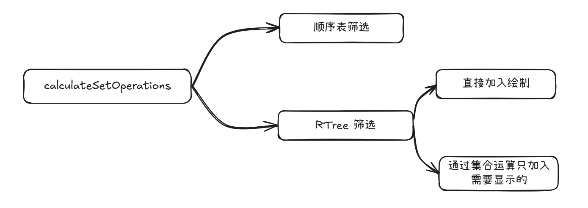
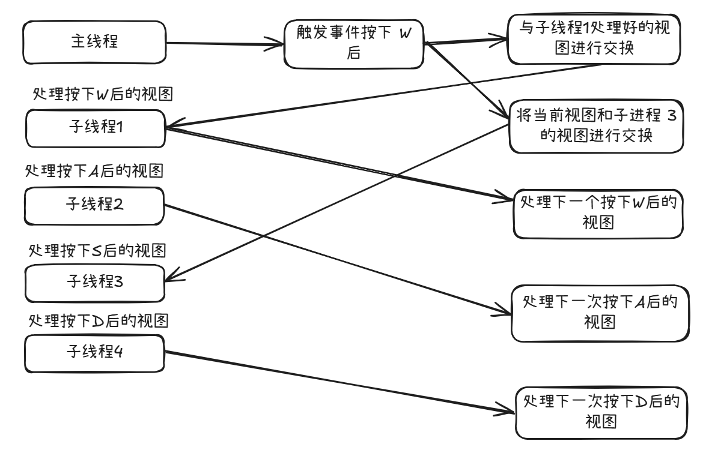
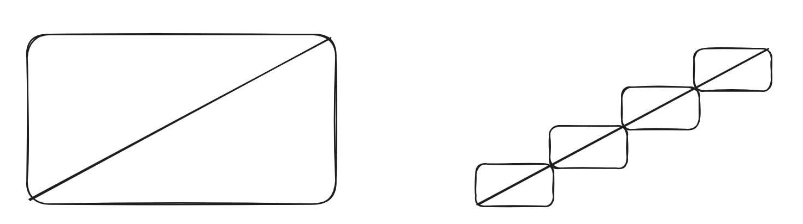

# 关于 R tree 进行绘图优化的尝试

R tree 绘图中负责筛选需要显示的多边形，通过扁平的 R tree，能比顺序表更快的找到需要显示的部分

## 实现思路：

首次打开 PCB

1. 初始化：将 PCB 中所有的多边形和线分别填入到不同的 R tree 中
2. 筛选：在 R tree 中筛选出当前需要显示的多边形和线
3. 绘制：将筛选出的多边形和线进行绘制

对画布进行移动

1. 初始化：清空之前筛选出的多边形和线
2. 筛选：筛选新画布中需要显示的多边形和线
3. 绘制：将筛选出的多边形和线进行绘制

框选

1. 初始化：设置框选的画布大小
2. 筛选：筛选与框选画布相交的多边形和线
3. 绘制：在底层画布之上再次绘出框选画布中的内容

## 尝试的优化方案：

1. 使用集合的交并补集去除重复绘制的部分

   虽然绘制速度提升，但是多边形计算交并补集的时间太长

2. 使用增量绘制的方式

   只绘制移动画布时多出的一块，但实际优化提升并不大，在多线程预处理中提升较大

## 使用多线程进行优化

主要思想是在单线程的基础上，将用户下一步的操作进行预处理，在用户操作的时候直接切换处理好的图片，然后后台持续更新用户下一步的操作。

在多线程中使用增量绘制，可以很好的将原有视图利用起来，其中后台只需要绘制增量部分，再和原有视图拼接起来

## 总结

在这次尝试中，将步骤很明确的分为

将绘制数据和底层数据分开，将绘制彻底独立

将步骤相互独立开，可以针对不同的步骤进行不同的优化

### 效率对比

|      量级      |  R Tree   |  顺序表   |
| :------------: | :-------: | :-------: |
|  100/1000000   |    0ms    | 40ms左右  |
|  1000/1000000  |    0ms    | 40ms左右  |
| 10000/1000000  |   1-2ms   | 42ms左右  |
| 100000/1000000 |   16ms    | 57ms左右  |
| 1000000/100000 | 120ms左右 | 100ms左右 |

使用 R tree 在稀疏部分时对比顺序表有巨大提升

在图越来越稠密时，提升会变小

在全部访问时由于结点数量的增多，会比顺序表稍慢

使用 R tree 更多的是对于稀疏部分的提升

## 优化方案：

### 数据处理：

将 PCB 中的数据进行分类（线，多边形，面），分别加入到不同类型的数据中

### R Tree 构建：

1. 可以根据不同层，不同类型的数据创建多个 R Tree，使用多线程去加速构建 R Tree

2. 对于斜线这种极有可能被误判的图形，可以使用将直线分段的方式进行优化

​	减少插入到 R tree 中的空 box 大小，减小被误判的可能

### 绘制：

1. 将绘制的过程使用其它例如 openGL 等方式进行计算和绘制
2. 使用增量计算，只计算需要更新的部分
3. 使用离屏渲染，预处理用户的下一步或者几步的操作，使用户切换无感