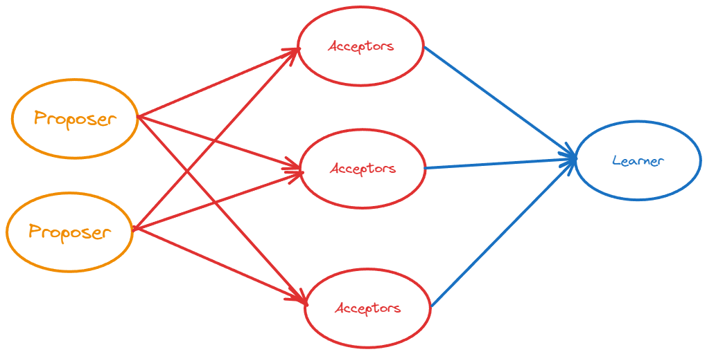
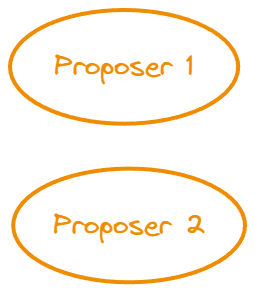
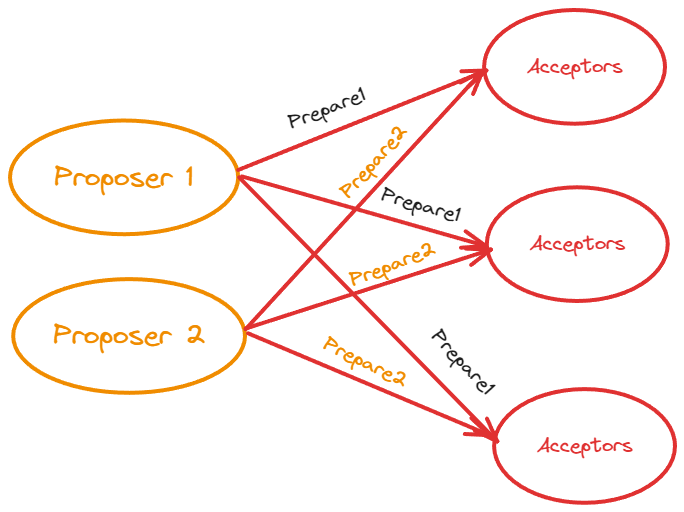
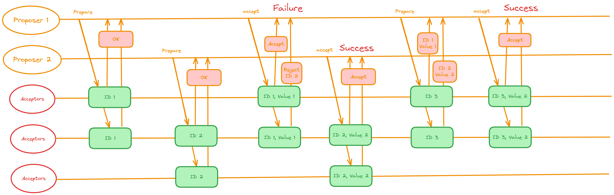
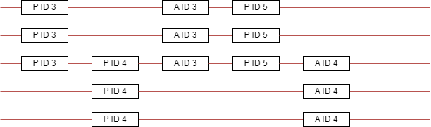

# Pasox

Paxos 算法解决的问题正是分布式一致性问题，即一个分布式系统中的各个进程如何就某个值（决议）达成一致。

Paxos 算法运行在允许宕机故障的异步系统中，不要求可靠的消息传递，可容忍消息丢失、延迟、乱序以及重复。它利用大多数 (Majority) 机制保证了2F+1的容错能力，即 2F+1个节点的系统最多允许F个节点同时出现故障。

一个或多个提议进程 (Proposer) 可以发起提案 (Proposal)，Paxos 算法使所有提案中的某一个提案，在所有进程中达成一致。系统中的多数派同时认可该提案，即达成了一致。最多只针对一个确定的提案达成一致。

Paxos 将系统中的角色分为提议者 (Proposer)，决策者 (Acceptor)，和最终决策学习者 (Learner):

- **Proposer**: 提出提案 (Proposal)。Proposal信息包括提案编号 (Proposal ID) 和提议的值 (Value)。
- **Acceptor**：参与决策，回应 Proposers 的提案。收到 Proposal 后可以接受提案，若 Proposal 获得多数 Acceptors 的接受，则称该 Proposal 被批准。
- **Learner**：不参与决策，从 Proposers/Acceptors 学习最新达成一致的提案（Value）。

在多副本状态机中，每个副本同时具有 Proposer、Acceptor、Learner 三种角色。

## 决议形成阶段

1. 第一阶段：Prepare 阶段。Proposer 向 Acceptors 发出 Prepare 请求，Acceptors 针对收到的 Prepare 请求进行 Promise 承诺。
2. 第二阶段：Accept 阶段。Proposer 收到多数 Acceptors 承诺的 Promise 后，向 Acceptors  发出 Propose 请求，Acceptors 针对收到的 Propose 请求进行 Accept 处理。
3. 第三阶段：Learn 阶段。Proposer 在收到多数 Acceptors 的 Accept 之后，标志着本次 Accept 成功，决议形成，将形成的决议发送给所有 Learners。

## Paxos 消息描述

- **Prepare**: Proposer 生成全局唯一且递增的 Proposal ID (可使用时间戳加 Server ID)，向所有 Acceptors 发送 Prepare 请求，这里无需携带提案内容，只携带 Proposal ID 即可。
- **Promise**: Acceptors 收到 Prepare 请求后，做出“两个承诺，一个应答”。

### 两个承诺

1. 不再接受 Proposal ID 小于等于（注意：这里是<= ）当前请求的 Prepare 请求。
2. 不再接受 Proposal ID 小于（注意：这里是< ）当前请求的 Propose 请求。

### 一个应答

不违背以前作出的承诺下，回复已经 Accept 过的提案中 Proposal ID 最大的那个提案的 Value 和 Proposal ID，没有则返回空值。

- **Propose**: Proposer 收到多数 Acceptors 的 Promise 应答后，从应答中选择 Proposal ID 最大的提案的 Value，作为本次要发起的提案。如果所有应答的提案 Value 均为空值，则可以自己随意决定提案 Value。然后携带当前 Proposal ID，向所有 Acceptors 发送 Propose 请求。
- **Accept**: Acceptor 收到 Propose 请求后，在不违背自己之前作出的承诺下，接受并持久化当前 Proposal ID 和提案 Value。
- **Learn**: Proposer 收到多数 Acceptors 的 Accept 后，决议形成，将形成的决议发送给所有 Learners。

## 具体流程

1. 获取一个 Proposal ID n，为了保证 Proposal ID 唯一，可采用时间戳 +Server ID 生成

2. Proposer 向所有 Acceptors 广播 Prepare(n) 请求

3. Acceptor 比较 n 和 minProposal，如果 n>minProposal，minProposal=n，并且将 acceptedProposal 和 acceptedValue 返回

1. Proposer 接收到过半数回复后，如果发现有 acceptedValue 返回，将所有回复中 acceptedProposal 最大的 acceptedValue 作为本次提案的 value，否则可以任意决定本次提案的 value
2. 到这里可以进入第二阶段，广播 Accept (n,value) 到所有节点
3. Acceptor 比较 n 和 minProposal，如果 n >= minProposal，则 acceptedProposal = minProposal = n，acceptedValue = value，本地持久化后返回，否则返回 minProposal。
4. 提议者接收到过半数请求后，如果发现有返回值 result > n，表示有更新的提议，跳转到 1，否则 value 达成一致

但是需要注意的是，普通的 Pasox 容易造成活锁

例如：

类似这样的，上面的 P 和下面的 P 会相互堵塞，永远达成不了共识，因为每次 Prepare 后都会被另一个 P 打断“多数”这个条件

## Multi-Paxos 算法

原始的 Paxos 算法（Basic Paxos）只能对一个值形成决议，决议的形成至少需要两次网络来回，在高并发情况下可能需要更多的网络来回，极端情况下甚至可能形成活锁。如果想连续确定多个值，Basic Paxos 搞不定了。因此 Basic Paxos 几乎只是用来做理论研究，并不直接应用在实际工程中。

实际应用中几乎都需要连续确定多个值，而且希望能有更高的效率。Multi-Paxos 正是为解决此问题而提出。Multi-Paxos 基于 Basic Paxos 做了两点改进：

1. 针对每一个要确定的值，运行一次 Paxos 算法实例（Instance），形成决议。每一个 Paxos 实例使用唯一的 Instance ID 标识。
2. 在所有 Proposers 中选举一个 Leader，由 Leader 唯一地提交 Proposal 给 Acceptors 进行表决。这样没有 Proposer 竞争，解决了活锁问题。在系统中仅有一个 Leader 进行 Value 提交的情况下，Prepare 阶段就可以跳过，从而将两阶段变为一阶段，提高效率。

Multi-Paxos 首先需要选举 Leader，Leader 的确定也是一次决议的形成，所以可执行一次 Basic Paxos 实例来选举出一个 Leader。选出 Leader 之后只能由 Leader 提交 Proposal，在Leader 宕机之后服务临时不可用，需要重新选举 Leader 继续服务。在系统中仅有一个 Leader 进行 Proposal 提交的情况下，Prepare 阶段可以跳过。

Multi-Paxos 通过改变 Prepare 阶段的作用范围至后面 Leader 提交的所有实例，从而使得 Leader 的连续提交只需要执行一次 Prepare 阶段，后续只需要执行 Accept 阶段，将两阶段变为一阶段，提高了效率。为了区分连续提交的多个实例，每个实例使用一个 Instance ID 标识，Instance ID 由 Leader 本地递增生成即可。

Multi-Paxos 允许有多个自认为是 Leader 的节点并发提交 Proposal 而不影响其安全性，这样的场景即退化为 Basic Paxos。