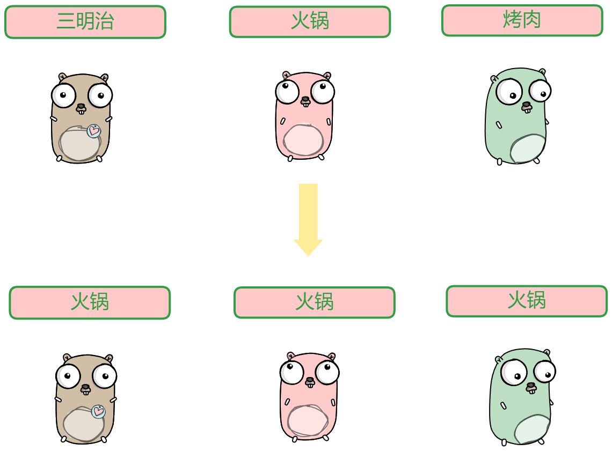
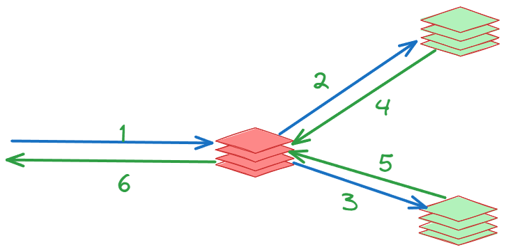
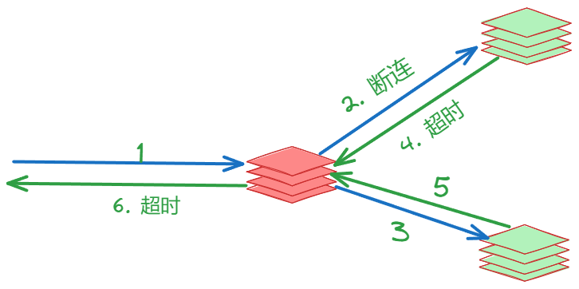
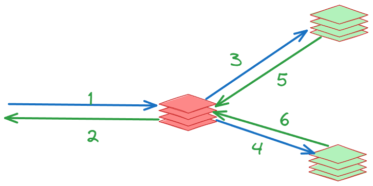
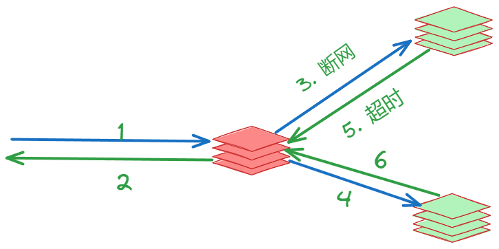
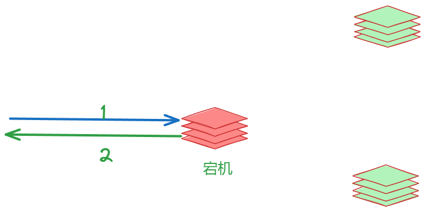

# 分布式一致性问题

在一个或者多个进程提议了一个值是什么之后，使系统中所有进程对这个值达成一致

这样的协定问题在分布式系统中很常用，比如：

- 领导者选举（leader election）：进程对leader达成一致；
- 互斥（mutual exclusion）：进程对进入临界区的进程达成一致；
- 原子广播（atomic broadcast）：进程对消息传递（delivery）顺序达成一致。

对于这些问题有一些特定的算法，但是，分布式一致性问题试图探讨这些问题的一个更一般的形式，如果能够解决分布式一致性问题，则以上的问题都可以解决。

为了达成一致，每个进程都提出自己的提议（propose），最终通过分布式一致性算法，所有正确运行的进程决定（decide）相同的值。

如果在一个不出现故障的系统中，很容易解决分布式一致性问题。但是实际分布式系统一般是基于消息传递的异步分布式系统，进程可能会慢、被杀死或者重启，消息可能会延迟、丢失、重复、乱序等。

在一个可能发生上述异常的分布式系统中如何就某个值达成一致，形成一致的决议，保证不论发生以上任何异常，都不会破坏决议的一致性，这些正是一致性算法要解决的问题。

# 应用场景

在分布式存储系统中经常使用多副本的方式实现容错，每一份数据保存多个副本。

每次更新都需要更新数据中的所有副本，使多个副本的数据保持一致，如何保证在任何情况下数据的一致性就成了问题

如果是 1 主副本，2 其他副本

## 同步方式

对应 Oracle 的最高保护模式 (Maximum Protection)

只有在两个从副本都成功修改之后，才返回修改成功的信号，这种方式保证了主从副本的强一致性，但是可用性差，只要一个副本写失败，写请求就执行失败

## 异步复制

对应 Oracle 的最高性能模式 (Maximum Performance)

写请求首先发送给主副本，主副本写成功后立即返回，然后异步的更新其它副本。这种方式可用性较好，只要主副本写成功，写请求就执行成功。但是不能保证副本之间数据的强一致性，写成功返回之后从各个副本读取到的数据不保证一致，只有主副本上是最新的数据，其它副本上的数据落后，只提供最终一致性。

如果出现断网导致后台异步复制失败，则主副本和其它副本将长时间不一致，其它副本上的数据一直无法更新，直到网络重新连通。

还有一种最高可用性模式 (Maximum Availability) 介于两者之间，在正常情况下，它和最高保护模式一样，但一旦同步出现故障，立即切换成最高性能模式。

# CAP 理论

CAP理论是分布式系统、特别是分布式存储领域中被讨论的最多的理论。其中 C 代表一致性 (Consistency)，A 代表可用性 (Availability)，P 代表分区容错性 (Partition tolerance)。CAP理论告诉我们C、A、P三者不能同时满足，最多只能满足其中两个。

- 一致性 (Consistency)：一个写操作返回成功，那么之后的读请求都必须读到这个新数据；如果返回失败，那么所有读操作都不能读到这个数据。所有节点访问同一份最新的数据。
- 可用性 (Availability)：对数据更新具备高可用性，请求能够及时处理，不会一直等待，即使出现节点失效。
- 分区容错性 (Partition tolerance)：能容忍网络分区，在网络断开的情况下，被分隔的节点仍能正常对外提供服务。

理解CAP理论最简单的方式是想象两个副本处于分区两侧，即两个副本之间的网络断开，不能通信。

- 如果允许其中一个副本更新，则会导致数据不一致，即丧失了C性质。
- 如果为了保证一致性，将分区某一侧的副本设置为不可用，那么又丧失了A性质。
- 除非两个副本可以互相通信，才能既保证C又保证A，这又会导致丧失P性质。

一般来说使用网络通信的分布式系统，无法舍弃P性质，那么就只能在一致性和可用性上做一个艰难的选择。