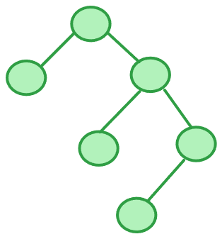
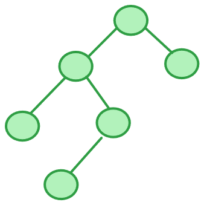

# AVL

AVL (平衡二叉树) 是在符合二叉查找树的条件下，还满足任何节点的两个子树的高度最大差为1。

这就是 AVL 树

这就不是 AVL 树

## 插入和删除

AVL 中通过插入和删除元素可能导致不平衡的情况，可以分为 LL，RR，LR，RL 四种。

* LL：左左，插入或删除一个节点后，根节点的**左孩子**的**左孩子**还有非空节点，导致根节点的左子树高度比右子树高度高2。

  

* RR：右右，插入或删除一个节点后，根节点的**右孩子**的**右孩子**还有非空节点，导致根节点的右子树高度比左子树高度高2。

  

* LR：左右，插入或删除一个节点后，根节点的**左孩子**的**右孩子**还有非空节点，导致根节点的左子树高度比右子树高度高2。

  

* RL：右左,插入或删除一个节点后，根节点的**右孩子**的**左孩子**还有非空节点，导致根节点的右子树高度比左子树高度高2。

  

同样的，解决的方法也有四种

#### LL：

1. 将根节点的左孩子作为新根节点。

2. 将新根节点的右孩子作为原根节点的左孩子。

3. 将原根节点作为新根节点的右孩子。

   

#### RR：

1. 将根节点的右孩子作为新根节点。

2. 将新根节点的左孩子作为原根节点的右孩子。

3. 将原根节点作为新根节点的左孩子。

   

#### LR：

1. 围绕根节点的左孩子进行RR旋转。

2. 围绕根节点进行LL旋转。

   

#### RL：

1. 围绕根节点的右孩子进行LL旋转。

2. 围绕根节点进行RR旋转。

   