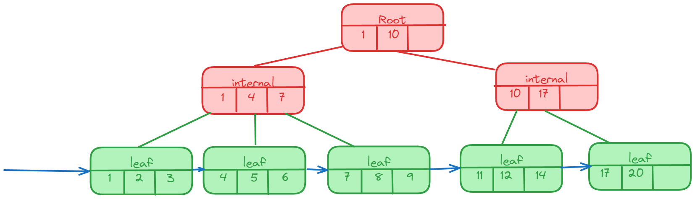

# B+树

B+树是一种数据结构，是一个N叉排序树，每个节点通常有多个孩子，一棵B+树包含根节点、内部节点和叶子节点。根节点可能是一个叶子节点， 也可能是一个包含两个或两个以上孩子节点的节点。

B+树通常用于数据库和操作系统的文件系统中。NTFS、ReiserFS、NSS、XFS、JFS、ReFS和BFS等文件系统都在使用B+树作为元数据索引。B+树的特点是能够保持数据稳定有序， 其插入与修改拥有较稳定的对数时间复杂度。B+树元素自底向上插入。

## 定义

B+ 树分为叶子节点和内部节点，数据只存在于叶子节点中，非叶子节点的每一条记录都是子树中最大或者最小的元素，并且叶子节点是一个链表

## B+树的特性

- 所有关键字都出现在叶子节点的链表中（稠密索引），且链表中的关键字恰好是有序的；
- 不可能在非叶子节点命中；
- 非叶子节点相当于叶子节点的索引（稀疏索引），叶子节点相当于是存储（关键字）数据的数据层；
- 更适合文件索引系统；

## B+树的查找

对`B+树`可以进行两种查找运算：

**1)** 从最小关键字起顺序查找；

**2)** 从根节点开始，进行随机查找

在查找时，若非终端节点上的关键字等于给定值，并不终止，而是继续向下直到叶子节点。因此，在`B+树`中，不管查找成功与否，每次查找都是走了一条从根到叶子节点的路径。其余同`B-树`的查找类似。

## B+树的插入

m阶`B+树`的插入操作在叶子节点上进行，假设要插入关键字`a`，找到叶子节点后插入`a`，做如下算法判别：

**1)** 如果当前节点是根节点，并且插入后节点关键字数目小于等于`m`，则算法结束；

**2)** 如果当前节点是非根节点， 并且插入后节点关键字数目小于等于m，则判断若`a`是新索引值时转`步骤4)`后结束，若`a`不是新索引值，则直接结束；

**3)** 如果插入后关键字数目大于`m`，则先分裂成两个节点`X`和`Y`，并且他们各自所含的关键字个数分别为： u=`⌈(m+1)/2⌉`, v=`⌊(m+1)/2⌋`。由于索引值位于节点的最左端或最右端，不妨假设索引值位于节点的最右端（即非终端节点含有其子树中的最大关键字）， 有如下操作：

- 如果当前分裂成的`X节点`和`Y节点`原来所属的节点是根节点，则从`X节点`和`Y节点`中取出索引关键字，将这两个关键字组成新的根节点，并且这个根节点指向`X`和`Y`，算法结束；
- 如果当前分裂成的`X节点`和`Y节点`原来所属的节点是非根节点，依据假设条件判断，如果`a`成为`Y节点`的新索引值，则转`步骤4)`得到`Y`双亲节点`P`；如果`a`不是`Y`节点的新索引值，则求出`X节点`和`Y节点`的双亲节点`P`, 然后提取`X节点`的新索引值`a'`，在`P`中插入关键字`a'`，继续进行插入算法；

**4)** 提取节点原来的索引值`b`，自顶向下先判断根是否含有`b`，如果含有则需要先将`b`替换为`a`。然后从根节点开始，记录节点地址`P`, 判断`P`的孩子是否含有索引值`b`而不含索引值`a`，如果是则将孩子节点中的`b`替换为`a`，然后将`P`的孩子的地址赋值给`P`，继续搜索，直到发现`P`的孩子中已经有`a`值时，停止搜索，返回地址`P`。

## B+树的删除

`B+`树的删除也仅在叶子节点中进行，当叶子节点中的最大关键字被删除时，其在非终端节点中的值可以作为一个`分界关键字`存在。若因删除而使节点中关键字的个数少于`⌈m/2⌉`时，其和兄弟节点的合并过程亦和`B-树`类似。
